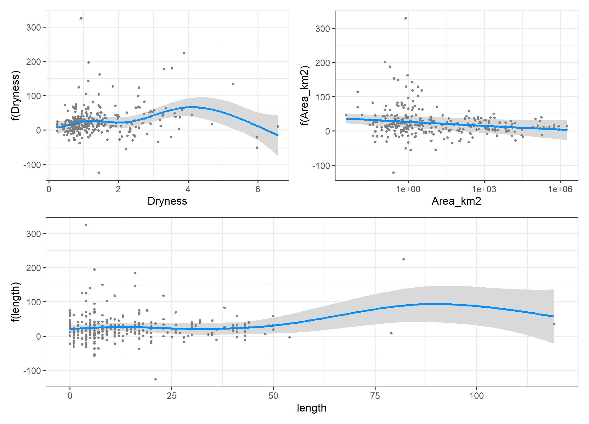
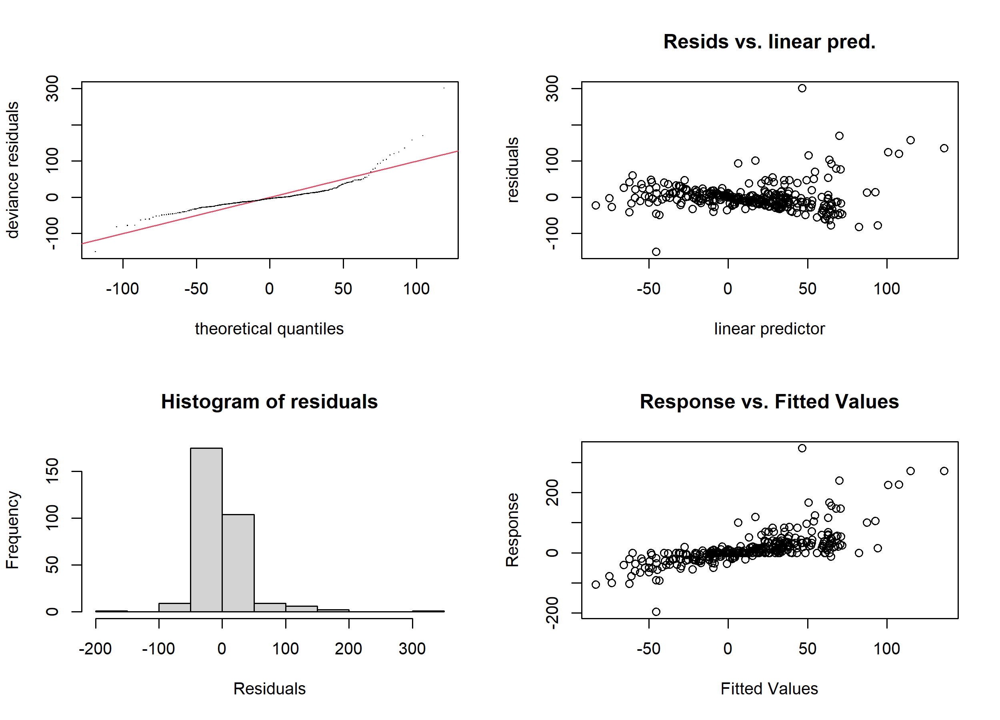
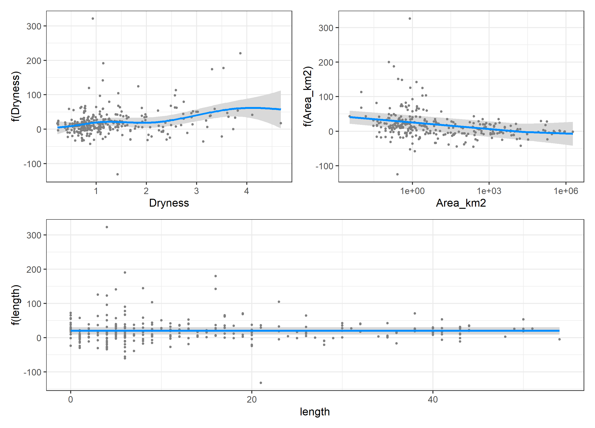
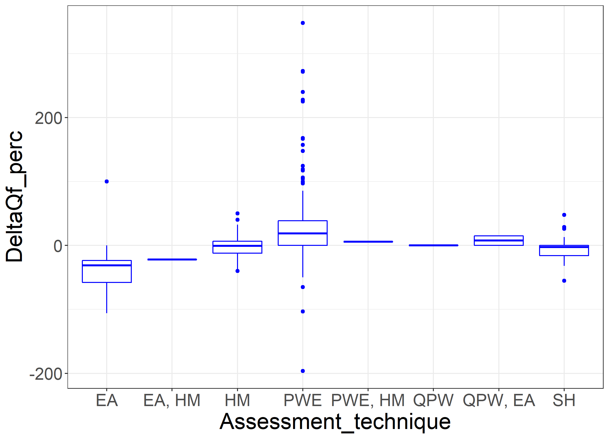

Introduction
==========================

The impacts of global deforestation and reforestation are important through their influence on streamflow and both blue and green water availability [@hoekvandijke2022; @schyns2019].  The past work reviewing these impacts [@andreassian2004; @jackson2005; @zhang2017; @brown2005; @brown2013; @filoso2017] highlights a general consensus that if forest areas increase, streamflow decreases and vice-versa. The most dramatic result is Figure 5 in @zhang2011 indicating (for Australian catchments) a 100% decrease in streamflow for catchments with 100% forest cover. However, on the other end of the spectrum, for three French catchments [@cosandey2005], there was no change in streamflow characteristics in two of the catchments after deforestation. For reforestation, a modelling study across the 1 millon km^2^ Murray Darling Basin also found no major effect, especially in larger catchments [@vandijk2007]. Similarly a modelling study by @beck2013 found no significant change in streamflows in 12 catchment in Puerto Rico as a result of deforestation. In contrast, in a recent study in Brazil across 324 catchments, @levy2018 found a significant increase in streamflow, particular in the dry season, as a result of deforestation. This suggests that there can be significant variation across the different studies,methodologies and geographical regions. 

For the purpose of this paper, *watershed* and *catchment* are interchangeable terms. Many of the US studies use *watershed*, while European and Australian studies use *catchment*. In particular, we retained the term "paired watershed studies" and "quasi-paired watershed studies" as this is the most common terminology, but further mostly use the term catchment.

As mentioned, several review papers have summarized the plethora of forestation and deforestation studies across the globe, in relation to paired watershed studies [@brown2005; @hewlett1984], related to reforestation in particular [@filoso2017], and more generally [@jackson2005; @zhang2017].  These studies aim to generalize the individual experimental and research findings and to identify if there are global trends or relationships. Others have used the understanding from these studies to extrapolate to global scales [@hoekvandijke2022].   

The most recent reviews [@zhang2017; @filoso2017] developed an impressive global database of catchment studies with changes in streamflow due to changes in forest cover. The @zhang2017 dataset, which covers over 312 studies, is described in terms of the change in streamflow as a result of the change in forest cover, where studies related to both forestation (increase in forest cover) and deforestation (decrease in forest cover) were included. In contrast, the paper by @filoso2017 focused primarily on reforestation, and covered an equally impressive database of 167 studies using a systematic review. In this case the collected data is mostly coded as count data and only a subset of 37 studies was analysed for actual water yield change. There is some overlap between the two data sets, but there are also some studies unique to both sets. The more regionally concentrated and detailed study by @levy2018 is a further independent dataset with no overlap with the other studies. However, for this study only the flow and rainfall data is available for the catchments, and the change in landcover was derived from satellite data and was not made available.

The conclusions of the first mentioned major review paper [@zhang2017] indicates that there is a distinct difference in the change in flow as a result of forestation or deforestation between small watersheds (catchments), defined as < 1000 km^2^ and large watersheds (catchments) > 1000 km^2^. While for small catchments there was no real change in runoff with changes in cover, for large catchments there was a clear trend showing a decrease in runoff with and increase in forest cover. Their main conclusion was that the response in annual runoff to forest cover was scale dependent and appeared to be more sensitive to forest cover change in water limited catchments relative to energy limited catchments [@zhang2017].

The second study [@filoso2017] is a systematic review of reforestation studies (only studies in which forest cover increased). This study classified the historical research and highlighted gaps in the spatial distribution, the types of studies and the types of analysis. Their main conclusion was also that reforestation decreases streamflow, but that there were many interacting factors. For a subset of the data (37 data points) they also indicated decreasing impacts of reforestation with increasing catchment size (agreeing with @zhang2017), but they did not identify a distinct threshold and fitted a log-linear relationship. In addition, they identified that studies with shorter periods of data collection resulted in larger declines in streamflow.

A final earlier summary paper that includes much of the same data as @zhang2017 and @filoso2017 is @zhou2015, which has one author in common with @zhang2017. However, this paper aims to explain the variation in the data using the elasticity approach in the Fuh model. In particular, it aims to link the variation in the observed data to variations in the exponent *m* in the Fuh model. A key observation is that in drier environments, the effects of removing forest cover are much greater than in wetter environments, which is also suggested by Figure 4 in @zhang2017. The Fuh model and variations of the Budyko equilibrium modelling approach was also used by @hoekvandijke2022 to interpret the global impact of reforestation.

There are some clear limitations in these studies. The main method in the work by @zhang2017 is a single covariate linear regression. In contrast, the systematic review from @filoso2017 emphasises the classification and distributions of the study. @zhang2017 points out that a main assumption in their work is that the catchment size threshold at 1000 km^2^ is a distinct separation between "small" and "large" catchments. However, a subset of 37 data points in @filoso2017 (their Figure 9) does not appear to support this, suggesting a continuum. And while the work @filoso2017 provides important insights in study types, analysis types, forest types and broad classification, there is limited quantification of actual impact.

In contrast to the single covariate linear regression in the earlier studies [@zhang2017; @filoso2017] and the top-down Budyko modelling [@zhou2015; @hoekvandijke2022], the regional Brazilian Cerrado study [@levy2018] provides a carefully designed statistical approach using mixed effects modelling and Differences-in-Differences modelling focusing specifically on the effect of deforestation. The analysis specifically accounted for differences between catchments and differences due to variations in climate. Their conclusion highlighted that in particular dry season streamflow was affected by deforestation.

Given all these previous reviews and the seemingly clear conclusions about the impact of forest cover change on streamflow, the question is why another paper?
There is a real attraction in the idea of quantitative analysis of past studies to be able to extrapolate findings to larger scales and to identify factors across global scales. 
However, there is also a real danger in this process, which is what we will highlight in this paper. There are four potential errors (or limitations) in the mentioned global analyses:  

- Latent variables that are not included in the typical single covariate analysis;
- Interpretation errors due to incomplete descriptions of the experiments in the original papers;  
- Aggregation of data that originates from different experiments with different objectives across a wide time period; and, finally    
- Transcription errors in the data, especially if data is collected from other review papers as some of the original papers are difficult to locate.

The aim of this paper is to highlight examples of each of these limitations, how they have influenced past work, and provide suggestions of how we can overcome these limitations. In addition, by applying more complex statistical models we will highlight the conclusions that can still be drawn from this work in relation to the impact of forest cover on streamflow. Finally, we will highlight future research needs in this area. 

We are taking advantage of the earlier work by @zhang2017, @filoso2017 and @zhou2015 and the large database of studies these authors have shared. 

Methods
==========


```{r, include=FALSE}
options(tinytex.verbose = FALSE)
```
```{r, echo = F, message = F, warning=FALSE}
require(tidyverse)
require(lubridate)
require(mgcv)
require(visreg)
require(patchwork)
library(ggcorrplot)
suppressWarnings(require(knitr))
suppressWarnings(require(bookdown))
suppressWarnings(require(pander))
```
## The original data set

As indicated, the starting point of this paper is the data base of studies which were included in @zhang2017 as supplementary material. The columns in this data set (are the catchment number, the	catchment name, the	Area in km^2^, the annual average precipitation	(Pa) in mm, the	forest type, hydrological regime, and climate type, the change in forest cover	in \% ($\Delta F\%$) and the change in streamflow in \% $(\Delta Qf\%)$, based on equation 1 in @zhang2017), the precipitation data type, the assessment technique, and the	source of the info, which is a citation. 
Several of these columns contain abbreviations to describe the different variables, which are summarised in Table \@ref(tab:table1). These abbreviations will later be used in the models.  

```{r table1, echo =F}

Table1 <- tibble("Factor" = c("forest type","","", "hydrological regime","", 
                              "climate type","","","precipitation data type",
                              "","","assessment technique", "","","",""),
                 "Abbreviation" = c("CF","BF","MF","RD","SD", "EL", "WL", "EQ", 
                                    "OB","SG","MD","PWE","QPW","HM","EA","SH"),
                 "Definition" = c("coniferous forest", "broadleaf forest", "mixed forest",
                                  "rain dominated", "snow dominated", "energy limited",
                                  "water limited", "equitant", "observed", "spatial gridded",
                                  "modelled", "paired watershed experiment", 
                                  "quasi-paired watershed experiment", 
                                  "hydrological modelling", "elasticity analysis",
                                  "statistical modelling and hydrographs"))

# |:------------|:-------|:----------|
# | forest type | CF |coniferous forest | 
# |  | BF | broadleaf forest |
# |  | MF |mixed forest  |
# |hydrological regime|RD|rain dominated|
# | |SD|snow dominated|
# | climate type| EL| energy limited|
# | |WL| water limited|
# | |EQ| equitant|
# |precipitation data type|OB|observed|
# | |SG|spatial gridded|
# | |MD|modelled|
# |assessment technique|PWE|paired watershed experiment|
# | |QPW|quasi-paired watershed experiment|
# | |HM|hydrological modelling|
# | |EA|elastictity analysis|
# | |SH|combined use of statistical methods|
# | | |and hydrographs|

pander(Table1, caption = "Summary of abbreviations of factors used in the Zhang et al. (2017) data set")
```

The paper by @zhang2017 use the dryness index, which is the annual rainfall (Pa) divided by the potential or reference evapotranspiration (ET~0~ or E~0~) in their analysis, and use the dryness index to identify the climate type. However, the potential or reference ET was not originally included as part of the published data set. We combined the tables for small catchments (< 1000 km^2^) and large catchments (>= 1000 km^2^) from @zhang2017 in our analysis. 

## Additional data collection

To enhance the existing data set, this study added additional variables and cross-checked the studies with the data set from @filoso2017. In particular, we focused on the 37 data points related to the quantitative regression analysis used in @filoso2017.

In addition, a few additional variables were included to enhance the data set. We added latitude and longitude for the center of the catchment as an approximation of its spatial location. Mostly the  data reported by the authors was used, but in some cases the variables had to be approximated from the location of the centre of the catchment using Google Maps^TM^. In the dataset, an additional column has been added to indicate the source of the location data to indicate if this is directly from the paper or elsewhere.  

As highlighted, @zhang2017 did not provide values for evapotranspiration in the data base. Using the location information  reference evapotranspiration (E~0~) was extracted from the Global Aridity Index and Potential Evapo-Transpiration (ET~0~) Climate Databasev2 [@trabucco2018], if a value of E~0~ was not available from the original papers. For large catchments, this value (and the associated coordinates), similar to annual average rainfall, is only an approximation of the climate at the location. 

Similar to @zhang2017, the "dryness index" was calculated from the reference evapotranspiration and the annual average rainfall (Pa) as:

\begin{equation}
D = \frac{E_{0}}{Pa} (\#eq:eq1)
\end{equation}

The length of the study can be a variable influencing the change in flow [e.g. @jackson2005; @filoso2017], as for example, more mature plantations are thought to have smaller impacts on flow or regrowth might follow a "Kuczera curve" [@kuczera1987]. It is not clear if this is an effect of increased water use in growth [@vertessy2001] or due to changes in interception [@stoof2012]. Therefore, the length of the study calculate as the difference between the starting data and completion date of the different studies was extracted from the references provided by @zhang2017. The length of the study was already included in the data from @filoso2017, but these were checked against the original publications.

Several additional data points from catchment studies were extracted from @almeida2016, @ferreto2020, @zhang2011, @zhao2010, @borg1988, @thornton2007, @zhou2010, @rodriguez2010, @ruprechtetal1991 and @penaarancibia2012, and these were checked against the existing studies to prevent overlap. In the citation column in the accompanying data set, the main reference for the calculated change in streamflow  was generally used, because sometimes the original study did not provide the quantification of the change in streamflow [i.e. Table 6 in @zhang2011].

We conducted a thorough review of all the studies mentioned in the data base of @zhang2017 and sourced all the original papers. As a result of this we made several changes to the data base, which are all recorded in Supplementary Data part 1.  Overall 36 data points were changed and the most common problem was a change in the sign for the change in forest cover or the change in flow. We assume that these were transcription errors.  
We also removed one data point from the data set, which corresponds to catchment #1 (Amazon) in @zhang2017. This is because the cited reference [@roche1981] only relates to 1  and 1.5 ha paired catchment studies in French Guyana, and in which the actual change in forest cover is not recorded. Finally, on review of all the data in @zhang2017 and @filoso2017, 29 potential duplicates were identified and flagged in the data, and not used in the analysis.  

The final column in the improved data base is a "notes" column, which we added, but is not further used in the analysis. It gives context to some of the data for future research and highlights some of the discrepancies that we found between the original papers and the data in the tables from @zhang2017. This will allow future research to scrutinise our input for errors. 

## Statistical modelling

```{r read_data, echo = F, message = F}
Zhang_small <- read_csv("../../data/SmallCatchments_T2.csv") %>%
  mutate(table = "small")
Zhang_large <- read_csv("../../data/LargeCatchments_T1.csv") %>%
  mutate(table = "large")
new_data <- read_csv("../../data/NewCatchments_T3.csv") %>%
  mutate(table = "new")
```

<!--- ### change names of columns
the package`mgcv` does not seem to be happy with complex names, so probably better to make all names simple --->

```{r, echo = F}
names(Zhang_small)[3:4] <- c("Area_km2", "Pa_mm")
names(Zhang_large)[3:4] <- c("Area_km2", "Pa_mm")
names(new_data)[3:4] <- c("Area_km2", "Pa_mm")
names(Zhang_small)[5:6] <- c("Forest_type", "Hydrological_regime")
names(Zhang_large)[5:6] <- c("Forest_type", "Hydrological_regime")
names(new_data)[5:6] <- c("Forest_type", "Hydrological_regime")
names(Zhang_small)[9:10] <- c("Precip_data_type", "Assessment_technique")
names(Zhang_large)[9:10] <- c("Precip_data_type", "Assessment_technique")
names(new_data)[9:10] <- c("Precip_data_type", "Assessment_technique")

```

<!-- combine both tables -->

```{r, echo = F, warning = F, message = F}
Zhang_small$From <- as.numeric(Zhang_small$From)
Zhang_small$To <- as.numeric(Zhang_small$To)
Zhang_all <- bind_rows(Zhang_large,Zhang_small) %>%
  mutate(dataset = "original Zhang et al data")
new_data <- new_data %>%
  mutate(dataset = "new data")
All_data <- bind_rows(Zhang_all, new_data)
```

<!--filter duplicates -->
```{r, echo = F}
All_data <- All_data %>%
  mutate(`Possible duplicate` = 
           ifelse(is.na(`Possible duplicate`)==T,0,`Possible duplicate`),
         `Possible duplicate` = as.numeric(`Possible duplicate`)) %>%
  filter(`Possible duplicate` != 1)
```

<!--now calculate dryness -->
```{r, echo = F}
# calculate dryness index
All_data <- All_data %>%
  mutate(Dryness = E0/Pa_mm)
```

<!--remove the Amazon from the analysis -->
```{r, echo = F}
All_data <- All_data %>%
  filter(`Watershed #` != 1)
```

<!-- remove data set 188 and 254 Kamakia and Sambret -->

```{r,echo = F}
All_data <- All_data %>%
  filter(`Watershed #` != 188) %>%
  filter(`Watershed #` != 254)
```

The aim of the statistical analysis is to highlight the most important variables in the data set that explain the change flow as a consequence of changes in forest cover. This first aim is similar to @zhang2017, but the main difference is that we start off with all variables in the data set in the model. Subsequently the analysis will concentrate on how the individual variables in the dataset relate to each other and  how latent variables in the data set can be masked and result in relationships that might not really exist. Finally, the analysis will highlight how the results are conditional on the dataset.  

To estimate how the change in streamflow is affected by the change in forest cover, while considering the effects of the other variables, we applied generalised additive modelling (GAM) [@wood2006].  

The general model tested is:

\begin{align}
\Delta Qf \% \sim &~ \Delta \% forest~cover + \notag \\ 
& \sum{X_i} + \sum{s(Z_i)} + \varepsilon (\#eq:eq2)
\end{align}


Here $X_i$ are factorial variables, while $Z_i$ are continuous variables. As a first step, the model assumes no direct interactions and that all variables are additive. A further assumption in the model is that all continuous variables $Z_i$ (such as annual precipitation (Pa)) can have either a linear or a non-linear relationship with $\Delta Qf \%$. This means that a smooth function $s()$ can be applied to the $Z_i$ variables. For the smoothing function we applied thin plate regression splines with an additional shrinkage penalty. The result of this approach is that for high enough smoothing parameters (i.e. if the data is very "wiggly") the smooth term can be shrunk to 0 and thus will be no longer significant [@wood2006]. This is done because a highly flexible smooth term could always fit the data, but would not necessarily indicate a relevant relationship. In other words, the approach balances finding a smooth non-linear relationship for the variable against overfitting the data. 

The changes in forest cover contain both positive (forestation) and negative values (deforestation). In @zhang2017, these changes were jointly analysed, assuming the effect on the change in flow was linear and the effect of removing forest cover was the same as an equivalent addition of forest cover.  

However, the impact of an increase in forest cover can be different from the same fractional decrease in forest cover. The question becomes how best to analyse this. One approach would be to allow a different slope and a different intercept for the decreases relative to the increases. 
This can be tested by converting all the change in forest cover data to positive values, and an additional binary column ($sign_{forest cover}$) can be included indicating whether it was a forest cover increase or decrease. In the model, the parameter for $sign_{forest cover}$ will indicate the difference in the changes in flow for increases in forest cover compared to decreases in forest cover. The disadvantage of this approach is that the relationship with forest cover becomes discontinuous at the origin (0 change in forest cover).

A second approach is to test the change in forest cover as a non-linear relationship in the GAM model. Because a shrinkage penalty is used, this will also test the non-linear assumption and allows the variable for forest cover to be continuous. The disadvantage of this approach is that the relationship between forest cover and change in flow is less easy to interpret, as the non-linear fit in the GAM has no direct parametric form. 
Both these approaches are tested in the results.

The over arching test focuses on identifying the change streamflow as a result of a change in forest cover and potentially affected by different other factors (as indicated by the previous research: @zhang2017; @filoso2017; @zhou2015): climate, size of catchment and length of study. In addition to these earlier identified factors, this study also tested for the factors listed in Table \@ref(tab:table1)

As an initial approach we  only used the data from @zhang2017 to make sure that the additional catchments added to the data set did not influence the results (This analysis is in supplementary material part 2). This analysis highlights that the newly added catchment and the changes to the dataset create minor differences when repeating the analysis from the original paper. 

To make all the data and code publicly available, all the final data and analysis for this paper are located on github:  
[https://github.com/WillemVervoort/Forest_and_water](https://github.com/WillemVervoort/Forest_and_water/tree/publish) on the "publish" branch.


Results
===========

<!-- analysis -->
## Description of the data

The overall dataset contains `r nrow(All_data)` observations of changes in flow, which includes the newly identified data sets and after removing identified duplicate data and lines with missing data. In contrast, the original dataset from @zhang2017 contained `r nrow(Zhang_all)` catchments and the @filoso2017 study used 37 catchments (Table S2 in @filoso2017). The current number of catchments is the result of the removal of duplicates and our modifications and additions. The overall distribution of changes in flow is highly skewed as is the distribution of changes in forest cover and *Area km^2^*. The values of changes in flow greater than 100\% and smaller than -100\% clearly create long tails on the change in flow distribution. Note also the large number of studies with 100\% forest cover reduction. Clearly visible is also that smaller catchments dominate the database with 42\% of the data from catchments < 1 km^2^ and 65\% of the data for catchments < 10 km^2^ (Figure 1). This high skew in some of the data can create difficulties in the statistical modelling and further transformation of the data might be required.

```{r, echo = F, warning = F, message=F, eval =F}
require(latex2exp)
png("DataExploration.png", width = 2500, height = 1800, res = 300)
All_data %>%
  mutate(log10Area = log10(Area_km2)) %>%
  pivot_longer(c(DeltaF_perc, DeltaQf_perc, log10Area, Pa_mm, E0), 
               names_to = "variable", values_to = "value") %>%
  ggplot(aes(value)) + geom_histogram(fill = "steelblue", bins=50) + theme_bw() +
  facet_wrap(~variable, scales = "free", labeller = labeller(variable = 
    c("log10Area" =  "log10(Area km2)", #latex2exp::TeX("$\\log_{10}({Area~km^2})$"),
      "DeltaF_perc" = "Delta Forest (%)",
      "DeltaQf_perc" = "Delta Qf (%)",
      "E0" = "Annual Potential E (mm)",
      "Pa_mm" = "Annual Rainfall (mm)"),default = label_parsed)) +   
  theme(axis.title = element_text(size = rel(1.5)),
        axis.text = element_text(size = rel(1.2)),
        strip.text = element_text(size = rel(1.5)),
        axis.text.x = element_text(angle = 45, hjust = 1))
dev.off()
```

(ref:datagraphscaption) Overview of the distribution of the data set for five of the included variables. Note that the first panel (showing the distribution of the catchment areas) indicates the distribution of the *log_10_* transformed Area (in km^2^).


```{r datagraphs, echo=F, out.width="90%", fig.cap="(ref:datagraphscaption)"}

include_graphics("./DataExploration.png")
```


```{r, echo = F}
All_data2 <- All_data %>%
  mutate(Forest_Sign = ifelse(DeltaF_perc < 0,
                              "Decrease", "Increase"),
         DeltaF_perc_pos = ifelse(DeltaF_perc < 0,
                                  -1*DeltaF_perc,
                                  DeltaF_perc))
```

```{r, eval = F, echo = F}
All_data2 %>%
  filter(is.na(Forest_Sign)==T)
```

```{r, echo = F}
# temporary write out of data files for review reply
write_csv(All_data, "All_data.csv")
write_csv(All_data2, "All_data2.csv")

```

### Geospatial location of the catchments

```{r globalmap, fig.cap="Distribution of included catchments across the globe based on reported or estimated latitude and longitude", out.width="90%", echo=F}  

include_graphics("FAOET0data_final_2022.png")
```

** DO WE NEED TO REDO THE MAP? Eliana please provide code **

Apart from looking at the distribution of the values, the spatial locations of the data can also be important, in particular when analysing the effect of climate. The catchments are spread across the world, and relative to @zhang2017, this dataset has a very similar geospatial distribution.  The major climate gradients are represented in the data, but there appears to be some bias in the spatial locations of the data. As the global map (Figure \@ref(fig:globalmap)) shows, the distribution of case study catchments covers multiple continents. There is some spatial clustering in the studies in North America, Australia and East Asia.

### Cross correlation between the different variables

A final data exploration is to identify potential cross correlations in the data, which can point to possible interactions or potential biases. This analysis can also provide further insight for the statistical modelling, highlighting potential latent variables in the data set.

```{r correlation, eval=F, echo = F}
All_data2 <- All_data2 %>%
  mutate(length = To - From,
         mid_year = From + (To - From)/2)


png("variable_corr_plot.png", width = 960, height = 960)
model.matrix(~0+DeltaF_perc + 
                   log10(Area_km2) + 
                    Dryness + 
                    length +
                    Precip_data_type +  Assessment_technique +
                    Forest_type +
                    Hydrological_regime, data=All_data2) %>% 
  cor(use="pairwise.complete.obs") %>% 
  ggcorrplot(show.diag = F, type="lower", lab=TRUE, lab_size=4)
dev.off()

```


```{r corgraphs, echo=F, out.width="90%", fig.cap="Correlation matrix for all variables"}

include_graphics("variable_corr_plot.png")
```

The correlation plot (Figure \@ref(fig:corgraphs)) highlights several correlations thate are worth investigating, even though in general cross correlation is quite low between variables. Some interesting relationships that appear in this graph are:  

- the negative relationship between log10(Area) and change in forest area (DeltaF_perc) indicating that in the data set larger catchments tended to have (obviously) smaller areas of forest change.  
- the weak positive relationship between log10(Area) and the assessment method using hydrological models. This highlights that paired catchment studies mostly concentrate on smaller scales.  
- A strong inverse relationship between log10(Area) and the paired watershed assessment method, which is simply the inverse from the last point, as also indicated by the negative relationship between the two assessment methods. This is further visible in the relationship between the change in forest cover and the paired watershed assessment method, showing the impact of the latent variable (log10(Area)). Smaller catchments used in paired watershed assessments are easier to fully clear or fully replant.


## Statistical analysis

The results of the overall statistical model that includes all the variables (but no interactions) reinforces some of the results from the correlation analysis.

This includes introducing non-linearity (Equation \@ref(eq:eq2)) for the numerical variables in the model. While increasing non-linearity in the model can increase the flexibility if the model, the shrinkage splines assist with limiting overfitting. Following @wood2006, the number of degrees of freedom *k* in the non-linear variables was based on assessment of the effective degrees of freedom in the model output. If the effective degrees of freedom were close to *k - 1* then *k* was increased and the model rerun. By using shrinkage splines, this also results in the whole term being shrunk to zero [@wood2006].


```{r model_all, echo = F}
All_data2 <- All_data2 %>%
  mutate(length = To - From,
         mid_year = From + (To - From)/2)

Forest_model_all <- gam(DeltaQf_perc ~ DeltaF_perc + 
                    s(log10(Area_km2), k = 5, bs="ts") + 
                    s(Dryness, k = 10, bs="ts" ) + 
                     s(length, k = 35, bs="ts") +
                    Precip_data_type +  Assessment_technique +
                    Forest_type +
                    Hydrological_regime
                    , data = All_data2)
#summary(Forest_model_all)
#gam.check(Forest_model_all)
#plot(model6_all)
```
```{r modelforestpos, eval =T, echo =F}
Forest_model_all2 <- gam(DeltaQf_perc ~ DeltaF_perc_pos + Forest_Sign + 
                    s(log10(Area_km2), k = 5, bs="ts") + 
                    s(Dryness, k = 10, bs="ts" ) + 
                     s(length, k = 35, bs="ts") +
                    Precip_data_type +  Assessment_technique +
                    Forest_type +
                    Hydrological_regime
                    , data = All_data2)
#summary(Forest_model_all2)

```
```{r modelforestnonlin, eval =T, echo =F}
Forest_model_nonlin <- gam(DeltaQf_perc ~ s(DeltaF_perc, k=10, bs = "ts") + 
                    s(log10(Area_km2), k = 5, bs="ts") + 
                    s(Dryness, k = 10, bs="ts" ) + 
                     s(length, k = 35, bs="ts") +
                    Precip_data_type +  Assessment_technique +
                    Forest_type +
                    Hydrological_regime
                    , data = All_data2)
#summary(Forest_model_nonlin)
#plot(Forest_model_nonlin)
```

```{r, echo = F}
pander(round(summary(Forest_model_all)$p.table,2), caption = "(\\#tab:m-all-linear) Statistical summary for the linear terms the full model")
#plot(model6_all)
```

```{r , echo = F}
pander(round(summary(Forest_model_all)$s.table,2), caption = "(\\#tab:m-all-smooth) Statistical summary for the smooth terms for the full model")
#plot(model6_all)
```

The overall explaining power of the model can be interpreted from the adjusted *r^2^* (which is penalised for the number of parameters). This indicates an *r^2^* of `r round(summary(Forest_model_all)$r.sq,2)` and deviance explained is `r round(summary(Forest_model_all)$dev.expl,2)`, suggesting the model only explains about 50% of the variance in the data. 

Inspecting the significance of the variables (Table \@ref(tab:m-all-linear) and Table \@ref(tab:m-all-smooth)) indicates some interesting features. 

The overall partial slope of the change in forest cover is `r round(summary(Forest_model_all)$p.table[2,1],2)`, if all other variables are kept constant. This suggest quite strong change in streamflow, moving from fully forested to fully cleared. Over the whole forest cover range, this is a change of `r round(summary(Forest_model_all)$p.table[2,1],2)*200` mm, with other variables held constant. This change is highly significant, as indicated by the low  p-value.

In addition, all the smoothed variables *log10(Area (km^2^))* (p = `r round(summary(Forest_model_all)$s.table[1,4],2)`)), *Dryness* (p = `r round(summary(Forest_model_all)$s.table[2,4],2)`)) and *length* (p = `r round(summary(Forest_model_all)$s.table[3,4],2)`)) explain variation in the data. For *length*, the p-value is not strictly smaller, than 0.05, but still indicates some reasonable evidence that the variable explains some of the variation in the change in streamflow.

Furthermore Table \@ref(tab:m-all-linear) indicates that several of the assessment methods explain variation in the change in streamflow, which was also indicated in the correlation analysis. In particular, the assessment methods Paired Watersheds experiments (PWE), Hydrological modelling (HM) and Statistical techniques (SH) are important explaining variables ($p < 0.05$). 

The remaining variables related to rainfall observation technique, forest type or hydrological regime don't appear to have an influence on the change in flow.

```{r, echo = F}
table_comparison <- tibble("Model for change in forest cover" = 
                             c("linear across range",
                               "different for forestation and deforestation",
                               "non-linear across the range"),
                           "Deviation explained" = 
                             c(round(summary(Forest_model_all)$dev.expl,2),
                               round(summary(Forest_model_all2)$dev.expl,2),
                               round(summary(Forest_model_nonlin)$dev.expl,2)),
                           "AIC" = c(AIC(Forest_model_all), AIC(Forest_model_all2),
                                     AIC(Forest_model_nonlin)))
pander(table_comparison, caption = "(\\#tab:tablecomparison) Comparison of alternative models for the relationship between the change in forest cover and the change in streamflow. (See Supplementary Material part 3)")
```


As discussed in the methods, the overall linear response to the change in forest cover was compared to a transformation of the negative forest cover to positives and a check whether the relationship might be non-linear. This approach tests whether the impact on streamflow from removing forest cover is different from reforestation, as outlined in the methods. The detail of the comparison is highlighted in Supplementary material part 3. However, generally the results of the analysis showed two main points (Table \@ref(tab:tablecomparison):  

1. The model assuming a simple linear relationship between change in forest cover (both positive and negative) and the change in flow explained the most variation in the data and indicated the best performance in terms of the Aikaike Information Criterium (AIC); and  
2. There is no need to assume a non-linear relationship, as a linear relationship provides a better fit to the data.

The smoothed variables in the model can be inspected visually to identify if there are any issues with the fit. This is in addition to the earlier mentioned checks using `gam.check()` in the R package `mgcv` to test whether the number of degrees of freedom *k* is adequate.


```{r visualisesmooths,echo =F, eval = F}
#require(visreg)
png("Forest_model_allsmooths.png", width = 2500, height = 1800, res = 300)
#par(mfrow=c(2,2))
D <- visreg(Forest_model_all, "Dryness", gg = T, plot = T) + theme_bw()
A <- visreg(Forest_model_all, "Area_km2", gg = T, plot = T) + theme_bw() + scale_x_log10()
L <- visreg(Forest_model_all, "length", gg = T, plot = T) + theme_bw()
#From <- visreg(model6_all, "From", gg = T, plot = T) + theme_bw()
(D + A) / L 
# visreg(model6_all,"Dryness",gg=T) + theme_bw()
# visreg(model6_all,"length",gg=T, add=T) + theme_bw()
# visreg(model6_all,"Area_km2",gg=T, add=T) + theme_bw() + scale_x_log10()
#par(mfrow=c(1,1))
dev.off()
```


```{r smoothsmodelall, echo = F, fig.cap="Visualisation of the smooth variables in the model, the shaded areas are the 95\\% confidence intervals associated with the fit of the smooth, the blue line is the mean smoothed relationship, with data plotted as individual points", out.width="90%"}

```

Figure \@ref(fig:smoothsmodelall) highlights that the relationship between *log10(Area km^2^)* and the change in flow is essentially linear. It indicates the negative slope that was also clear from @zhang2017, indicating that in larger catchments changes in forest cover have less impact on streamflow than for smaller catchments. 

Both the *length* and *Dryness* variables show strong non-linearity, but the relationships do not show a clear trend due to the scatter and the distribution of the data. A further problem appears to be that *length* and *Dryness* have several points with very high leverage that determine much of the non-linearity in the relationship.


<!-- plot the residuals -->
```{r, eval = F, echo = F}
png("residual_plot_model_all.png", width = 2500, height = 1800, res = 300)
par(mfrow=c(2,2))
gam.check(Forest_model_all)
par(mfrow=c(1,1))
dev.off()
```

```{r gamcheckmodelall, echo =F, fig.cap="Residual plots for the regression model indicating a slightly fat-tailed residual distribution", out.width="90%"}

```


As this is not always shown in papers discussing regression relationship, the residual distribution is provided in more detail (Figure \@ref(fig:gamcheckmodelall). Visually, the residuals appear approximately normal, although there is a noticable skew in a limited number of the data in the upper part of the distribution (Figure \@ref(fig:gamcheckmodelall)). This is related to a limited number catchments that have very high changes in streamflow in the data set. In other words, the distribution of the residuals is somewhat fat-tailed. 

One solution could be to transform the data, however this is not that simple. As the data for the change in flow cover the domain $\mathbb{R}$, a simple log or Gamma transformation is not a solution. More complex transformations make the results of the regression difficult to interpret, and at some point can be slightly contrived.

Given the majority of the residuals indicate a relatively well behaved distribution, we simply note the behaviour at the extremes and will discuss this later in the paper, and explain how this relates to the characteristics of the dataset.

### Test removal of studies of great length and for very dry catchments

```{r, echo = F}
pander(All_data2 %>% filter(Dryness > 5) %>% select(`Watershed #`,Latitude, Longitude,`Watershed name`) %>%
         rename("Number" = `Watershed #` , `Catchment name` = `Watershed name`), caption = "(\\#tab:drytable) catchments for which the dryness index > 5")
```

The flexible nature of the splines means that the length variable highlights substantial non-linearity in the data, but it is unclear what exactly is captured. The shape of the conditional response (Figure \@ref(fig:smoothsmodelall)) does not reflect a similar response as indicated by @filoso2017 and @jackson2005. One reason could be that the relationship is dominated by the few data points with very long data series, which show highly variable responses (Figure \@ref(fig:smoothsmodelall)). 

The points related to catchments with very long studies (> 60 years) might be questionable, as changes other than forest cover change could affect streamflow. In addition, a few of the catchments have Dryness values that are very large (> 5) and these values have high leverage in the data, affecting the residual distribution. These catchments are listed in Table \@ref(tab:drytable), and are three catchments in Arizona and 1 catchment in South Africa. It is possible that catchments in these climate zones behave different from the rest of the catchments.

<!-- reduced length and dryness model -->

```{r model_all_red_Length, echo = F}

NoLong_Data <- All_data2 %>% filter(length<= 60, Dryness <= 5) 

model_redLength <- gam(DeltaQf_perc ~ DeltaF_perc + Forest_Sign + 
                    s(Dryness, k = 10, bs="ts" ) + 
                      s(log10(Area_km2), k = 5, bs = "ts") +
                s(length, k = 10, bs = "ts") + 
                    Precip_data_type +  Assessment_technique +
                Forest_type +
                    Hydrological_regime, data = NoLong_Data)
#summary(model_redLength)
#gam.check(model_redLength)
# plot(model7)
```


```{r, echo = F}
pander(round(summary(model_redLength)$p.table,2), caption = "(\\#tab:m-red-linear) Statistical summary for the linear terms the restricted model")
#plot(model6_all)
```


```{r, echo = F}
pander(round(summary(model_redLength)$s.table,2), caption = "(\\#tab:restrictlength) Statistical summary of the smooth terms reducing dataset to studies with the study length shorter than 60 years and Dryness <= 5.")
```


```{r visualisesmoothsOther,echo =F, eval = F}
#require(visreg)
png("model_redLength_smooths.png", width = 2500, height = 1800, res = 300)
#par(mfrow=c(2,2))
D <- visreg(model_redLength, "Dryness", gg = T, plot = T) + theme_bw()
A <- visreg(model_redLength, "Area_km2", gg = T, plot = T) + theme_bw() + scale_x_log10()
L <- visreg(model_redLength, "length", gg = T, plot = T) + theme_bw()
#From <- visreg(model7, "From", gg = T, plot = T) + theme_bw()
(D + A) / L#(L + From) 
# visreg(model6_all,"Dryness",gg=T) + theme_bw()
# visreg(model6_all,"length",gg=T, add=T) + theme_bw()
# visreg(model6_all,"Area_km2",gg=T, add=T) + theme_bw() + scale_x_log10()
#par(mfrow=c(1,1))
dev.off()
```


```{r smoothsmodelredLength, fig.cap="Visualisation of the smooth variables in the model with reduced data for dryness and length", out.width="90%", echo=F}  


```

Therefore it is worth investigating what effect removing these few data points has on the overall model and the significance of the variables. Data that have *Dryness* <= 5 and *length* <= 60 years were removed from the dataset and the model based on a reduction of the data set from `r nrow(All_data2)` to `r nrow(NoLong_Data)` catchments is run again.

This model, which excludes data with long studies and very dry catchments explains only slightly less of the variation with an adjusted *r^2^* of `r round(summary(model_redLength)$r.sq,2)` and a deviance explained of `r round(summary(model_redLength)$dev.expl,2)`. 

Investigating the non-linear responses suggest that *Dryness* has a clear non-linear response, which is significant,  where changes in forest cover in drier catchments having a greater impact on streamflow (Figure \@ref(fig:smoothsmodelredLength) and Table \@ref(tab:restrictlength)). Catchment area (*log10(Area (km^2^))*) still has an impact on flow with p = `r round(summary(model_redLength)$s.table[2,4],2)`, and the relationship looks almost linear. More importantly, the variable *length* is no longer significant, after removal of the two studies with very long lengths.

**Possibly insert here a model to investigate total forest area as a random effect**


```{r, eval =T, echo =F}
Table_assessment <- All_data2 %>%
  group_by(Assessment_technique) %>%
  summarise(n = n()) %>%
  arrange(desc(n))
```
```{r, echo=F}
pander(Table_assessment, caption = "(\\#tab:tableassess) Distribution of assessment techniques in the data set")
```


One concern with the results presented so far is that there are a few assessment techniques in the data set with a very low number of observations and could influence the results of the analysis. This includes the category of Quasi paired watersheds and combinations of elasticity analysis and hydrological modelling (EA,HM) and paired watersheds and hydrological modelling (PWE,HM) (Table \@ref(tab:tableassess). <!-- and Figure \@ref(fig:assessment)). -->

Therefore, the model was rerun excluding the combined assessment techniques (EA, HM), (PWE, HM) and (QPW, EA).  

```{r model_reduc_assess, echo = F}
All_data3 <- All_data2 %>%
  filter(Assessment_technique != "EA, HM" & Assessment_technique != "PWE, HM" & Assessment_technique != "QPW, EA" )

model_assess <- gam(DeltaQf_perc ~ DeltaF_perc  + 
                    s(Dryness, k=10,bs="ts" ) + #s(Latitude, bs="ts") + 
                      s(log10(Area_km2), k = 10, bs = "ts") + s(length, bs = "ts") + #s(From, bs = "ts") +
                    Precip_data_type +  Assessment_technique + Forest_type +
                    Hydrological_regime, data = All_data3 %>% filter(length< 60, Dryness <= 4))
#plot(model8_assess)
#summary(model_assess)
#gam.check(model_assess)
```

```{r, echo = F}
pander(round(summary(model_assess)$p.table,2), caption= "(\\#tab:modelassess-linear) Statistical overview of the linear components of the model removing studies with limited observations in the assessment techniques")
pander(round(summary(model_assess)$s.table,2), caption = "(\\#tab:modelassess-smooth) Statistical overview of the smooth components of the model removing studies with limited observations in the assessment techniques")

```

Concentrating only on the assessment techniques that have more than 10 observations in the data set does not change much in the results (Table \@ref(tab:modelassess-linear) and \@ref(tab:modelassess-smooth)). It strengthens the significance of the different assessment techniques,  but generally results in the same interpretation. Overall this suggests that although those observations have some impact on the overall relationships, they do not strongly bias the outcomes. 

However, the model results also clearly highlight that some of the assessment techniques (in particular paired watershed studies (PWE) and combined use of statistical methods and hydrographs (SH)), have a strong impact on the predicted change in flow. Particularly, relative to EA (elasticity approaches) all other assessment techniques have higher predicted changes in flow. In other words, there is a distinct difference in the way the change in flow is assessed, and the EA method (for example in @zhou2015) appears to suggest a much smaller effect on the change in flow. <!-- However, as indicated earlier, the EA studies in the database are all on the drier end of the *Dryness* spectrum, highlighting another unresolved interaction in the data.-->
 

Discussion
======================

The results presented so far, while using generalised additive modelling rather than single variable regression, end up with roughly the same conclusions as earlier papers [@zhang2017; @filoso2017]. It appears that:  

1. Larger catchments show lower impact of forest cover change on streamflow;  
2. Drier catchments show a greater impact of forest cover change on streamflow; and  
3. There is a general linear relationship between the change in forest cover and the change in streamflow.

```{r, echo = F, eval =F}
png("flow_forest_byArea.png", width = 2500, height = 1800, res = 300)
All_data2 %>%
  filter(is.na(Forest_Sign) == F) %>%
  ggplot(aes(DeltaF_perc, DeltaQf_perc, colour = Assessment_technique,size = log10(Area_km2), 
             shape = Forest_Sign)) + geom_point(alpha = 0.5) +
  theme_bw() + ylab("% change in flow") +
  theme(axis.title = element_text(size = rel(2)),
        axis.text = element_text(size = rel(1.5))) +
  xlab("% change in forest cover") + #scale_y_log10() +
  scale_size_continuous(name = "log10(Area in km2)") +
  scale_colour_discrete(name = "Assessment Technique") +
  scale_shape_discrete(name = "Forest cover direction")
dev.off()
```


```{r overview, fig.cap="Overview of the data highlighting the dominance of small catchment studies which are fully forested or cleared and the scatter in the data", out.width="90%", echo=F}  

include_graphics("flow_forest_byArea.png")

```

Figure \@ref(fig:overview) provides a further overview of the whole data set and the size of the catchments and the different assessment methods are highlighted. This figure clearly indicates that the data relating to high changes in forest cover are all small catchments and relate mostly to paired watershed experiments. In contrast, data related to large catchments are related to smaller changes in forest cover and different methods, such as hydrological modelling and elasticity analysis. This confirms the model results (Table \@ref(tab:modelassess-linear)) and the earlier correlation analysis (Figure \@ref(fig:corgraphs)). 

It is possible that one of the reasons why @zhang2017 separated their analysis in large (> 1000 km^2^) and small (< 1000 km^2^) catchments, is that they realised this difference in assessment methods and wanted to account for this. However, this is not explicitly identified, and there is no real physical explanation of the 1000 km^2^ threshold. 

The other interesting point in Figure \@ref(fig:overview) is that the variation in the data increases as the catchment size decreases and the change in forest cover increases. This also means that the overall variation in the data for paired watershed experiments (PWE) is much greater than for any of the other methods. 

## Is there a problem with extending local experimental data to larger scales?

The overarching reason for combining past studies at a global scale is to infer relationships that can be used to make more general statements or develop more global scale modelling of impacts [i.e. @zhou2015; @jackson2005; @hoekvandijke2022]. Therefore, the results from the analysis could be seen as a confirmation of the earlier research [@zhang2017; @filoso2017; @zhou2015; @jackson2005]. However, the explaining power of the developed model is quite low and a lot of variation in the data is unexplained. As is highlighted in the introduction there are four major issues with this type of analysis, and the results from this paper also highlight these issues. Here, these issues are further explained.  

### Issue 1: Latent variables are not included in the typical single covariate analysis

The results show that it is simply impossible to analyse a single covariate relationship, as there are several latent variables in the data. An example of this is the general relationship of the change in flow as a function of the change in forest cover. Clearly the relationship is highly impacted by the fact that all the small catchments have large changes in forest cover and are all associated with paired watershed experiments. Without taking these factors into account, a definite answer about the impact of forest cover on the change in flow cannot be given. Furthermore, the large variability in the change in flow data for these small catchments (Figure \@ref(fig:overview)) indicates that there is a further (unknown) variable that explains the variation in the data. 

If the remaining variation in the residuals is small relative to the trend, then there is little need to identify further latent variables, but if the variation is large, then it is unclear if it is the latent variable that determines the trend, or the actual relationship in the data.

Similarly, the data for the larger catchments containing smaller changes in forest cover are dominated by hydrological modelling studies, resulting in a further complication. If the reponse of the streamflow in the modelling studies is the result of the conceptualised relationship between streamflow and forest cover (possibly from a subset of the paired catchment studies), then it is impossible to say if the change in streamflow is real, or simply a result of a pre-conceived model relationship. Is the smaller variation in the data for smaller changed in forest cover (Figure \@ref(fig:overview)) a result of similar conceptualised model relationships, or actual variation between catchments and climate types? Currently this question cannot be answered.

This becomes problematic when extrapolated to larger scales. A clear example of this is the paper by @hoekvandijke2022 where the conceptualised relationship between forest cover and streamflow pre-determines the outcomes of the global modelling.

The only  way to analyse changes in streamflow as a function of forest cover in larger catchments is to actually derive this from observed data of long term streamflow and forest cover (as was done in @levy2018). 

We are not arguing that there is no relationship between streamflow and forest cover, and there might indeed be a global relationship that can be discovered. But, this relationship can only be discovered if we are able to address some of the major other factors that explain the variability, and work with actual data and not model outputs. 

### Issue 2: Interpretation errors due to complex descriptions of the experiments in the original papers  

The second major issue that became clear from reviewing many of the original papers is that some of the variability might be an interpretation problem. In many cases the original description in the paper is interpreted to extract the \% change in streamflow from the \% change in forest cover. This seems like a simple activity, but this is not always the case.

Two examples can be highlighted:

- The papers from @almeida2016 and @ferreto2020 partly discuss the same experiment and the same catchment. In @almeida2016, the methods discuss how two experimental catchments of approximately 80ha in size which were harvested. One catchment was 100\% harvested and the other 30\% harvested. Throughout the paper the catchments are indicated as 100\% harvested and 30\% harvested. However, only after reading @ferreto2020, did we discover that in fact the 100\% and 30\% refer to the "eucalyptus plantation area", which was about 60\% of the total area. This is in fact mentioned in Table 1 in @almeida2016, but does not appear in the text. The question then becomes how to interpret this in the data base for this paper. Clearly it was a 100\% and 30\% change in forest cover, but only for the 60\% plantation cover, not for any of the other areas in the catchment, which included native vegetation and riparian vegetation. There are several other examples like this in the different papers [for example @blackie1979kimakia; @blackie1979kericho]. 
- Another example is the paper by @waterloo2007. This modelling study in Fiji of the clearing of a catchment reports the changes in streamflow over parts of the year. For a period of 324 days the streamflow increased from 252 mm to 580 mm (a 230\% increase if calculated as $580/252*100$) and for a second period of 309 days the streamflow increased from 90 mm to 194 mm (a 215 \% increase). However, how we convert this to a change in annual flow (which most of the other data relate to) is difficult. The original data base listed a 50 \% change in flow, but it is difficult to identify how this is calculated. We suspect that results from $252/580*100 \approx 50$ and $90/194 \approx 50$. 

Clearly, interpreting older papers can be difficult and this can result in variation and errors in the data that is being analysed. Similar to the last issue, if these errors only introduce small variation in the data, then it will not limit the interpolation to larger scales. At this point, it is not clear if this is indeed the case. The large variation in the experimental watershed data suggests that this might be a more serious problem.

### Issue 3: Aggregation of data that originates from different experiments with different objectives across a wide time period    

The last issue leads into the next issue. For many of the small catchment studies listed in the database, the assumption is that the original experimental design can be interpreted in terms of a binary "forestation" or "deforestation". However, the real situation is often much more complex and fuzzy.

Many of the paired watershed experiments included a harvesting and replanting or regrowth after  harvesting or fire experiment [e.g. @cornish1993; @cornish2001; @webb2013]. As a result, it becomes difficult to assess how we interpret the change in flow as a result of a change in cover. In many cases we would expect the flow to change over time as a function of the recovery [@jones2017] and therefore the timeseries of the flow needs to be assessed over a longer time. 

Many of the papers in the database report early results (for example 1 or 3 years after harvesting), but some also report longer time periods. As earlier work [@cornish2001; @jones2017] has highlighted, we can always expect a larger effect directly after harvesting, but this effect diminishes over time (even if it does not always return to the original state). Comparing studies reporting results directly after treatment to longer term studies therefore becomes problematic.

In our work, the variable *length* was used in the model to test for some of these effects, but this was insignificant in the model (Table \@ref(tab:restrictlength)). Given the other variation in the data, this does not necessarily mean that there is no effect.  

This is further complicated by the variation in different types of clearing and the different types of vegetation. In the original @zhang2017 a variable to describe the *forest type* was included (Table \@ref(tab:table1)), but in the model this is not significant (Table \@ref(tab:m-all-linear)). This is probably because the broad classification used does not capture the actual variation in runoff response. In addition, as Figure \@ref(fig:corgraphs) shows, there is a correlation between coniferous forests and snow dominated hydrological regimes, further complicating the analysis.

An additional complication related to combining studies related to wild fires or bush fires and logging studies is the differences in vegetation recovery. For example, @heath2014 found that catchments with resprouting species around Sydney indicated little change in the streamflow in comparison to species regrowing from seed further south on the continent @zhou2015bushfire.

As a result, it can be difficult to exactly pinpoint the change in flow as a result of the change in cover, as well as being difficult to assess what the exact change in cover actually was. 

As indicated before, if the overall variation due to this issues is small, then this would not be an issue for upscaling the results, but the large variation for the smaller catchments suggest that effects could be considerable. As @jones2017 indicate, this really needs time series analysis of the different experiments. Some of the time series data might not be recoverable from the older experiments, which will limit the opportunities for analysis.

### Issue 4: Transcription errors in the data

This issue seems to mainly occur if data is collected from other review papers. This might be because some of the original papers are difficult to locate and therefore values from reporting papers are used. In supplementary data part 1, several changes to the original data sets have been documented, and as can be seen several of these are transcription errors.

This does influence the results in @zhang2017, comparing the results in Supplementary material 2 with the original paper. The main example is that in this study the largest catchment (watershed #1 in @zhang2017) had to be removed, as this study actually involved paired watershed experiments on very small plots, for which the characteristics were not recoverable.

Clearly, this is a problem for all reviews that attempt to bring together large numbers of results from published papers, and where actual results are copied rather than using some sort of automated text analysis.

In the end, careful review of the data and the original papers can circumvent most of this issue. And, making the data available (as @zhang2017, @zhou2015 and @filoso2017 have done) provides an opportunity for review by other researchers, and over time most of the transcription errors can be resolved.

```{r, eval = F, echo =F}
png("AssessmentTechnique_byDeltaQf.png", width = 2500, height = 1800, res = 300)
All_data2 %>%
  ggplot(aes(Assessment_technique, DeltaQf_perc)) + 
  geom_boxplot(colour = "blue") + theme_bw() +
    theme(axis.title = element_text(size = rel(2)),
        axis.text = element_text(size = rel(1.5)))
dev.off()
```


```{r assessment, fig.cap="Boxplot of the variation in the change in flow for the different assessment techniques, showing the dominance of the variation and the outliers in the dataset in the paired watershed experiments", out.width="90%", echo=F, eval =T}  


```

**Maybe include a figure that shows the variation in the flow data by Assessment technique**


## General discussion

**Still to do**

- studies are conditional on the data
- residuals: should the data be further transformed  
- no interactions  
- implications for other "meta-analysis" studies  
- future research needs


Conclusions
============

This study demonstrates that analyses of large databases of essentially "aggregated data" should be considered carefully and simple single variable regressions often present simplistic relationships that can be misleading. 

There are four major interlinked reasons why this is the case, and this has implications for meta-analyses in Environmental Science and Hydrology in general:  

- The existence of latent variables in the data that create the appearance of a relationship that really does not exist;  
- The difficulty in fully interpreting the specifics of different studies;  
- The difficulty of integrating data from seemingly similar studies, but with quite different objectives; and  
- The chance of transcription errors influencing the data.

Any statistical analysis, including the one in this paper, needs to be considered "conditional on the data", and given the issues indicated, extrapolation of the results of summary studies into global hydrological models has to be done with great care. Better would be to explicitly include uncertainty in the extrapolation of the results.

This therefore has implications for the recent growth in meta-analysis review papers, which has been boosted by increased computational capacity and much better on-line accessible data bases with research data. Clearly, this requires careful definition of the search terms, and follow-up review of the harvested papers, as well as an understanding that the statistical relationships can be hiding other unknown factors. As the old adagium says: Correlation is not the same as causation.

Future research should ...

 In addition, a more detailed analysis of the historical studies, in particular focussing on differences in flow components can further clarify some of the uncertainties highlighted here.


Acknowledgements
================
This work was funded through project FPTA 358, Instituto Nacional de Investigacion Agropecuaria, INIA-Uruguay.


References {#references .unnumbered}
==========

