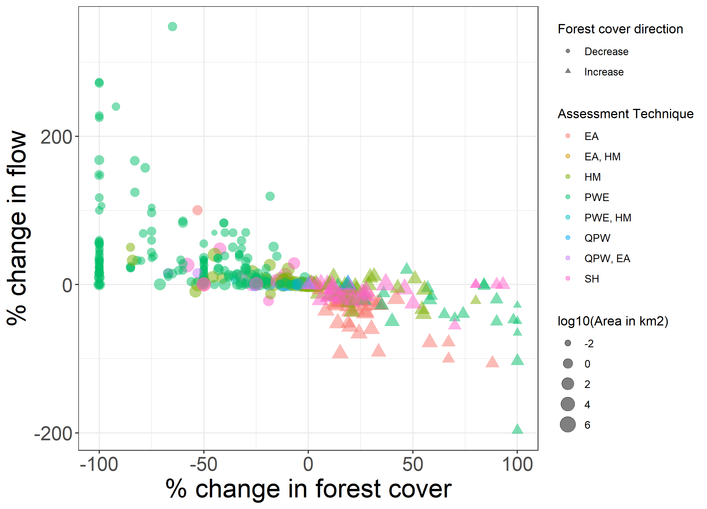

Introduction
==========================

There has been an long and on-going discussion in the hydrologcal literature around the impact of forests on streamflow [@andreassian2004; @jackson2005; @zhang2017; @brown2005; @brown2013; @filoso2017]. The historic work highlights a general consensus that if forest areas increase, streamflow decreases and vice-versa. The most dramatic result in relation to this, is Figure 5 in @zhang2011 indicating (for Australian catchments) a 100% decrease in streamflow for catchments with 100% forest cover. However, on the other end of the spectrum, for three French catchments [@cosandey2005], there was no change in streamflow characteristics in two of the catchmensts after deforestation.

<!-- Include Filoso paper -->
For the purpose of this paper, *watershed* and *catchment* are interchangeable terms. Many of the US studies use *watershed*, while European and Australian studies use *catchment*. In particular, we retained the term "paired watershed studies" as this is the most common terminology, but further mostly use the term catchment.

Several review papers have summarized the plethora of forestation and deforestation studies across the globe, in relation to paired watershed studies [@brown2005; @hewlett1984], related to reforestation in particular [@filoso2017], and more generally [@jackson2005; @zhang2017].  These studies aim to generalize the individual findings and to identify if there are global trends or relationships that can be developed. The most recent reviews [@zhang2017; @filoso2017] developed an impressive global database of catchment studies in relation to changes in streamflow due to changes in forest cover. The @zhang2017 dataset, which covers over 312 studies, is described in terms of the change in streamflow as a result of the change in forest cover, where studies related to both forestation (increase in forest cover) and deforestation (decrease in forest cover) were included. In contrast, the paper by @filoso2017 focused primarily on reforestation, and covered an equally impressive database of 167 studies using a systematic review. In this case the collected data is mostly coded as count data and only a subset of 37 studies was analysed for actual water yield change. There is some overlap between the two data sets, but there are also some studies unique to both sets.

The conclusions of the first paper [@zhang2017] suggest that there is a distinct difference in the change in flow as a result of forestation or deforestation between small watersheds (catchments), defined as < 1000 km^2^ and large watersheds (catchments) > 1000 km^2^. While for small catchments there was no real change in runoff with changes in cover, for large catchments there was a clear trend showing a decrease in runoff with and increase in forest cover. Their main conclusion was that the response in annual runoff to forest cover was scale dependent and appeared to be more sensitive to forest cover change in water limited catchments relative to energy limited catchments [@zhang2017].

The second study [@filoso2017] was a systematic review which classified the historical research and highlighted gaps in the spatial distribution, the types of studies and the types of analysis. Their main conclusion was also that reforestation decreases streamflow, but that there were many interacting factors. For a subset of quantitative data (37) they showed a log-linear relationship between decreasing catchment size and an increasing decline in streamflow. In addition, they identified that studies with shorter periods of data collection resulted in larger declines in streamflow.

A final summary paper that includes much of the same data as @zhang2017 and @filoso2017 is @zhou2015, which has one author in common with @zhang2017. However, this paper aims to explain the variation in the data using the Fuh model, and in particular aims to link the variation in the observed data to variations in the exponent *m* in the model. A key observation is that in drier environments, the effects of deforestation are much greater than in wetter environments, which is also suggested by Figure 4 in @zhang2017. 

Encouraged by the work presented by @zhang2017, @filoso2017 and @zhou2015 and the large database of studies presented by these authors, we believe more can be done to add to this important discussion. In this paper, the aim extend the analysis of the collected data and to expand and combine the data sets. 

In particular, the main method in the work by @zhang2017 is a single covariate linear regression, and in @filoso2017 the focus is mainly on classification and there is again some single covariate linear regression. As @zhang2017 points out, a main assumption in their work is that the catchment size threshold at 1000 km^2^ is a distinct separation between "small" and "large" catchments. However, the subset of 37 data points in @filoso2017 (their Figure 9) does not appear to support this, suggesting a continuum. And while the work @filoso2017 provides important insights in study types, analysis types, forest types and broad classification, there is limited quantification of actual impact, and focussed only on forest cover increase and did not deal with forest cover removal.    

As a result the objective of this paper is to 1) enhance the data set from @zhang2017 with further catchments (such as from @filoso2017) and spatial coordinates and 2) to analyse the possibility of non-linear and confounding partial effects of the different factors and variables in the data using generalised linear (GLM) and generalised additive models (GAM @wood2006).

Building on the analyses by @zhang2017 and @filoso2017, and combining their conclusions, the main hypothesis to test is that the change in streamflow is impacted by the change in forest cover. However, this change is is potentially modulated by the area under consideration (affecting the length of the flowpaths @zhou2015), the length of the study (c.f. @jackson2005; @filoso2017) and  the climate (as indicated by either E0/Pa or latitude and longitude @filoso2017; @zhou2015).

However, there could be further confounding factors, which are eluded to by @filoso2017:  

* the type of analysis, i.e. paired watershed studies, modelling, time series analysis etc.

* the age of the study, assuming that historical studies might not have had the ability to measure at the accuracy that currently is available to researchers, or that more careful historical attention to detail in field studies might have been lost more recently due to reductions in research investment.  

Finally, this work aims to point to further research that can expand this area of work, based on the collected data, to better understand the impact of forest cover change on streamflow.

Methods
==========

## The original data sets

The starting point of this paper is the data base of studies which were included in @zhang2017 as supplementary material. The columns in this data set are the catchment number, the	catchment name, the	Area in km^2^, the annual average precipitation	(Pa) in mm, the	forest type, hydrological regime, and climate type, the change in forest cover	in \% ($\Delta F\%$) and the change in streamflow in \% $(\Delta Qf\%)$, based on equation 1 in @zhang2017), the precipitation data type, the assessment technique, and the	source of the info, which is a citation. 
Several of these columns contain abbreviations to describe the different variables, which are summarised in Table 1.  

Table 1  Summary of abbreviations of factors used in the @zhang2017 data set

|Factor | Abbreviation | Definition |
|:------------|:-------|:----------|
| forest type | CF |coniferous forest | 
|  | BF | broadleaf forest |
|  | MF |mixed forest  |
|hydrological regime|RD|rain dominated|
| |SD|snow dominated|
| climate type| EL| energy limited|
| |WL| water limited|
| |EQ| equitant|
|precipitation data type|OB|observed|
| |SG|spatial gridded|
| |MD|modelled|
|assessment technique|PWE|paired watershed experiment|
| |QPW|quasi-paired watershed experiment|
| |HM|hydrological modelling|
| |EA|elastictity analysis|
| |SH|combined use of statistical methods|
| | |and hydrographs|

While @zhang2017 use the dryness index in their analysis, and calculate the variable climate type from this index, the potential or reference evapotranspiration was not originally included as part of the published data set. In this paper, we used only the dryness index and did not use the climate type as a variable (as they are interchangeable).
We combined the tables for small catchments (< 1000 km^2^) and large catchments (>= 1000 km^2^) in our analysis. 

## Additional data collection

To enhance the existing data set, this study added additional variables and cross-checked the studies with the data set from @filoso2017. In particular, we focussed on the 37 data points included in the quantitative analysis in @filoso2017.

In addition, additional variables added were the latitude and longitude for the centre of the catchment as an approximation of its spatial location. Using this information  reference evapotranspiration (E~0~) was extracted from the Global Aridity Index and Potential Evapo-Transpiration (ET~0~) Climate Databasev2 [@trabucco2018]. For large catchments, this value, similar to annual average rainfall, is only an approximation of the climate at the location. 

Similar to @zhang2017, the "dryness index" was calculated from the reference evapotranspiration and the annual average rainfall (Pa) as:

\begin{equation}
D = \frac{E_{0}}{Pa} (\#eq:eq1)
\end{equation}

The length of the study can be a variable influencing the change in flow [e.g. @jackson2005; @filoso2017], as for example, more mature plantations are thought to have smaller impacts on flow or regrowth might follow a "Kuczera curve" [@kuczera1987]. Therefore, the length of the study calculate as the difference between the starting data and completion date of the different studies was extracted from the references provided by @zhang2017. The length of the study was already included in the data from @filoso2017, but these were checked against the original publications.

Several additional data points from catchment studies were extracted from @zhang2011, @zhao2010, @borg1988, @thornton2007, @zhou2010, @rodriguez2010, @ruprechtetal1991 and @pena-arancibia2012, and these were checked against the existing studies to prevent overlap. In the citation column in the data set, in general the main reference for the calculated change in streamflow  was used, because sometimes the original study did not provide the quantification of the change in streamflow (i.e. Table 6 in @zhang2011).
We also removed one data point from the analysis, which corresponds to catchment #1 (Amazon) in @zhang2017. This is because the cited reference [@roche1981] only relates to 1  and 1.5 ha paired catchment studies in French Guyana, and in which the actual change in forest cover is not recorded. Furthermore, the change in flow for catchment #76 was corrected from 600% to 157% after review of the original publication [@baker1984]. Finally, on review of all the data in @zhang2017 and @filoso2017 and the additional studies, 29 potential duplicates were identified and flagged in the data.  

The final column in the improved data set is a "notes" column, which is not further used in the analysis, but gives context to some of the data for future research and highlights some of the discrepancies that we found between the original papers and the data in the tables from @zhang2017. 

## Statistical modelling

<!----
The starting point consists of the two tables in the supplementary data from Zhang et al. (2017), which means there is one table for small watersheds (< 1000 km2) and one table for large watersheds (> 1000 km2). We might combine these tables as we can easily add a variable indicating whether the watershed originates from the small or large table.
--->
```{r, echo = F, message = F}
require(tidyverse)
require(lubridate)
require(mgcv)
require(visreg)
require(patchwork)
suppressWarnings(require(knitr))
suppressWarnings(require(bookdown))
suppressWarnings(require(pander))

Zhang_small <- read_csv("../../data/TablesZhangetal2017_small.csv")
Zhang_large <- read_csv("../../data/TablesZhangetal2017_large.csv") %>%
  mutate(Complete = 1,
         `Possible duplicate` = 0)
new_data <- read_csv("../../data/TableNewData.csv")
```

<!-- read in the ET data -->
<!-- no longer needed as this is now included in the data
```{r, echo = F, warning = F, message=F}
PET_large <- read_csv("../../data/largeET.csv")
PET_small <- read_csv("../../data/smallET.csv")


# drop columns and make sure the titles are the same
PET_large <- PET_large %>%
  rename(Latitude = Latitiude,
         E0 = rvalue_1,
         `Watershed #` = Watershed)

PET_small <- PET_small %>%
  select(site_name, lat, long, rvalue_1) %>%
  rename(Latitude = lat,
         Longitude = long,
         `Watershed #` = site_name,
         E0 = rvalue_1)

# 
PET_all <- bind_rows(PET_large, PET_small)
# There are 7 missing E0 values
# > PET_all$`Watershed #`[is.na(PET_all$E0)==T]
# [1]  38 278 269 243 236 299 250
```
--->

<!--- ### change names of columns
the package`mgcv` does not seem to be happy with complex names, so probably better to make all names simple --->

```{r, echo = F}
names(Zhang_small)[3:4] <- c("Area_km2", "Pa_mm")
names(Zhang_large)[3:4] <- c("Area_km2", "Pa_mm")
names(new_data)[3:4] <- c("Area_km2", "Pa_mm")
names(Zhang_small)[5:6] <- c("Forest_type", "Hydrological_regime")
names(Zhang_large)[5:6] <- c("Forest_type", "Hydrological_regime")
names(new_data)[5:6] <- c("Forest_type", "Hydrological_regime")
names(Zhang_small)[9:10] <- c("Precip_data_type", "Assessment_technique")
names(Zhang_large)[9:10] <- c("Precip_data_type", "Assessment_technique")
names(new_data)[9:10] <- c("Precip_data_type", "Assessment_technique")

```

<!-- combine both tables -->

```{r, echo = F, warning = F}
Zhang_small$From <- as.numeric(Zhang_small$From)
Zhang_small$To <- as.numeric(Zhang_small$To)
Zhang_all <- bind_rows(Zhang_large,Zhang_small) %>%
  mutate(dataset = "original Zhang et al data")
new_data <- new_data %>%
  mutate(dataset = "new data")
All_data <- bind_rows(Zhang_all, new_data)
```

<!--filter duplicates -->
```{r, echo = F}
All_data <- All_data %>%
  mutate(`Possible duplicate` = 
           ifelse(is.na(`Possible duplicate`)==T,0,`Possible duplicate`),
         `Possible duplicate` = as.numeric(`Possible duplicate`)) %>%
  filter(`Possible duplicate` != 1)
```

```{r, eval = F, echo = F}
# checking missing values
summary(All_data)


```


<!--now combine with E0 values -->
<!-- No longer needed as now included in the data -->
```{r, echo = F}
# All_data <- left_join(All_data ,PET_all %>% select(-c(Longitude, Latitude)), by = "Watershed #")
# All_data <- All_data %>%
#   mutate(E0 = ifelse(is.na(E0.x)==T, E0.y, E0.x)) %>%
#   select(-c(E0.x,E0.y)) #%>%
#   #rename(Latitude = Latitude.x,
# #         Longitude = Longitude.x)

# calculate dryness index
All_data <- All_data %>%
  mutate(Dryness = E0/Pa_mm)
```

<!--remove the Amazon from the analysis -->
```{r, echo = F}
All_data <- All_data %>%
  filter(`Watershed #` != 1)
```

<!-- correct watershed #76 (Baker1984) to be 157 for DeltaQf_perc -->

```{r,echo = F}
All_data <- All_data %>%
  mutate(DeltaQf_perc = ifelse(`Watershed #` == 76,157,DeltaQf_perc))
```

To estimate how the change in streamflow is affected by the change in forest cover while considering the effects of the other variables, we applied generalised additive modelling (GAM) [@wood2006]. 

The general model tested is:

\begin{align}
\Delta Qf \% \sim &~ \Delta \% forest~cover_{positive} + sign_{forest~cover} + \notag \\ 
& \sum{X_i} + \sum{s(Z_i)} + \varepsilon (\#eq:eq2)
\end{align}


Here $X_i$ are factorial variables, while $Z_i$ are continuous variables. The model assumes no direct interactions and all variables are additive. The changes in forest cover contain both positive (forestation) and negative values (deforestation). In @zhang2017, these changes were jointly analysed, assuming the effect on the change in flow was linear and the effect if removing forest cover was the same as an equivalent reforestation. However, the impact of an increase in forest cover can be different from the same fractional decrease in forest cover. Therefore all the change in forest cover data is converted to positive values, and an additional column ($sign_{forest cover}$) is added that indicates whether it was a forest cover increase or decrease. 
A further assumption in the model is that all continuous variables $Z_i$ (such as annual precipitation (Pa)) can have a linear or non-linear relationship with $\Delta Qf \%$. This means that a smooth function $s()$ is applied to the $Z_i$ variables. For the smoothing function we applied thin plate regression splines with an additional shrinkage penalty which means the terms can be shrunk to 0 if not significant [@wood2006].

For the model in equation 2, we initially only used the data from @zhang2017 to make sure that the additional catchments added to the data set did not influence the results. Subsequently the analysis was repeated and the additionally identified catchments were added. 

More generally the results were analysed to identify:  
1. the significance of the different variables  
2. the direction of the categorical or shape of the smooth variables  


Results
===========

<!-- analysis -->
## description of the data

The overall dataset contains `r nrow(All_data)` observations of changes in flow, which includes the newly identified data sets and after removing identified duplicate data and lines with missing data. In contrast, the original dataset from @zhang2017 contained `r nrow(Zhang_all)` catchments and the @filoso2017 study used 37 catchments (Table S2 in @filoso2017). The overall distribution of changes in flow is highly skewed as is the distribution of changes in forest cover and Area. The values of changes in flow greater than 100\% and smaller than -100\% clearly create long tails on the change in flow distribution. Note also the large number of studies with 100\% forest cover reduction. Smaller catchments dominate the database with 42\% of the data from catchments < 1 km^2^ and 65\% of the data for catchments < 10 km^2^.

```{r, echo = F, warning = F, message=F, eval =F}
png("DataExploration.png", width = 2500, height = 1800, res = 300)
All_data %>%
  pivot_longer(c(DeltaF_perc, DeltaQf_perc, Area_km2, Pa_mm, E0), 
               names_to = "variable", values_to = "value") %>%
  ggplot(aes(value)) + geom_histogram(fill = "steelblue", bins=50) + theme_bw() +
  facet_wrap(~variable, scales = "free", labeller = labeller(variable = 
    c("Area_km2" = "Area (km2)",
      "DeltaF_perc" = "Delta Forest (%)",
      "DeltaQf_perc" = "Delta Qf (%)",
      "E0" = "Annual E0 (mm)",
      "Pa_mm" = "Annual Rainfall (mm)"))) +   
  theme(axis.title = element_text(size = rel(1.5)),
        axis.text = element_text(size = rel(1.2)),
        strip.text = element_text(size = rel(1.5)),
        axis.text.x = element_text(angle = 45, hjust = 1))
dev.off()
```

(ref:datagraphscaption) Overview of the distribution of the data set for five of the included variables.

```{r datagraphs, echo=F, out.width="90%", fig.cap="(ref:datagraphscaption)"}

include_graphics("./DataExploration.png")
```


```{r, echo = F}
All_data2 <- All_data %>%
  mutate(Forest_Sign = ifelse(DeltaF_perc < 0,
                              "Decrease", "Increase"),
         DeltaF_perc_pos = ifelse(DeltaF_perc < 0,
                                  -1*DeltaF_perc,
                                  DeltaF_perc))
```

```{r, echo = F, warning = F, message=F, eval =F}
# plot to show the difference
png("Increase_decrease.png", width = 2500, height = 1800, res = 300)
All_data2 %>%
  filter(is.na(DeltaF_perc_pos) == F) %>%
  ggplot(aes(DeltaF_perc_pos,DeltaQf_perc, colour = Forest_Sign)) + 
  geom_point() +  
  facet_wrap(~Forest_Sign, ncol=1, scales = "free") + 
  theme_bw() + 
    theme(axis.title = element_text(size = rel(1.5)),
        axis.text = element_text(size = rel(1.2)),
        legend.text = element_text(size = rel(1.2)),
        legend.title = element_text(size = rel(1.2)),
        strip.text = element_text(size = rel(1.5))) + 
  scale_colour_manual(name = "Forest change direction", 
                      values = c("Decrease" = "red", "Increase" = "blue")) +
  xlab("Change in forest cover %") + ylab("Change in flow (Qf) %")
dev.off()

```


```{r increasedecrease, echo =F, fig.cap="Changes in flow as a function of increases and decreases in forest cover", out.width="90%"}
include_graphics("Increase_decrease.png")
```


This shows that for the data related to forest decreases, there is almost always a positive flow change. In other words, flow almost always increased. However, for increases in forest cover, this is not the case, and flow can both increase and decrease. However in both cases the variability in the reported change in flow increases with the increase in forest cover change.


## The general relationship between change in forest cover and streamflow

Following @zhang2017, the first step is to investigate the percent change in flow as a linear effect of the percent change forestry and modulated by the direction of the change, either an increase in forest cover, or decrease in forest cover:


\begin{equation}
\Delta Qf \% \sim ~ \Delta \% forest~cover_{positive} + sign_{forest~cover} + \varepsilon (\#eq:eq3)
\end{equation}

```{r model1, echo = F}
linear_model_simple <- gam(DeltaQf_perc ~ DeltaF_perc_pos +
                             Forest_Sign, 
                           data = All_data2 %>% filter(dataset == "original Zhang et al data"))
#summary(linear_model_simple)
#gam.check(linear_model_simple)

```

```{r model1b, echo = F}
linear_model_simple_b <- gam(DeltaQf_perc ~ DeltaF_perc_pos +
                             Forest_Sign, 
                           data = All_data2)
#summary(linear_model_simple)
r_sq <- round(summary(linear_model_simple_b)$r.sq,2)
```


```{r, echo =F}
pander(round(rbind(summary(linear_model_simple)$p.table,
                       summary(linear_model_simple_b)$p.table),2), caption="(\\#tab:tabmodel1) Summary results of the first regression model predicting change in streamflow from change in forest cover and accounting for the direction of the change. The first three rows relate to the model using the original data base from Zhang et al. (2017). The bottom three rows are the results of the model including the new data")
```

The overall variance explained in this model (equation \@ref(eq:eq3)) is not high with an adjusted *r^2^* of `r r_sq`, it generally supports the hypothesized relationship between the change in forest cover and the change in flow. The model suggests that for every 1\% change in forest cover, on the average, the flow changes 0.45\%. However the change in flow is different for forest cover decreases compared to forest cover increases. In fact, forest cover increases decrease flow by 29\% less than a similar decrease in forest cover causes flow to increase. So roughly speaking, a 1\% forest cover increase on the average decreases flow by $(1 - 0.29)*0.45\%$, while a the percentage forest cover decrease will increase flow by 0.45\%.

```{r, eval = F, echo = F}
png("residual_plot_model1.png", width = 2500, height = 1800, res = 300)
par(mfrow=c(2,2))
gam.check(linear_model_simple)
par(mfrow=c(1,1))
dev.off()
```

```{r gamcheck, echo =F, fig.cap="Residual plots for the first simple regression model indicating a slightly fat-tailed residual distribution", out.width="90%"}
include_graphics("residual_plot_model1.png")
```

Of importance here is to highlight the residuals of this regression (equation \@ref(eq:eq3) and Figure \@ref(fig:gamcheck)). These are approximately normal, although there is still significant skew on the upper and lower parts of the distribution (Figure \@ref(fig:gamcheck)). In other words, the distribution of the residuals is somewhat fat-tailed. We will discuss this later.

Including the data from some of the newly identified studies indicates that this mainly strengthens the difference between the forest cover increases and decreases (Table \@ref(tab:tabmodel1)), and the result indicate a reduction in the mean decrease in flow as a result of forest cover change if the new data is included.

It is however it is clear from the lack of explaining power for the model, that there could be confounding factors, as alluded to in the methods. The obvious ones being catchment dryness and area (following @zhang2017), which we will analyse later. 

## The effect of location on the globe
<!-- include Lat and Long (later E0) -->

```{r globalmap, fig.cap="Distribution of included catchments across the globe based on reported or estimated latitude and longitude", out.width="90%", echo=F}  

include_graphics("../../data/FAOET0data.png")
```

As indicated, an initial hypothesis relates to whether there is a strong spatial global gradient as captured by latitude and longitude. These data were added for the different studies, mostly by using the data reported by the authors, but in some cases approximating the location of the centre of the catchment using Google Maps. In the dataset, an additional column is added to indicate the source of the location data.  As the global map (Figure \@ref(fig:globalmap)) shows, the distribution of case study catchments covers multiple continents and shows some distinct clustering in parts of the world. Of interest is whether the spatial clustering also indicates a difference in response to forest cover change:

\begin{align}
\Delta Qf \% \sim ~ & \Delta \% forest~cover_{positive} + sign_{forest~cover} + \notag \\ &  Latitude + Longitude + \varepsilon (\#eq:eq4)
\end{align}


```{r model3, echo = F}
model3_includeLatLong <- gam(DeltaQf_perc ~ DeltaF_perc_pos + Forest_Sign + Latitude + Longitude, data = All_data2)
#summary(model3_includeLatLong)
#gam.check(model3_includeLatLong)
```

```{r, echo =F}
pander(round(summary(model3_includeLatLong)$p.table,2), caption= "(\\#tab:out-model3) Results of the model including Latitude and Longitude including new data")
```


There appears to be no significant gradient in either latitude or longitude (Table \@ref(tab:out-model3)), suggesting that the distribution of the catchments across the globe has little influence on the overall result. The total explaining power of the model is still low with an adjusted *r^2^* of `r round(summary(model3_includeLatLong)$r.sq,2)` suggesting further factors influencing the change in streamflow that are currently not included in the model.

## Impact of climate

Climate, and in particular evapotranspiration can have a significant effect on the streamflow change as represented by the dryness index, which is also highlghted by both @zhang2017 and @jackson2005. Increased evapotranspiration could lead to drier catchments, unless balanced by rainfall (such as possibly in the tropics). Initially, we tested models using annual average precipitation (*Pa (mm)*), but because of the interactions between precipitation, evapotranspiraton and the dryness index, we concentrated on the dryness index as the key variable. Given that Latitude and Longitude were not significant, we dropped these from the model. 


\begin{align}
\Delta Qf \% \sim ~ & \Delta \% forest~cover_{positive} + sign_{forest~cover} + \notag \\ & Dryness + \varepsilon (\#eq:eq5)
\end{align}


<!-- include Dryness index -->

```{r model4, echo = F}
#Zhang_all2 <- Zhang_all2 %>%
#  mutate(length = To - From)
model4_dryness <- gam(DeltaQf_perc ~ DeltaF_perc_pos + Forest_Sign +  
                        Dryness, data = All_data2)
#summary(model4_dryness)
#gam.check(model4_dryness)
```

```{r, echo =F}
pander(round(summary(model4_dryness)$p.table,2), caption = "(\\#tab:out-model4) Results of the model including the dryness index")
```
```{r testing_dryness, echo = F, eval= F}
All_data2 %>% ggplot(aes(Dryness,log10(Area_km2), colour = DeltaF_perc_pos)) + geom_point() + theme_bw()
```
```{r testing_PCA, eval = F, echo = F, warning = F}
require(FactoMineR)
require(factoextra)
 res.pca <- PCA(All_data2 %>% mutate(length = To - From) %>% select(`Watershed #`, `Watershed name`, Area_km2, DeltaF_perc, DeltaQf_perc,  Dryness,  From, length), scale.unit = TRUE, ncp = 4, quali.sup = 1:2, graph=FALSE)
 # scree.plot <- fviz_eig(res.pca, addlabels = TRUE, ylim = c(0, 41))
 #  scree.plot
 #  
 #   var.plot <- fviz_pca_var(res.pca, axes = c(1, 2), col.var = "black")
 #  var.plot
 png("PCA_biplot_Alldata.png", width = 800, height = 800)
  biplot_test <- fviz_pca_biplot(res.pca, axes = c(1, 2), repel = TRUE,
                                                      col.var = "darkblue", # Variables color
                            label="var", #"var" 
                            col.ind = "red", # Individuals color
                            title = "",labelsize = 8, pointsize = 4, arrowsize = 1) +
        theme(text = element_text(size = 14, face = "bold"),
              axis.title = element_text(size = rel(2), face = "bold"),
        axis.text = element_text(size = rel(2), face = "bold"))
 print(biplot_test)
 dev.off()

```


The results from this model (equation \@ref(eq:eq5) and Table \@ref(tab:out-model4)) indicate no impact of dryness on the change in streamflow as a function of the change in forest cover change, which is surprising in light of earlier reported results [@zhang2017; @filoso2017]. In this case the evidence is highly doubtful (p = `r round(summary(model4_dryness)$p.table[4,4],2)`). However, it is very well possible that there is a further interaction in the data that this simpler version of the model cannot identify. Again, overall variance explained is not very much, with an adjusted *r^2^* of `r round(summary(model4_dryness)$r.sq,2)`.

```{r, echo = F}
pander(All_data2 %>% filter(Dryness > 4) %>% select(Latitude, Longitude,`Watershed name`), caption = "(\\#tab:drytable) catchments for which the dryness index > 4")
```

There are also possible issues with the data, a few of the catchments have Dryness values that are very large (> 4) and these values have high leverage in the data, affecting the residual distribution. These catchments are listed in Table \@ref(tab:drytable).

## Is there a distinct effect of area?

The major hypothesis to test is the effect of area on the change in flow, following the analysis by @zhang2017 and @filoso2017. Given the highly skewed distribution of the catchment areas (Figure \@ref(fig:datagraphs)), a log base 10 transformation was applied to the variable *Area (km^2^)*. The effect of Dryness remains in the model, given that there could be interactions that are worth exploring. 

\begin{align}
\Delta Qf \% \sim ~ & \Delta \% forest~cover_{positive} + sign_{forest~cover} + \notag \\ & log10(Area ~(km^2)) + Dryness + \varepsilon (\#eq:eq6)
\end{align}

```{r modelArea, echo = F}
#Zhang_all2 <- Zhang_all2 %>%
#  mutate(length = To - From)
model_Area <- gam(DeltaQf_perc ~ DeltaF_perc_pos + Forest_Sign +  
                        Dryness + log10(Area_km2), data = All_data2)
#summary(model_Area)
#gam.check(model_Area)
```

```{r, echo =F}
pander(round(summary(model_Area)$p.table,2), caption = "(\\#tab:out-modelArea) Results of the model including Area and the dryness index")
```

The results of this model (Equation \@ref(eq:eq6)) indicate a reduction in the effect of forest cover change with Area (km^2^) (Table \@ref(tab:out-modelArea)). In fact, the results suggests that for every additional 10 km^2^ in catchment size the mean change in flow reduces by 3.5\%. Another interesting fact to note is that with the inclusion of Area (km^2^) as a variable in the model, the effect of Dryness becomes more significant, possibly suggesting an interaction between Dryness and Area. Including this interaction suggest that the interaction term (log10(Area) by Dryness) would be significant, but this replaces the effect of Area (results not shown). 


```{r modelArea_b, echo = F, eval =F}
#Zhang_all2 <- Zhang_all2 %>%
#  mutate(length = To - From)
model_Area_b <- gam(DeltaQf_perc ~ DeltaF_perc_pos + Forest_Sign +  
                        Dryness*log10(Area_km2), data = All_data2)
summary(model_Area_b)
#gam.check(model_Area)
```

## Are some of the variables possibly non-linear?

The work by @filoso2017 and earlier by @jackson2005 has indicated that the length of the study might influence the response. This links to the idea from @kuczera1987 that the effect of logging or deforestation or reforestation reduces with the length of time post intervention (see also @jackson2005). In addition to adding *length* (being the difference between the reported start date and end date of data collection in the specific study) as a variable, three other continuous variables (*Dryness, Area, From*) were considered non-linear in this model. This is also indicated a shrinkage smoothing spline [@wood2006] was applied to these variables. *From* represents the starting date of the data collection.


\begin{align}
\Delta Qf \% \sim &~ \Delta \% forest~cover_{positive} + sign_{forest~cover} + \notag \\ & s(log10(Area ~(km^2)) + s(length) + s(Dryness) + \\ & s(From) + \varepsilon (\#eq:eq7)
\end{align}


```{r model5, echo = F}
All_data2 <- All_data2 %>%
  mutate(length = To - From)

model5_all <- gam(DeltaQf_perc ~ DeltaF_perc_pos + Forest_Sign + 
                    s(log10(Area_km2), bs="ts") + s(Dryness, bs="ts") + 
                    s(length, bs="ts") + s(From, bs = "ts") ,
                  data = All_data2)
#summary(model5_all)
#gam.check(model5_all)
#plot(model5_all)
```


```{r , echo = F}
pander(round(summary(model5_all)$p.table,2), caption = "(\\#tab:mfive-linear) Statistical summary for the linear terms in the model with non-linear terms")
```

```{r , echo = F}
pander(round(summary(model5_all)$s.table,2), caption = "(\\#tab:mfive-smooth) Statistical summary for the smooth terms in the model with non-linear terms")

```


Including non-linearity (Equation \@ref(eq:eq7)) increases the overall explaining power of the model to an adjusted *r^2^* of `r round(summary(model5_all)$r.sq,2)` and deviance explained of `r round(summary(model5_all)$dev.expl,2)`, but creates a few changes in the significance of the variables (Table \@ref(tab:mfive-smooth)). For example, the smoothed variable for Area (km^2^) is no longer a strong effect explaining variations in changes in stream flow. Clearly *length* is also not explaining the variation. In contrast, *From*, which indicate the start date of the study (and therefore the age of the study) is a significant effect.  
However, it also increases the chance of over fitting, as the smoothing splines allow significant flexibility, which will be investigated later. Including interactions into the smooths is possible, but the results are even more difficult to interpret given the high flexibility of the two-dimensional smooth.

A final model includes the remaining categorical variables (Precipitation data type, Assessment technique, Forest type and Hydrological regime).

```{r model6_all, echo = F}


model6_all <- gam(DeltaQf_perc ~ DeltaF_perc_pos + Forest_Sign + 
                    s(log10(Area_km2), bs="ts") + s(Dryness, bs="ts" ) + 
                     s(length, bs="ts") + s(From, bs = "ts") +
                    Precip_data_type +  Assessment_technique + Forest_type +
                    Hydrological_regime
                    , data = All_data2)
#summary(model6_all)
#gam.check(model6_all)
#plot(model6_all)
```

```{r, echo = F}
pander(round(summary(model6_all)$p.table,2), caption = "(\\#tab:msix-linear) Statistical summary for the linear terms the full model")
#plot(model6_all)
```

```{r , echo = F}
pander(round(summary(model6_all)$s.table,2), caption = "(\\#tab:msix-smooth) Statistical summary for the smooth terms for the full model")
#plot(model6_all)
```

This model explains more of the variance, but the improvement is marginal compared to the previous model with a deviance explained of `r round(summary(model6_all)$dev.expl,2)`. This indicates that the categorical variables explain a limited amount of the variance. However, interesting to note from Table \@ref(tab:msix-linear) that several of the assessment methods are significant. In particular Paired Watersheds experiments (PWE), Hydrological modelling (HM) and Statistical techniques (SH) are strongly significant ($p < 0.05$). 
In this case, *Area (km^2)* is no longer a significant predictor. 


```{r visualisesmooths,echo =F, eval = F}
#require(visreg)
png("model6_smooths.png", width = 2500, height = 1800, res = 300)
#par(mfrow=c(2,2))
D <- visreg(model6_all, "Dryness", gg = T, plot = T) + theme_bw()
A <- visreg(model6_all, "Area_km2", gg = T, plot = T) + theme_bw() + scale_x_log10()
L <- visreg(model6_all, "length", gg = T, plot = T) + theme_bw()
From <- visreg(model6_all, "From", gg = T, plot = T) + theme_bw()
(D + A) / (L + From) 
# visreg(model6_all,"Dryness",gg=T) + theme_bw()
# visreg(model6_all,"length",gg=T, add=T) + theme_bw()
# visreg(model6_all,"Area_km2",gg=T, add=T) + theme_bw() + scale_x_log10()
#par(mfrow=c(1,1))
dev.off()
```


```{r smoothsmodel6, fig.cap="Visualisation of the smooth variables in the model", out.width="90%", echo=F}  

include_graphics("model6_smooths.png")
```


Figure \@ref(fig:smoothsmodel6) highlights that the relationship between log10(Area km^2^) and the change in flow is essentially linear, not significant, and does not need to be smoothed (this is the value of using penalized smooths following @wood2006). It still has a negative slope, indicating that in larger catchments the impact of changes in forest cover on streamflow is less than for smaller catchments. Similarly, the length variable is not significant. However, both the length and Dryness variables show non-linearity, but this does not show a clear trend due to the scatter and the distributions of the data.


<!--filter length < 60 -->
```{r model7_nolongLength, echo = F}
NoLong_Data <- All_data2 %>% filter(length< 60, Dryness <= 4, From > 1930)
model7 <- gam(DeltaQf_perc ~ DeltaF_perc_pos + Forest_Sign + 
                    s(Dryness, bs="ts" ) + #s(Latitude, bs="ts") + 
                      s(log10(Area_km2), bs = "ts") + s(length, bs = "ts") + s(From, bs = "ts") +
                    Precip_data_type +  Assessment_technique + Forest_type +
                    Hydrological_regime, data = NoLong_Data)
#summary(model7)
```
```{r, echo = F}
pander(round(summary(model7)$s.table,2), caption = "(\\#tab:restrictlength) Statistical summary of the smooth terms reducing dataset to studies with the study length shorter than 60 years")
```
```{r visualisesmooths7,echo =F, eval = F}
#require(visreg)
png("model7_smooths.png", width = 2500, height = 1800, res = 300)
#par(mfrow=c(2,2))
D <- visreg(model7, "Dryness", gg = T, plot = T) + theme_bw()
A <- visreg(model7, "Area_km2", gg = T, plot = T) + theme_bw() + scale_x_log10()
L <- visreg(model7, "length", gg = T, plot = T) + theme_bw()
From <- visreg(model7, "From", gg = T, plot = T) + theme_bw()
(D + A) / (L + From) 
# visreg(model6_all,"Dryness",gg=T) + theme_bw()
# visreg(model6_all,"length",gg=T, add=T) + theme_bw()
# visreg(model6_all,"Area_km2",gg=T, add=T) + theme_bw() + scale_x_log10()
#par(mfrow=c(1,1))
dev.off()
```
```{r smoothsmodel7, fig.cap="Visualisation of the smooth variables in the model with reduced data for dryness and length", out.width="90%", echo=F}  

include_graphics("model7_smooths.png")
```


The flexible nature of the splines means that the length variable captures some substantial variation in the data, but it is unclear what exactly is captured. The shape of the conditional response (Figure \@ref(fig:smoothsmodel6)) also does not reflect the type of response highlighted in @filoso2017 and @jackson2005. One reason could be the few data points with very long data series, and very old studies (before 1930 essentially), and highly variable responses (Figure \@ref(fig:smoothsmodel6)). Reducing the flexibility of the splines, removing any studies longer than 60 years and removing the 4 studies with Dryness > 4 (Table \@ref(tab:restrictlength)) results in log10(Area) once again showing a significant effect with larger catchments having less impact of changes in forest cover. Dryness now shows a clear non-linear response with drier catchments having a greater impact of changes in forest cover. Finally, more recent studies also show greater impacts of changes in forest cover (Figure \@ref(fig:smoothsmodel7)).


```{r, echo = F, eval =F}
png("flow_forest_byArea.png", width = 2500, height = 1800, res = 300)
All_data2 %>%
  ggplot(aes(DeltaF_perc_pos, DeltaQf_perc, colour = Assessment_technique,size = log10(Area_km2), 
             shape = Forest_Sign)) + geom_point(alpha = 0.5) +
  theme_bw() + ylab("% change in flow") +
  theme(axis.title = element_text(size = rel(2)),
        axis.text = element_text(size = rel(1.5))) +
  xlab("% change in forest cover") + #scale_y_log10() +
  scale_size_continuous(name = "log10(Area in km2)") +
  scale_colour_discrete(name = "Assessment Technique") +
  scale_shape_discrete(name = "Forest cover direction")
dev.off()
```


```{r overview, fig.cap="Overview of the data highlighting the dominance of small catchment studies which are fully forested or cleared and the scatter in the data", out.width="90%", echo=F}  



```


Discussion
======================

## Catchment size

Essentially, the analysis shows that there is a clear effect of catchment size (Figure \@ref(fig:smoothsmodel7)), even though, in contrast to @zhang2017, there is no evidence a distinct threshold in the size of the catchment that influences the change in the streamflow as a result of changes in forestry. If anything the scatter in the data (in the change in flow) is greater for the smaller catchments then for the larger catchments (Figure \@ref(fig:overview)). In other words, the response to changes in forest cover is more consistent for larger catchments than it is for smaller catchments.

An explanation for the catchment size effect might be that large catchments have more storage and longer flow paths and therefore have more opportunity to buffer the effects of forest cover change [@navas2019]. Therefore, specifically if the  forest cover change is small relative to the catchment size, the effect of this change will be buffered. 

```{r, eval =T, echo =F}
# All_data2 %>%
#   ggplot(aes(log10(Area_km2), DeltaF_perc_pos)) + 
#   geom_point(alpha = 0.5) + theme_bw()

Area_deltaF <- lm(DeltaF_perc_pos~log10(Area_km2), data = All_data2)
```

There are two caveats on this explanation. The first is that there is a distinct trend in the data between $\Delta$Forest cover and log10(Area (km^2^)) (linear regression indicates an adjusted *r^2^* of `r round(summary(Area_deltaF)$r.sq,2)` with a slope of `r as.numeric(round(coefficients(Area_deltaF)[2],2))`) indicating that for every 10 km^2^ increase in catchment size on the average the recorded forest cover change is 10% lower. This is basically a result of the fact that large changes in forest cover are difficult to "implement" in an experiment. 
This is also reflected in the second caveat most of the smaller catchments are "real observed data" using paired watershed studies, while for larger catchments, the analysis are mostly based on modelling approximations using either elasticity analysis (EA), Hydrological modelling (HM) or a combined use of statistical methods (SH) or quasi paired watershed analysis (QPW) (Figure \@ref(fig:overview)). These techniques for larger catchments all provide an approximation of the effect of forestry on streamflow rather than a direct comparison of catchments. This is a confounding factor that is not easily addressed in the regression modelling attempted here. Furthermore, the catchments analysed using EA, are concentrated in the drier end of the Dryness index scale compared to the other methods, with only the paired watershed experiment (PWE) assessment technique covering the full range of dryness indices.

In other words, the current data sets cannot resolve whether there actually is a non-linear catchment size × forest cover effect, which then feeds into the buffering in larger catchments.

Apart from a difficulty of analysing complex confounding factors in the data, a general limitation of the type of analysis presented is that this work does not consider the spatial arrangement of the forest clearing in the catchments. While for fully or almost fully cleared smaller catchments this might not be an issue, it is perceivable that for larger catchments being partially cleared, a interaction between spatial location and clearing could be a factor in determining the change in streamflow. Clearing head water catchments on shallower soils might have a larger impact than clearing in downstream areas on deeper soils.    

## Model residuals

As pointed out earlier the residuals of the model diverge from the normal distribution for large positive and large negative residuals. These residuals are mainly associated with the small catchments from the paired watershed studies (Figure \@ref(fig:overview)), which show very high variability. The final model removing the data with large values of Dryness and long study lengths has removed some of the spreading, mainly for the large negative residuals (Figure \@ref(fig:gamcheck7)).  

```{r, eval = F, echo = F}
png("residual_plot_model7.png", width = 2500, height = 1800, res = 300)
par(mfrow=c(2,2))
gam.check(model7)
par(mfrow=c(1,1))
dev.off()
```
```{r gamcheck7, echo =F, fig.cap="Residual plots for the final model indicating a small improvement in the residual distribution towards normal", out.width="90%"}
include_graphics("residual_plot_model1.png")
```

The reason why the regression model is better able to resolve the variance in the data for the negative residuals (generally related to increases in forest cover) compared the large positive residuals might link back to the issue of buffering and flow paths in the catchments. Small catchments that are stripped of most of the forest cover would provide little buffering, interception and infiltration, does leading to greater changes in flow. In contrast, revegetated catchments would have increased interception and buffering and therefore relatively smaller changes in flow. This also provides an explanation for the differences between forest cover removal and forest cover restoration (Figure \@ref(fig:increasedecrease)).

## The effect of assessment techniques with very small numbers of observations
 

```{r, eval =T, echo =F}
Table_assessment <- All_data2 %>%
  group_by(Assessment_technique) %>%
  summarise(n = n()) %>%
  arrange(desc(n))
```
```{r, echo=F}
pander(Table_assessment, caption = "(\\#tab:tableassess) Distribution of assessment techniques in the data set")
```


```{r, eval = F, echo =F}
png("AssessmentTechnique_byArea.png", width = 2500, height = 1800, res = 300)
All_data2 %>%
  ggplot(aes(Assessment_technique, log10(Area_km2))) + 
  geom_boxplot(colour = "blue") + theme_bw() +
    theme(axis.title = element_text(size = rel(2)),
        axis.text = element_text(size = rel(1.5)))
dev.off()
```


```{r assessment, fig.cap="Boxplot of the log base 10 of the catchment area (in km2) for the different assessment techniques, showing the dominance of small catchments in the paired watershed experiments", out.width="90%", echo=F, eval =T}  

include_graphics("AssessmentTechnique_byArea.png")
```


One concern is that there are a few assessment techniques in the original dataset with a very low number of observations and this might skew the results of the analysis. This includes the category of Quasi paired watersheds and combinations of elasticity analysis and hydrological modelling (EA,HM) and paired watersheds and hydrological modelling (PWE,HM) (Table \@ref(tab:tableassess) and Figure \@ref(fig:assessment)).

```{r model8_reduc_assess, echo = F}
All_data3 <- All_data2 %>%
  filter(Assessment_technique != "EA, HM" & Assessment_technique != "PWE, HM" & Assessment_technique != "QPW, EA" )

model8_assess <- gam(DeltaQf_perc ~ DeltaF_perc_pos + Forest_Sign + 
                    s(Dryness, bs="ts" ) + #s(Latitude, bs="ts") + 
                      s(log10(Area_km2), bs = "ts") + s(length, bs = "ts") + s(From, bs = "ts") +
                    Precip_data_type +  Assessment_technique + Forest_type +
                    Hydrological_regime, data = All_data3 %>% filter(length< 60))
#plot(model8_assess)
#summary(model8_assess)

```
```{r, echo = F}
pander(round(summary(model8_assess)$p.table,2), caption= "(\\#tab:model8-linear) Statistical overview of the linear components of the model removing studies with limited observations in the assessment techniques")
pander(round(summary(model8_assess)$s.table,2), caption = "(\\#tab:model8-smooth) Statistical overview of the smooth components of the model removing studies with limited observations in the assessment techniques")

```

Concentrating only on the assessment techniques that have more than 10 observations in the data set does not change much in the results (Table \@ref(tab:model8-linear) and \@ref(tab:model8-smooth)). It strengthens the significance of the different assessment techniques but slightly reduces the importance of some of the smooth variables (*log10(Area (km^2^))* and *From*). Overall this suggests that although those observations have some impact on the overall relationships, they do not strongly bias the outcomes. 

However, the model results also clearly highlight that some of the assessment techniques (in particular paired watershed studies (PWE) and combined use of statistical methods and hydrographs (SH)), have a strong impact on the predicted change in flow. Particularly, relative to EA (elasticity approaches) all other assessment techniques have higher predicted changes in flow. In other words, there is a distinct difference in the way the change in flow is assessed, and the EA method (for example in @zhou2015) appears to suggest a much smaller effect on the change in flow. However, as indicated earlier, the EA studies are all on the drier end of the Dryness spectrum, highlighting another unresolved interaction in the data.

## The effect of climate

In drier catchments, changes in forest cover have greater impact on flow, which is similar to the observations in earlier studies [@zhang2017; @zhou2015; @filoso2017]. This is most likely because in these catchments the overall flow is surface flow dominated and therefore the buffering that is afforded by the groundwater inputs is not as great. As the dataset currently does not include a separate variable for groundwater inputs (although this effect is estimated in several of the studies), the effect again cannot be analysed separately. 

Excluding the few catchments that have very high dryness values, clarified the *Dryness* trend, agreeing with earlier studies and showing a increase in the change in flow for drier catchments. However, this really only starts to have an effect for Dryness > 2. 

## Further considerations

In contrast to @filoso2017, we did not identify the length of the observation period as a significant variable, however, we did find that the start date of the observations was significant. What is puzzling is that the effect of the start date (*From*) had a positive slope indicating that more recent studies measured a greater effect on stream flow of forest cover change. At this point, it is unclear what this trend signifies. It is also possible that there is an interaction between the start date of the observations and the length of the study, as later start dates would never have been able to present long observed data series.  

There are further confounding factors in the data, which were also classified by @filoso2017 and these might create biases in the data set that can impact the overall assessment. For example, snow dominated hydrological regimes (SD), are dominated by Coniferous Forests (CF), while the majority of the rain dominated regimes are all broadleaf of mixed type forests (BF or MF). However, the forest type classification is very coarse and does not fully capture possible physiological differences that could affect evapotranspiration and therefore changes in streamflow [@vervoort2021].


Conclusions
============

More rigorous checking of data and statistical analysis results in both agreement and disagreement with older studies.  

Results of this statistical analysis need to be considered "conditional on the data"
Conditional on the data, the impact of forestry on streamflow is:  
- Greater for forest clearing then for reforestation  
- Reduced for larger watersheds  
- Increases for drier watersheds  
- Sensitive to the assessment method used in the historical data  


References {#references .unnumbered}
==========


```{r, eval =F, echo =F}
Zhang_all2 %>%
  ggplot(aes(Longitude, Latitude, colour = DeltaF_perc, size = DeltaQf_perc/100 )) + geom_point(alpha = 0.5)
```

<!--Check the size distribution of the watersheds -->

```{r, eval =F, echo =F}
Zhang_all %>%
  ggplot(aes(Area_km2)) + geom_histogram(fill="blue", bins =50) +
  scale_x_log10()
total <- nrow(Zhang_all)
length(Zhang_all$Area_km2[Zhang_all$Area_km2<10])/total
```
```{r, eval =F, echo = F}
Zhang_all2 %>%
  ggplot(aes(length)) + geom_histogram(fill="blue", bins =50) 
```

```{r, eval =F, echo =F}
Zhang_all2 %>%
  ggplot(aes(log10(Area_km2), DeltaQf_perc, colour = DeltaF_perc)) + 
  geom_point(alpha = 0.5) + theme_bw()
```

```{r, eval =F, echo =F}
All_data2 %>%
  ggplot(aes(log10(Area_km2), Dryness)) + 
  geom_point(colour = "blue") + theme_bw()
```

<!--- Analysis of Methods by dryness -->

```{r, eval =F, echo =F}
Zhang_all2 %>%
  ggplot(aes(Assessment_technique, Dryness)) + 
  geom_boxplot(colour = "blue") + theme_bw()
```


<!--
```{r model4b, echo = F, eval = F}
All_data2 <- All_data2 %>%
  mutate(length = To - From)

model4b <- gam(DeltaQf_perc ~ DeltaF_perc_pos + Forest_Sign + From + 
                    s(log10(Area_km2), bs="ts") + s(Dryness, bs="ts") +
                 s(length, bs = "ts"),
                  data = All_data2 %>% filter(length < 60))
summary(model4b)

```
-->
```{r model5b, echo = F, eval = F}
All_data2 <- All_data2 %>%
  mutate(length = To - From)

model5_b <- gam(DeltaQf_perc ~ DeltaF_perc_pos + Forest_Sign + 
                    te(log10(Area_km2),Dryness, bs="ts") +  
                  s(log10(Area_km2), bs="ts") + s(Dryness, bs="ts") +
                    s(length, bs="ts") + s(From, bs = "ts") ,
                  data = All_data2)
summary(model5_b)
plot(model5_b)
```


```{r model9_interact, echo = F, eval = F}
All_data3 <- All_data2 %>%
  filter(Assessment_technique != "EA, HM" & Assessment_technique != "PWE, HM" & Assessment_technique != "QPW, EA" )

model9_interact <- gam(DeltaQf_perc ~ DeltaF_perc_pos + Forest_Sign + 
                    s(log10(Area_km2), bs="ts") + s(Dryness, bs="ts") + 
                      ti(Dryness,From, bs="ts" ) + #s(Latitude, bs="ts") + 
                     # ti(log10(Area_km2),From, bs="ts" ) +
                     # log10(Area_km2):Assessment_technique +
                      s(length, bs = "ts") + 
                      s(From, bs = "ts") +
                    Precip_data_type + Forest_type + Assessment_technique +
                    Hydrological_regime, data = All_data3 %>% filter(length < 60, Dryness <= 4))
#gam.check(model9_interact)
# plot(model9_interact)
summary(model9_interact)

```
