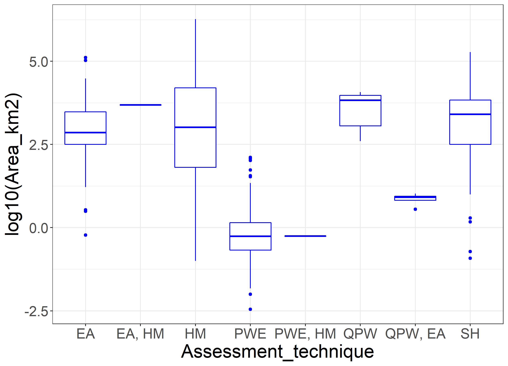

Introduction
==========================

## Introduction

There has been an long and on-going discussion in the hydrologcal literature around the impact of forests on streamflow [@andreassian2004; @jackson2005; @zhang2017; @brown2005; @brown2013; @filoso2017]. The historic work highlights a general consensus that if forest areas increase, streamflow decreases and vice-versa. The most dramatic result in relation to this, is Figure 5 in @zhang2011 indicating (for Australian watersheds) a 100% decrease in streamflow for watersheds with 100% forest cover. However, on the other end of the spectrum, in a series of French watersheds [@cosandey2005], there was no change in streamflow characteristics in 2 of the three watersheds studied in relation to deforestation.

<!-- Include Filoso paper -->

Several review papers have summarized different studies across the globe, in relation to paired watershed studies [@brown2005; @hewlett1984], related to reforestation in particular [@filoso2017], and more generally [@jackson2005; @zhang2017]. These studies aim to generalize the individual findings and to identify if there are global trends or relationships that can be developed. The most recent reviews [@zhang2017; @filoso2017] developed an impressive global database of watershed studies in relation to changes in streamflow due to changes in forest cover. The @zhang2017 dataset, which covers over 250 studies, is described in terms of the change in streamflow as a result of the change in forest cover, where studies related to both forestation (increase in forest cover) and deforestation (decrease in forest cover) were included. In contrast, the paper by @filoso2017 focused primarily on reforestation, and covered an equally impressive database of 167 studies using a systematic review. In this case the collected data is mostly coded as count data and only a subset of 37 studies was analysed for actual water yield change.

The conclusions of the first paper [@zhang2017] suggest that there is a distinct difference in the change in flow as a result of forestation or deforestation between small watersheds, defined as < 1000 km^2^ and large watersheds > 1000 km^2^. While for small watersheds there was no real change in runoff with changes in cover, for large watersheds there was a clear trend showing a decrease in runoff with and increase in forest cover. Their main conclusion was that the response in annual runoff to forest cover was scale dependent and appeared to be more sensitive to forest cover change in water limited watersheds relative to energy limited watershed [@zhang2017].

The second study [@filoso2017] was a systematic review which classified the historical research and highlighted gaps in the spatial distribution, the types of studies and the types of analysis. Their main conclusion was also that reforestation decreases streamflow, but that there were many interacting factors. For a subset of quantitative data (37) they showed a relationship between watershed size and decline in streamflow.

A final summary paper that includes much of the same data as @zhang2017 and @filoso2017 is @zhou2015, which has one author in common with @zhang2017. However, this paper aims to explain the variation in the data using the Fuh model, and in particular aims to link the variation in the observed data to variations in the exponent *m* in the model. A key observation is that in drier environments, the effects of deforestation are much greater than in wetter environments, which is also suggested by Figure 4 in @zhang2017. 

Encouraged by the work presented by @zhang2017 and @filoso2017 and the fantastic database of studies presented by these authors, we believe we can add to the discussion. In this paper, the aim is to develop further analysis of the collected data and expanding and combining the two data sets to provide further depth. 

In particular, the main method in the work by @zhang2017 is using simple linear regression, and in @filoso2017 the focus is mainly on classification. As @zhang2017 points out, the main assumption in their work is that the threshold at 1000 km^2^ is a distinct separation between "small" and "large" watersheds, but the subset of data in @filoso2017 does not appear to support this. And while te work @filoso2017 provides important insights in study types, analysis types and broad classification, there is limited quantification of actual impact. This is because the work had a strict criterion to select quantitative studies. However, given the fantastic data sets collected, the analyses can be easily expanded to look at interactions between the terms and to test the assumption of a distinct threshold at 1000 km^2^.

As a result the objective of this paper is to 1) enhance the data set from @zhang2017 with further watersheds (such as from @filoso2017) and spatial coordinates and 2) to analyse the possibility of non-linear, interactions and partial effects of the different factors and variables in the data using generalised linear (GLM) and generalised additive models (GAM @wood2006).

Building on the analyses by @zhang2017 and @filoso2017, and combining their conclusions, the main hypothesis to test is that the change in streamflow is impacted by the change in forest cover. However, this change is clearly modulated by the area under consideration (affecting the length of the flowpaths @zhou2015), the length of the study (c.f. @jackson2005) and possibly the climate (as indicated by either E0/Pa or latitude and longitude @filoso2017; @zhou2015).

However, there could be further confounding factors, which are eluded to by @filoso2017:  

* the type of analysis, i.e. paired watershed studies, modelling, time series analysis etc.

* the age of the study, assuming that historical studies might not have had the ability to measure at the accuracy that currently is available to researchers, or that more careful historical attention to detail in field studies might have been lost more recently due to reductions in research investment.  

Finally, this work aims to point to further research that can expand this area of work, based on the collected data, to better understand the impact of forest cover change on streamflow.

Methods
==========

## The original data sets

The starting point of this paper is the data base of studies which were included in @zhang2017 as supplementary material. The columns in this data set are the watershed number, the	watershed name, the	Area in km^2^, the annual average precipitation	(Pa) in mm, the	forest type, hydrological regime, and climate type, the change in forest cover	in % ($\Delta$F%) and the change in streamflow in % ($\Delta$Qf(%), based on equation 1 in @zhang2017), the precipitation data type, the assessment technique, and the	source of the info, which is a citation. 
Several of these columns contain abbreviations to describe the different variables, which are summarised in Table 1.


Table 1  Summary of abbreviations of factors used in the @zhang2017 data set

|Factor | Abbreviation | Definition |
|:------------|:-------|:----------|
| forest type | CF |coniferous forest | 
|  | BF | broadleaf forest |
|  | MF |mixed forest  |
|hydrological regime|RD|rain dominated|
| |SD|snow dominated|
| climate type| EL| energy limited|
| |WL| water limited|
| |EQ| equitant|
|precipitation data type|OB|observed|
| |SG|spatial gridded|
| |MD|modelled|
|assessment technique|PWE|paired watershed experiment|
| |QPW|quasi-paired watershed experiment|
| |HM|hydrological modelling|
| |EA|elastictity analysis|
| |SH|combined use of statistical methods|
| | |and hydrographs|

While @zhang2017 use the dryness index in their analysis, potential or reference evapotranspiration was not originally included as part of the published data set.
We combined the tables for small (< 1000 km^2^) and large (>= 1000 km^2^) watershed data sets in our analysis. 

## Additional data collection

To enhance the existing data set, this study added additional variables and cross-checked the studies with the data set from @filoso2017. In particular, we focussed on the 37 data points included in the quantitative analysis in @filoso2017.

In addition, additional variables added were the latitude and longitude for the center of the watershed as an approximation of its spatial location. Using this information  reference evapotranspiration (E~0~) was extracted from the Global Aridity Index and Potential Evapo-Transpiration (ET~0~) Climate Databasev2 [@trabucco2018], if a value of E~0~ was not available from the original papers. For large watersheds, this value, similar to annual average rainfall, is only an approximation of the climate at the location. 

The length of the study can be a variable influencing the change in flow [e.g. @jackson2005], as for example, more mature plantations are thought to have smaller impacts on flow. Therefore, the length of the study calculate as the difference between the starting data and completion date of the different studies was extracted from the references provided by @zhang2017.

Several additional data points from watershed studies were extracted from @zhang2011, @zhao2010, @borg1988, @thornton2007, @zhou2010, @rodriguez2010, @ruprechtetal1991 and @pena-arancibia2012, and these were checked against the existing studies to prevent overlap. In the citation column in the data set, in general the main reference for the calculated change in streamflow  was used, because sometimes the original study did not provide the quantification of the change in streamflow (i.e. Table 6 in @zhang2011).
We also removed one data point from the analysis, which corresponds to Watershed #1 (Amazon) in @zhang2017. This is because the cited reference [@roche1981] only relates to 1  and 1.5 ha paired watershed studies in French Guyana, and in which the actual change in forest cover is not recorded. 

The final column in the improved data set is a "notes" column, which is not further used in the analysis, but gives context to some of the data for future research and highlights some of the discrepancies that we found between the original papers and the data in the tables from @zhang2017. 

Similar to @zhang2017, the "dryness index" was calculated from the reference evapotranspiration and the annual average rainfall (Pa) as:
$$\tag{1}
\begin{aligned}
D = \frac{E_{0}}{Pa}
\end{aligned}$$


## Statistical modelling

<!----
The starting point consists of the two tables in the supplementary data from Zhang et al. (2017), which means there is one table for small watersheds (< 1000 km2) and one table for large watersheds (> 1000 km2). We might combine these tables as we can easily add a variable indicating whether the watershed originates from the small or large table.
--->
```{r, echo = F, message = F}
require(tidyverse)
require(lubridate)
require(mgcv)
suppressWarnings(require(knitr))
suppressWarnings(require(bookdown))
suppressWarnings(require(pander))

Zhang_small <- read_csv("../../data/TablesZhangetal2017_small.csv")
Zhang_large <- read_csv("../../data/TablesZhangetal2017_large.csv") %>%
  mutate(Complete = 1,
         `Possible duplicate` = 0)
new_data <- read_csv("../../data/TableNewData.csv")
```

<!-- read in the ET data -->

```{r, echo = F, warning = F, message=F}
PET_large <- read_csv("../../data/largeET.csv")
PET_small <- read_csv("../../data/smallET.csv")


# drop columns and make sure the titles are the same
PET_large <- PET_large %>%
  rename(Latitude = Latitiude,
         E0 = rvalue_1,
         `Watershed #` = Watershed)

PET_small <- PET_small %>%
  select(site_name, lat, long, rvalue_1) %>%
  rename(Latitude = lat,
         Longitude = long,
         `Watershed #` = site_name,
         E0 = rvalue_1)

# 
PET_all <- bind_rows(PET_large, PET_small)
# There are 7 missing E0 values
# > PET_all$`Watershed #`[is.na(PET_all$E0)==T]
# [1]  38 278 269 243 236 299 250
```


```{r, echo =F, eval = F}
PET_all %>%
  ggplot(aes(`Watershed #`,E0)) + geom_bar(stat="identity", fill= "steelblue")
```

```{r, echo =F, eval = F}
PET_all %>%
  ggplot(aes(Longitude,Latitude, colour = E0)) + geom_point() + coord_equal()

```

<!--- ### change names of columns

the package`mgcv` does not seem to be happy with complex names, so probably better to make all names simple --->

```{r, echo = F}
names(Zhang_small)[3:4] <- c("Area_km2", "Pa_mm")
names(Zhang_large)[3:4] <- c("Area_km2", "Pa_mm")
names(new_data)[3:4] <- c("Area_km2", "Pa_mm")
names(Zhang_small)[5:6] <- c("Forest_type", "Hydrological_regime")
names(Zhang_large)[5:6] <- c("Forest_type", "Hydrological_regime")
names(new_data)[5:6] <- c("Forest_type", "Hydrological_regime")
names(Zhang_small)[9:10] <- c("Precip_data_type", "Assessment_technique")
names(Zhang_large)[9:10] <- c("Precip_data_type", "Assessment_technique")
names(new_data)[9:10] <- c("Precip_data_type", "Assessment_technique")

```

<!-- combine both tables -->

```{r, echo = F, warning = F}
Zhang_small$From <- as.numeric(Zhang_small$From)
Zhang_small$To <- as.numeric(Zhang_small$To)
Zhang_all <- bind_rows(Zhang_large,Zhang_small) %>%
  mutate(dataset = "original Zhang et al data")
new_data <- new_data %>%
  mutate(dataset = "new data")
All_data <- bind_rows(Zhang_all, new_data)
```

<!--filter duplicates -->
```{r, echo = F}
All_data <- All_data %>%
  mutate(`Possible duplicate` = 
           ifelse(is.na(`Possible duplicate`)==T,0,`Possible duplicate`),
         `Possible duplicate` = as.numeric(`Possible duplicate`)) %>%
  filter(`Possible duplicate` != 1)
```
Removing possible duplicates removes 29 watersheds from the overall data set


<!--now combine with E0 values -->
```{r, echo = F}
All_data <- left_join(All_data ,PET_all %>% select(-c(Longitude, Latitude)), by = "Watershed #")
All_data <- All_data %>%
  mutate(E0 = ifelse(is.na(E0.x)==T, E0.y, E0.x)) %>%
  select(-c(E0.x,E0.y)) #%>%
  #rename(Latitude = Latitude.x,
#         Longitude = Longitude.x)

# calculate dryness index
All_data <- All_data %>%
  mutate(Dryness = E0/Pa_mm)
```

<!--remove the Amazon from the analysis -->
```{r, echo = F}
All_data <- All_data %>%
  filter(`Watershed #` != 1)
```

<!-- correct watershed #76 (Baker1984) to be 157 for DeltaQf_perc -->

```{r,echo = F}
All_data <- All_data %>%
  mutate(DeltaQf_perc = ifelse(`Watershed #` == 76,157,DeltaQf_perc))
```


To estimate how the change in streamflow is affected by the change in forest cover while considering the effects of the other variables, we applied generalised additive modelling (GAM) [@wood2006]. 

The general model tested is:

$$\tag{2}
\begin{aligned}
\Delta \% Q \sim ~ &\Delta \% forest~cover_{positive} + sign_{forest~cover} + \\ & \sum{X_i} + \sum{s(Z_i)} + \varepsilon
\end{aligned}$$


Here $X_i$ are factorial variables, while $Z_i$ are continuous variables. The model assumes no direct interactions and all variables are additive. The changes in forest cover contain both positive (forestation) and negative values (deforestation). In @zhang2017, these changes were jointly analysed, assuming the effect on the change in flow was linear and the effect if removing forest cover was the same as an equivalent reforestation. However, the impact of an increase in forest cover can be different from the same fractional decrease in forest cover. Therefore all the change in forest cover data is converted to positive values, and an additional column (*sign_{forest cover}*) is added that indicates whether it was a forest cover increase or decrease. 
A further assumption in the model is that all continuous variables $Z_i$ (such as annual precipitation (Pa)) can have a linear or non-linear relationship with $\Delta Q \%$. This means that a smooth function $s()$ is applied to the $Z_i$ variables. For the smoothing function we applied thin plate regression splines with an additional shrinkage penalty which means the terms can be shrunk to 0 if not significant [@wood2006].

For the model in equation 2, we initially only used the data from @zhang2017 to make sure that the additional watersheds added to the data set did not influence the results. Subsequently the analysis was repeated and the additionally identified watersheds were added. 

More generally the results were analysed to identify:  
1. the significance of the different variables  
2. the direction of the categorical or shape of the smooth variables  


Results
===========

<!-- analysis -->
## description of the data

The overall dataset contains `r nrow(Zhang_all)` observations of changes in flow. The overall distribution of changes in flow is highly skewed as is the distribution of changes in forest cover and Area. The values of changes in flow greater than 100\% and smaller than -100\% clearly create long tails on the change in flow distribution. Note also the large number of studies with 100\% forest cover reduction. Smaller watersheds dominate the database with 42% of the data from watersheds < 1 km^2^ and 65% of the data for watersheds < 10 km^2^.

```{r, echo = F, warning = F, message=F, eval =F}
png("DataExploration.png", width = 2500, height = 1800, res = 300)
All_data %>%
  pivot_longer(c(DeltaF_perc, DeltaQf_perc, Area_km2, Pa_mm, E0), 
               names_to = "variable", values_to = "value") %>%
  ggplot(aes(value)) + geom_histogram(fill = "steelblue", bins=50) + theme_bw() +
  facet_wrap(~variable, scales = "free", labeller = labeller(variable = 
    c("Area_km2" = "Area (km2)",
      "DeltaF_perc" = "Delta Forest (%)",
      "DeltaQf_perc" = "Delta Flow (%)",
      "E0" = "Annual Potential E (mm)",
      "Pa_mm" = "Annual Rainfall (mm)"))) +   
  theme(axis.title = element_text(size = rel(1.5)),
        axis.text = element_text(size = rel(1.2)),
        strip.text = element_text(size = rel(1.5)),
        axis.text.x = element_text(angle = 45, hjust = 1))
dev.off()
```

```{r data_graphs, echo =F, fig.cap = "Overview of the distributions of some of the variables in the data set", out.width= "90%"}
include_graphics("DataExploration.png")
```


```{r, echo = F}
All_data2 <- All_data %>%
  mutate(Forest_Sign = ifelse(DeltaF_perc < 0,
                              "decrease", "increase"),
         DeltaF_perc_pos = ifelse(DeltaF_perc < 0,
                                  -1*DeltaF_perc,
                                  DeltaF_perc))
```

```{r, echo = F, warning = F, message=F, eval =F}
# plot to show the difference
png("Increase_decrease.png", width = 2500, height = 1800, res = 300)
All_data2 %>%
  ggplot(aes(DeltaF_perc_pos,DeltaQf_perc, colour = Forest_Sign)) + 
  geom_point() +  
  facet_wrap(~Forest_Sign, ncol=1, scales = "free") + 
  theme_bw() + 
    theme(axis.title = element_text(size = rel(1.5)),
        axis.text = element_text(size = rel(1.2)),
        legend.text = element_text(size = rel(1.2)),
        legend.title = element_text(size = rel(1.2)),
        strip.text = element_text(size = rel(1.5))) + 
  scale_colour_manual(name = "Forest change direction", 
                      values = c("increase" = "blue", "decrease" = "red")) +
  xlab("Change in forest cover %") + ylab("Change in flow %")
dev.off()

```

```{r increase_decrease, echo =F, fig.cap = "Changes in flow as a function of increases and decreases in forest cover", out.width= "90%"}
include_graphics("Increase_decrease.png")
```

This shows that for the data related to forest decreases, there is almost always a positive flow change. In other words, flow almost always increased. However, for increases in forest cover, this is not the case, and flow can both increase and decrease. However in both cases the variability in the reported change in flow increases with the increase in forest cover change.


## The initial relationship between change in forest cover and streamflow

Following @zhang2017, the first step is to use a linear regression to investigate the percent change in flow as a result in the percent change forestry and modulated by the direction of the change, either an increase in forest cover, or decrease in forest cover:

$$\tag{3}
\begin{aligned}
\Delta \% Q \sim ~ &\Delta \% forest~cover_{positive} + sign_{forest~cover} + \varepsilon
\end{aligned}$$

```{r model1, echo = F}
linear_model_simple <- gam(DeltaQf_perc ~ DeltaF_perc_pos +
                             Forest_Sign, 
                           data = All_data2 %>% filter(dataset == "original Zhang et al data"))
#summary(linear_model_simple)
#gam.check(linear_model_simple)

```

```{r model1b, echo = F}
linear_model_simple_b <- gam(DeltaQf_perc ~ DeltaF_perc_pos +
                             Forest_Sign, 
                           data = All_data2)
#summary(linear_model_simple)
#gam.check(linear_model_simple)

```


```{r, echo =F}
pander(round(summary(linear_model_simple)$p.table,2), caption="Summary results of the first regression model predicting change in streamflow from change in forest cover and accounting for the direction of the change")
```
```{r, echo =F}
pander(round(summary(linear_model_simple_b)$p.table,2), caption="Summary results of the first regression model predicting change in streamflow from change in forest cover and accounting for the direction of the change including the new data sets")
```

While the overall variance explained in this model is not high with an adjusted *r^2^* of `r round(summary(linear_model_simple)$r.sq,2)`, it clearly supports the hypothesized relationship between the change in forest cover and the change in flow. The model suggests that for every 1\% change in forest cover, on the average, the flow changes 0.45\%. However the change in flow is different for forest cover decreases compared to forest cover increases. In fact, forest cover increases decrease flow by 29\% less than a similar decrease in forest cover causes flow to increase. So roughly speaking, a 1\% forest cover increase on the average decreases flow by $(1 - 0.29)*0.45\%$, while a the percentage forest cover decrease will increase flow by 0.45\%.

Checking this result against including the new data indicates that this mainly strengthens the difference between the forest cover increases and decreases, and decreases the mean decrease in flow as a result of forest cover change


It is however it is clear from the lack of explaining power for the model, that there could be confounding factors, as alluded to in the methods. The obvious ones being watershed dryness and area (following @zhang2017): 

$$\tag{4}
\begin{aligned}
\Delta \% Q \sim ~ &\Delta \% forest~cover_{positive} + sign_{forest~cover} + \\ & Pa_{mm} + log10(Area_{km^2}) + \varepsilon
\end{aligned}$$

Where $Pa_mm$ is the annual average rainfall in mm, and a log base 10 transformation is applied to the area variable given that the distribution of Area is higly skewed (Figure 1)

<!-- At the moment using watershed rainfall, we probably want to straight away use P/E0, and explain that rainfall itself might not be a good predictor. Alternatively we can first show that Latitude is a predictor -->

```{r model2, echo = F}

linear_model2 <- gam(DeltaQf_perc ~ DeltaF_perc_pos + Forest_Sign + log10(Area_km2) + Pa_mm, data = All_data2)
#summary(linear_model2)
#gam.check(linear_model2)
```

```{r, echo = F}
pander(round(summary(linear_model2)$p.table,2), caption="Summary of the second model, taking into account the annual rainfall and the area of the watershed")
```

Including area and annual precipitation slightly improves the overall explaining power of the model. Annual precipitation is in fact not significant. Relative to earlier reported studies [@zhang2017; @filoso2017], the log base 10 transformed watershed area indicates a p-value of only `r round(summary(linear_model2)$p.table[4,4],2)`, suggesting a marginal impact on the change in stream flow. This supports our approach (in contrast to @zhang2017) to consider watershed area as a continuous variable and making no separation between larger and smaller watersheds The main effects remain the change in forest cover and whether this is an increase or decrease.

## The effect of location on the globe
<!-- include Lat and Long (later E0) -->

```{r global_map, fig.cap="Distribution of included watersheds across the globe based on reported or estimated latitude and longitude", out.width="90%", echo=F}  

include_graphics("../../data/FAOET0data2.png")
```

As indicated, a further hypothesis relates to whether there is a strong spatial global gradient as captured by latitude and longitude. As the global map (\@ref(fig:global_map)) shows, the distribution of case study watersheds covers multiple continents and shows some distinct clustering in parts of the world. Of interest is whether the spatial clustering also indicates a difference in response to forest cover change:

$$\tag{5}
\begin{aligned}
\Delta \% Q \sim ~ &\Delta \% forest~cover_{positive} + sign_{forest~cover} + \\ & Pa_{mm} + log10(Area_{km^2}) + Latitude + Longitude + \varepsilon
\end{aligned}$$


```{r model3, echo = F}
model3_includeLatLong <- gam(DeltaQf_perc ~ DeltaF_perc_pos + Forest_Sign + log10(Area_km2) + Pa_mm + Latitude + Longitude, data = All_data2)
#summary(model3_includeLatLong)
#gam.check(model3_includeLatLong)
```

```{r, echo =F}
pander(round(summary(model3_includeLatLong)$p.table,2), caption= "Results of the model including Latitude and Longitude including new data")
```


There appears to be no significant latitudinal gradient. The total explaining power of the model is still low with an adjusted *r^2^* of `r round(summary(model3_includeLatLong)$r.sq,2)` suggesting further factors that are currently not included in the model.

Note that in this case the significance of the Area variable increases, and generally indicates that larger watersheds would be expected to have a lower change in streamflow as also indicated in @zhang2017.

## Impact of the dryness index

Climate, and in particular evapotranspiration would be expected to have a significant effect on the streamflow change as represented by the dryness index, which is also indicated in @zhang2017. Increased evapotranspiration could lead to drier watersheds, unless balanced by rainfall (such as possibly in the tropics). This model introduces the dryness index as a linear variable and drops the annual average precipitation as a variable, as dryness is calculated from the precipitation. It also drops the Latitude and Longitude as these are indicated not to be significant.


<!-- include Dryness index -->

```{r model4, echo = F}
#Zhang_all2 <- Zhang_all2 %>%
#  mutate(length = To - From)
model4_dryness <- gam(DeltaQf_perc ~ DeltaF_perc_pos + Forest_Sign + log10(Area_km2) +  
                        Dryness, data = All_data2)
#summary(model4_dryness)
#gam.check(model4_dryness)
```

```{r, echo =F}
pander(round(summary(model4_dryness)$p.table,2), caption = "Results of the model replacing the annual precipitation with the dryness index")
```

The results from this model confirm that dryness is a significant confounding factor of the change in streamflow as function of the change in forest cover change. In fact if the dryness index doubles (remembering that Dryness = 1 when E0 = Pa, so in this case E0 = 2*Pa, which is very dry), the change in runoff is ~14\% greater. However, more interesting, Latitude remains a significant predictor with each degree in latitude causing an -0.31\% change in runoff. This indicates that Dryness (i.e. an increase in radiation) alone does not explain the trend in the Latitude and some other unknown confounding factor is captured by Latitude.  

However, the result also indicates possible issues with the data, some of the Dryness values are very large (> 4) and these values have high leverage in the data. These watersheds are listed in Table 5:


```{r, echo = F}
pander(Zhang_all2 %>% filter(Dryness > 4) %>% select(Latitude, Longitude,`Watershed name`), caption = "Watersheds for which the dryness index > 4")
```

### Are some of the variables possibly non-linear?

The work by @filoso2017 and earlier by @jackson2005 has indicated that the length of the study might influence the response. This links to the idea from @kuczera1987 that the effect of logging or deforestation or reforestation reduces with the length of time post intervention (see also @jackson2005). In addition to adding the length as a variable, all continuous variables (Dryness, Area, length and Latitude) were considered non-linear in this model and as indicated a shrinkage smoothing spline [@wood2006] was applied to these variables. 

```{r model5, echo = F}
All_data2 <- All_data2 %>%
  mutate(length = To - From)

model5_all <- gam(DeltaQf_perc ~ DeltaF_perc_pos + Forest_Sign + 
                    s(log10(Area_km2), bs="ts") + s(Dryness, bs="ts") + 
                    s(length, bs="ts") ,
                  data = All_data2)
summary(model5_all)
#gam.check(model5_all)
#plot(model5_all)
pander(round(summary(model5_all)$p.table,2))
pander(round(summary(model5_all)$s.table,2))
```
<!-- model 2c include smooth variables -->

Including non-linearity increases the overall explaining power of the model to an adjusted *r^2^* of `r round(summary(model5_all)$r.sq,2)`, but creates few changes in the significance of the variables. However, it also can create a chance of overfitting, as the smoothing splines allow significant flexibility, which will be investigated below.

However, first a final full model which includes the remaining categorical variables (Precipitation data type, Assessment technique, Forest type and Hydrological regime) are included in the model

```{r model6_all, echo = F}


model6_all <- gam(DeltaQf_perc ~ DeltaF_perc_pos + Forest_Sign + 
                    s(log10(Area_km2), bs="ts") + s(Dryness, bs="ts" ) + 
                     s(length, bs="ts") +
                    Precip_data_type +  Assessment_technique + Forest_type +
                    Hydrological_regime
                    , data = All_data2)
#summary(model6_all)
#gam.check(model6_all)
#plot(model6_all)
pander(round(summary(model6_all)$p.table,2))
pander(round(summary(model6_all)$s.table,2))
plot(model6_all, select = 2)
```

```{r model6_reduc, eval = F, echo = F}
model6_reduc <- gam(DeltaQf_perc ~ DeltaF_perc_pos + Forest_Sign + 
                    s(Dryness, bs="ts" )  + 
                      s(log10(Area_km2), bs="ts") +  length +
                    Assessment_technique +
                    Hydrological_regime, data = Zhang_all2)
summary(model6_reduc)

```

Clearly Latitude is masking other factors including the assessment technique and the forest type

<!-- Show boxplots of relationships with latitude-->
```{r, eval =T, echo =F}
All_data2 %>%
  ggplot(aes(Assessment_technique, length)) + 
  geom_boxplot(colour = "blue") + theme_bw()
```

```{r, eval =T, echo =F}
All_data2 %>%
  group_by(Assessment_technique) %>%
  summarise(n = n())
```

Maybe remove data for low numbers of assessment techniques and rerun the analysis (<10)

```{r, eval =F, echo =F}
png("AssessmentTechnique_byArea.png", width = 2500, height = 1800, res = 300)
All_data2 %>%
  ggplot(aes(Assessment_technique, log10(Area_km2))) + 
  geom_boxplot(colour = "blue") + theme_bw() +
    theme(axis.title = element_text(size = rel(2)),
        axis.text = element_text(size = rel(1.5)))
dev.off()
```


```{r assessment, fig.cap="Boxplot of the log base 10 of the watershed area (in km2) for the different assessment techniques, showing the dominance of small watersheds in the paired watershed experiments", out.width="90%", echo=F}  


```


```{r, eval =F, echo =F}
Zhang_all2 %>%
  ggplot(aes(Forest_type, Latitude)) + 
  geom_boxplot(colour = "blue") + theme_bw()
```

```{r, eval =F, echo =F}
Zhang_all2 %>%
  ggplot(aes(Hydrological_regime, Latitude)) + 
  geom_boxplot(colour = "blue") + theme_bw()
```


Clearly all have at least some relationship with Latitude, therefore are being masked if Latitude is included in the model.

The flexible nature of the splines and the shrinkage applied to the splines means that the length variable can capture variation in the data, but it is unclear what exactly is captured. The shape of the resulting conditional response does not reflect the reponses highlighted in @filoso2017 and @jackson2005. Reducing the flexibility of the splines, or fitting a linear term results in "length" not being significant, which suggests that this variable is not helpful in explaining the variation in the data.


```{r, eval =T, echo =F}
All_data2 %>%
  ggplot(aes(DeltaQf_perc, length)) + 
  geom_point(colour = "blue") + theme_bw()
```

In drier watersheds, changes in forest cover have greater impact on flow, which is similar to @zhang2017. This is most likely because in these watersheds the overall flow is surface flow dominated and therefore the buffering that is afforded by the groundwater inputs is not as great. As we don't have a separate variable for groundwater inputs (although this effect is estimated in many studies), we cannot analyse this effect separately.

In contrast to @filoso2017, we also did not identify an effect of the 

Given how skewed Dryness is due tot he few watersheds that have very high dryness values, it is worth investigating what excluding these 4 watersheds from the data means for the relationships. 

\newpage

<!--reduce drynes < 4 -->
```{r model7_noLatb, echo = F}
model7_noLatb <- gam(DeltaQf_perc ~ DeltaF_perc_pos + Forest_Sign + 
                    s(Dryness, bs="ts" ) + #s(Latitude, bs="ts") + 
                      s(log10(Area_km2), bs="ts") + s(length,bs="ts") +
                    Precip_data_type +  Assessment_technique + Forest_type +
                    Hydrological_regime, data = All_data2 %>% filter(length< 60))
#summary(model7_noLatb)
#plot(model7_noLatb)
pander(round(summary(model7_noLatb)$p.table,2))
pander(round(summary(model7_noLatb)$s.table,2))
plot(model7_noLatb)
summary(model7_noLatb)
```

### remove the assessment techniques with very small numbers

```{r model8_reduc_assess, echo = F}
All_data3 <- All_data2 %>%
  filter(Assessment_technique != "EA, HM" & Assessment_technique != "PWE, HM" & Assessment_technique != "QPW, EA" )

model8_assess <- gam(DeltaQf_perc ~ DeltaF_perc_pos + Forest_Sign + 
                    s(Dryness, bs="ts" ) + #s(Latitude, bs="ts") + 
                      s(log10(Area_km2), bs="ts") + s(length,bs="ts") +
                    Precip_data_type +  Assessment_technique + Forest_type +
                    Hydrological_regime, data = All_data3 %>% filter(length< 60))
#summary(model7_noLatb)
#plot(model7_noLatb)
pander(round(summary(model8_assess)$p.table,2))
pander(round(summary(model8_assess)$s.table,2))
plot(model8_assess)
summary(model8_assess)

```


```{r, echo = F}
png("flow_forest_byArea.png", width = 2500, height = 1800, res = 300)
All_data2 %>%
  ggplot(aes(DeltaF_perc_pos, DeltaQf_perc, colour = Assessment_technique,size = log10(Area_km2), 
             shape = Forest_Sign)) + geom_point(alpha = 0.5) +
  theme_bw() + ylab("% change in flow") +
  theme(axis.title = element_text(size = rel(2)),
        axis.text = element_text(size = rel(1.5))) +
  xlab("% change in forest cover") + #scale_y_log10() +
  scale_size_continuous(name = "log10(Area in km2)") +
  scale_colour_discrete(name = "Assessment Technique") +
  scale_shape_discrete(name = "Forest cover direction")
dev.off()
```

```{r, eval =F}
Zhang_all2 %>%
  ggplot(aes(Longitude, Latitude, colour = DeltaF_perc, size = DeltaQf_perc/100 )) + geom_point(alpha = 0.5)
```

<!--Check the size distribution of the watersheds -->

```{r, eval =F}
Zhang_all %>%
  ggplot(aes(Area_km2)) + geom_histogram(fill="blue", bins =50) +
  scale_x_log10()
total <- nrow(Zhang_all)
length(Zhang_all$Area_km2[Zhang_all$Area_km2<10])/total
```
```{r, eval =F}
Zhang_all2 %>%
  ggplot(aes(length)) + geom_histogram(fill="blue", bins =50) 
```

```{r, eval =F, echo =F}
Zhang_all2 %>%
  ggplot(aes(log10(Area_km2), DeltaQf_perc, colour = DeltaF_perc)) + 
  geom_point(alpha = 0.5) + theme_bw()
```

```{r, eval =F, echo =F}
Zhang_all2 %>%
  mutate(size_class = round(log10(Area_km2),0)) %>%
  ggplot(aes(log10(Area_km2), DeltaQf_perc, group = size_class)) + 
  geom_boxplot(colour = "blue") + theme_bw()
```

<!--- Analysis of Methods by dryness -->

```{r, eval =F, echo =F}
Zhang_all2 %>%
  ggplot(aes(Assessment_technique, Dryness)) + 
  geom_boxplot(colour = "blue") + theme_bw()
```


Discussion
======================

Essentially, the analysis shows at the moment that in contrast to @zhang2017 there is no evidence that the size of a watershed influences the change in the streamflow as a result of changes in forestry. If anything the scatter in the data (in the change in flow) is greater for the smaller watersheds then for the larger watersheds. In other words, the response to changes in forest cover is more consistent for larger watersheds than it is for smaller watersheds.

As shown earlier, most of the smaller watersheds are "real observed data" using paired watershed studies, while for larger watersheds, the analysis are mostly based on modelling approximations using either elasticity analysis (EA), Hydrological modelling (HM) or a combined use of statistical methods (SH) or quasi paired watershed analysis (QPW), thus all providing an approximation of the effect of forestry on streamflow rather than a direct comparison of watersheds. This is a confounding factor that is not easily addressed in the regression modelling attempted here. Furthermore, the catchments analysed using EA, are concentrated in the drier end of the Dryness index scale compared to the other methods, with only the paired watershed experiment (PWE) assessment technique covering the full range of dryness indices.

There are further confounding factors in the data, which were also classified by @filoso2017 and these create biases in the data set that can impact the overall assessment. For example, snow dominated hydrological regimes (SD), which are weakly significant, are dominated by Coniferous Forests (CF), while the majority of the rain dominated regimes are all broadleaf forests (BF). However, the forest type classification is very coarse and does not fully capture possible physiological differences that could affect evapotranspiration and therefore changes in streamflow.

Apart from a difficulty of analysing complex confounding factors in the data, a general limitation of the type of analysis presented is that this work does not consider the spatial arrangement of the forest clearing in the catchments. While for fully or almost fully cleared smaller catchments this might not be an issue, it is perceivable that for larger catchments being partially cleared, a interaction between spatial location and clearing could be a factor in determining the change in streamflow. Clearing head water catchments on shallower soils might have a larger impact than clearing in downstream areas on deeper soils.    


References {#references .unnumbered}
==========
