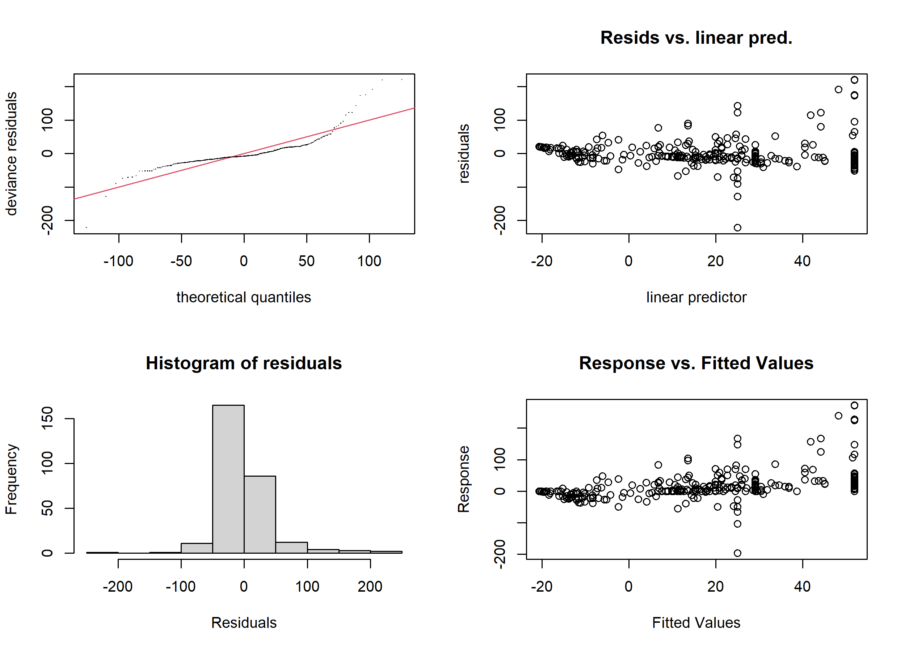
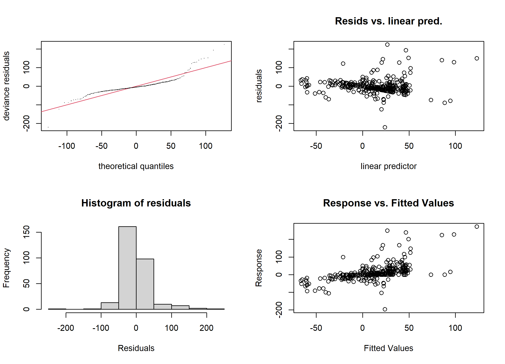

\doublespacing

Introduction
==========================

The impacts of global deforestation and reforestation are important through their influence on streamflow and both blue and green water availability [@hoekvandijke2022; @schyns2019].  The past work reviewing these impacts [@andreassian2004; @jackson2005; @zhang2017; @brown2005; @brown2013; @filoso2017] highlights a general consensus that if forest areas increase, streamflow decreases and vice-versa. The most dramatic result is Figure 5 in @zhang2011 indicating (for Australian catchments) a 100% decrease in streamflow for catchments with 100% forest cover. However, on the other end of the spectrum, for three French catchments [@cosandey2005], there was no change in streamflow characteristics in two of the catchments after deforestation. For reforestation, a modelling study across the 1 millon km^2^ Murray Darling Basin also found no major effect, especially in larger catchments [@vandijk2007]. Similarly a modelling study by @beck2013 found no significant change in streamflows in 12 catchment in Puerto Rico as a result of deforestation. In contrast, in a recent study in Brazil across 324 catchments, @levy2018 found a significant increase in streamflow, particular in the dry season, as a result of deforestation. This suggests that there can be significant variation across the different studies,methodologies and geographical regions. 

For the purpose of this paper, *watershed* and *catchment* are interchangeable terms. Many of the US studies use *watershed*, while European and Australian studies use *catchment*. In particular, we retained the term "paired watershed studies" and "quasi-paired watershed studies" as this is the most common terminology, but further mostly use the term catchment.

As mentioned, several review papers have summarized the plethora of forestation and deforestation studies across the globe, in relation to paired watershed studies [@brown2005; @hewlett1984], related to reforestation in particular [@filoso2017], and more generally [@jackson2005; @zhang2017].  These studies aim to generalize the individual experimental and research findings and to identify if there are global trends or relationships. Others have used the understanding from these studies to extrapolate to global scales [@hoekvandijke2022].   

The most recent reviews [@zhang2017; @filoso2017] developed an impressive global database of catchment studies with changes in streamflow due to changes in forest cover. The @zhang2017 dataset, which covers over 312 studies, is described in terms of the change in streamflow as a result of the change in forest cover, where studies related to both forestation (increase in forest cover) and deforestation (decrease in forest cover) were included. In contrast, the paper by @filoso2017 focused primarily on reforestation, and covered an equally impressive database of 167 studies using a systematic review. In this case the collected data is mostly coded as count data and only a subset of 37 studies was analysed for actual water yield change. There is some overlap between the two data sets, but there are also some studies unique to both sets. The more regionally concentrated and detailed study by @levy2018 is a further independent dataset with no overlap with the other studies. However, for this study only the flow and rainfall data is available for the catchments, and the change in landcover was derived from satellite data and was not made available.

The conclusions of the first mentioned major review paper [@zhang2017] indicates that there is a distinct difference in the change in flow as a result of forestation or deforestation between small watersheds (catchments), defined as < 1000 km^2^ and large watersheds (catchments) > 1000 km^2^. While for small catchments there was no real change in runoff with changes in cover, for large catchments there was a clear trend showing a decrease in runoff with and increase in forest cover. Their main conclusion was that the response in annual runoff to forest cover was scale dependent and appeared to be more sensitive to forest cover change in water limited catchments relative to energy limited catchments [@zhang2017].

The second study [@filoso2017] is a systematic review of reforestation studies (only studies in which forest cover increased). This study classified the historical research and highlighted gaps in the spatial distribution, the types of studies and the types of analysis. Their main conclusion was also that reforestation decreases streamflow, but that there were many interacting factors. For a subset of the data (37 data points) they also indicated decreasing impacts of reforestation with increasing catchment size (agreeing with @zhang2017), but they did not identify a distinct threshold and fitted a log-linear relationship. In addition, they identified that studies with shorter periods of data collection resulted in larger declines in streamflow.

A final earlier summary paper that includes much of the same data as @zhang2017 and @filoso2017 is @zhou2015, which has one author in common with @zhang2017. However, this paper aims to explain the variation in the data using the elasticity approach in the Fuh model. In particular, it aims to link the variation in the observed data to variations in the exponent *m* in the Fuh model. A key observation is that in drier environments, the effects of removing forest cover are much greater than in wetter environments, which is also suggested by Figure 4 in @zhang2017. The Fuh model and variations of the Budyko equilibrium modelling approach was also used by @hoekvandijke2002 to interpret the global impact of reforestation.

There are some clear limitations in these studies. The main method in the work by @zhang2017 is a single covariate linear regression. In contrast, the systematic review from @filoso2017 emphasises the classification and distributions of the study. @zhang2017 points out that a main assumption in their work is that the catchment size threshold at 1000 km^2^ is a distinct separation between "small" and "large" catchments. However, a subset of 37 data points in @filoso2017 (their Figure 9) does not appear to support this, suggesting a continuum. And while the work @filoso2017 provides important insights in study types, analysis types, forest types and broad classification, there is limited quantification of actual impact.

In contrast to the single covariate linear regression in the earlier studies [@zhang2017; @filoso2017] and the top-down Budyko modelling [@zhou2015; @hoekvandijke2022], the regional Brazilian Cerrado study [@levy2018] provides a carefully designed statistical approach using mixed effects modelling and Differences-in-Differences modelling focusing specifically on the effect of deforestation. The analysis specifically accounted for differences between catchments and differences due to variations in climate. Their conclusion highlighted that in particular dry season streamflow was affected by deforestation.

Given all these previous reviews and the seemingly clear conclusions about the impact of forest cover change on streamflow, the question is why another paper?
There is a real attraction in the idea of quantitative analysis of past studies to be able to extrapolate findings to larger scales and to identify factors across global scales. 
However, there is also a real danger in this process, which is what we will highlight in this paper. There are three potential errors (or limitations) in the mentioned global analyses:  

- Latent variables that are not included in the typical single covariate analysis;     
- Aggregation of data that originates from different experiments with different objectives across a wide time period; and, finally    
- Transcription errors in the data, especially if data is collected from other review papers as some of the original papers are difficult to locate.

The aim of this paper is to highlight examples of each of these limitations, how they have influenced past work, and provide suggestions of how we can overcome these limitations. In addition, by applying more complex statistical models we will highlight the conclusions that can still be drawn from this work in relation to the impact of forest cover on streamflow. Finally, we will highlight future research needs in this area. 

We are taking advantage of the earlier work by @zhang2017, @filoso2017 and @zhou2015 and the large database of studies these authors have shared. 

Methods
==========

## The original data set

As indicated, the starting point of this paper is the data base of studies which were included in @zhang2017 as supplementary material. The columns in this data set (are the catchment number, the	catchment name, the	Area in km^2^, the annual average precipitation	(Pa) in mm, the	forest type, hydrological regime, and climate type, the change in forest cover	in \% ($\Delta F\%$) and the change in streamflow in \% $(\Delta Qf\%)$, based on equation 1 in @zhang2017), the precipitation data type, the assessment technique, and the	source of the info, which is a citation. 
Several of these columns contain abbreviations to describe the different variables, which are summarised in \@ref(Table 1). These abbreviations will later be used in the models.  

Table (\#table:tab1)  Summary of abbreviations of factors used in the @zhang2017 data set

|Factor | Abbreviation | Definition |
|:------------|:-------|:----------|
| forest type | CF |coniferous forest | 
|  | BF | broadleaf forest |
|  | MF |mixed forest  |
|hydrological regime|RD|rain dominated|
| |SD|snow dominated|
| climate type| EL| energy limited|
| |WL| water limited|
| |EQ| equitant|
|precipitation data type|OB|observed|
| |SG|spatial gridded|
| |MD|modelled|
|assessment technique|PWE|paired watershed experiment|
| |QPW|quasi-paired watershed experiment|
| |HM|hydrological modelling|
| |EA|elastictity analysis|
| |SH|combined use of statistical methods|
| | |and hydrographs|

@zhang2017 use the dryness index, which is the annual rainfall (Pa) divided by the potential or reference evapotranspiration (ET~0~ or E~0~) in their analysis, and use the dryness index to identify the climate type. However, the potential or reference ET was not originally included as part of the published data set. We combined the tables for small catchments (< 1000 km^2^) and large catchments (>= 1000 km^2^) from @zhang2017 in our analysis. 

## Additional data collection

To enhance the existing data set, this study added additional variables and cross-checked the studies with the data set from @filoso2017. In particular, we focused on the 37 data points related to the quantitative regression analysis used in @filoso2017.

In addition, a few additional variables were included to enhance the data set. We added latitude and longitude for the center of the catchment as an approximation of its spatial location. Mostly the  data reported by the authors was used, but in some cases the variables had to be approximated from the location of the centre of the catchment using Google Maps^TM^. In the dataset, an additional column has been added to indicate the source of the location data to indicate if this is directly from the paper or elsewhere.  

As highlighted, @zhang2015 did not provide values for evapotranspiration in the data base. Using the location information  reference evapotranspiration (E~0~) was extracted from the Global Aridity Index and Potential Evapo-Transpiration (ET~0~) Climate Databasev2 [@trabucco2018], if a value of E~0~ was not available from the original papers. For large catchments, this value (and the associated coordinates), similar to annual average rainfall, is only an approximation of the climate at the location. 

Similar to @zhang2017, the "dryness index" was calculated from the reference evapotranspiration and the annual average rainfall (Pa) as:

\begin{equation}
D = \frac{E_{0}}{Pa} (\#eq:eq1)
\end{equation}

The length of the study can be a variable influencing the change in flow [e.g. @jackson2005; @filoso2017], as for example, more mature plantations are thought to have smaller impacts on flow or regrowth might follow a "Kuczera curve" [@kuczera1987]. It is not clear if this is an effect of increased water use in growth [@vertessy2001] or due to changes in interception [@stoof2012]. Therefore, the length of the study calculate as the difference between the starting data and completion date of the different studies was extracted from the references provided by @zhang2017. The length of the study was already included in the data from @filoso2017, but these were checked against the original publications.

Several additional data points from catchment studies were extracted from @almeida2016, @ferreto2020, @zhang2011, @zhao2010, @borg1988, @thornton2007, @zhou2010, @rodriguez2010, @ruprechtetal1991 and @pena-arancibia2012, and these were checked against the existing studies to prevent overlap. In the citation column in the accompanying data set, the main reference for the calculated change in streamflow  was generally used, because sometimes the original study did not provide the quantification of the change in streamflow (i.e. Table 6 in @zhang2011).

We conducted a thorough review of all the studies mentioned in the data base of @zhang2015 and sourced all the original papers. As a result of this we made several changes to the data base, which are all recorded in Supplementary Data part 1.  Overall 36 data points were changed and the most common problem was a change in the sign for the change in forest cover or the change in flow. We assume that these were transcription errors.  
We also removed one data point from the data set, which corresponds to catchment #1 (Amazon) in @zhang2017. This is because the cited reference [@roche1981] only relates to 1  and 1.5 ha paired catchment studies in French Guyana, and in which the actual change in forest cover is not recorded. Finally, on review of all the data in @zhang2017 and @filoso2017, 29 potential duplicates were identified and flagged in the data, and not used in the analysis.  

The final column in the improved data base is a "notes" column, which we added, but is not further used in the analysis. It gives context to some of the data for future research and highlights some of the discrepancies that we found between the original papers and the data in the tables from @zhang2017. This will allow future research to scrutinise our input for errors. 

## Statistical modelling
```{r, include=FALSE}
options(tinytex.verbose = FALSE)
```
<!----
The starting point consists of the two tables in the supplementary data from Zhang et al. (2017), which means there is one table for small watersheds (< 1000 km2) and one table for large watersheds (> 1000 km2). We might combine these tables as we can easily add a variable indicating whether the watershed originates from the small or large table.
--->
```{r, echo = F, message = F, warning=FALSE}
require(tidyverse)
require(lubridate)
require(mgcv)
require(visreg)
require(patchwork)
library(ggcorrplot)
suppressWarnings(require(knitr))
suppressWarnings(require(bookdown))
suppressWarnings(require(pander))

Zhang_small <- read_csv("../../data/SmallCatchments_T2.csv") %>%
  mutate(table = "small")
Zhang_large <- read_csv("../../data/LargeCatchments_T1.csv") %>%
  mutate(table = "large")
new_data <- read_csv("../../data/NewCatchments_T3.csv") %>%
  mutate(table = "new")
```

<!--- ### change names of columns
the package`mgcv` does not seem to be happy with complex names, so probably better to make all names simple --->

```{r, echo = F}
names(Zhang_small)[3:4] <- c("Area_km2", "Pa_mm")
names(Zhang_large)[3:4] <- c("Area_km2", "Pa_mm")
names(new_data)[3:4] <- c("Area_km2", "Pa_mm")
names(Zhang_small)[5:6] <- c("Forest_type", "Hydrological_regime")
names(Zhang_large)[5:6] <- c("Forest_type", "Hydrological_regime")
names(new_data)[5:6] <- c("Forest_type", "Hydrological_regime")
names(Zhang_small)[9:10] <- c("Precip_data_type", "Assessment_technique")
names(Zhang_large)[9:10] <- c("Precip_data_type", "Assessment_technique")
names(new_data)[9:10] <- c("Precip_data_type", "Assessment_technique")

```

<!-- combine both tables -->

```{r, echo = F, warning = F, message = F}
Zhang_small$From <- as.numeric(Zhang_small$From)
Zhang_small$To <- as.numeric(Zhang_small$To)
Zhang_all <- bind_rows(Zhang_large,Zhang_small) %>%
  mutate(dataset = "original Zhang et al data")
new_data <- new_data %>%
  mutate(dataset = "new data")
All_data <- bind_rows(Zhang_all, new_data)
```

<!--filter duplicates -->
```{r, echo = F}
All_data <- All_data %>%
  mutate(`Possible duplicate` = 
           ifelse(is.na(`Possible duplicate`)==T,0,`Possible duplicate`),
         `Possible duplicate` = as.numeric(`Possible duplicate`)) %>%
  filter(`Possible duplicate` != 1)
```

<!--now calculate dryness -->
```{r, echo = F}
# calculate dryness index
All_data <- All_data %>%
  mutate(Dryness = E0/Pa_mm)
```

<!--remove the Amazon from the analysis -->
```{r, echo = F}
All_data <- All_data %>%
  filter(`Watershed #` != 1)
```

<!-- remove data set 188 and 254 Kamakia and Sambret -->

```{r,echo = F}
All_data <- All_data %>%
  filter(`Watershed #` != 188) %>%
  filter(`Watershed #` != 254)
```

The aim of the statistical analysis is to highlight the most important variables in the data set that explain the change flow as a consequence of changes in forest cover. This first aim is similar to @zhang2017, but the main difference is that we start off with all variables in the data set in the model. Subsequently the analysis will concentrate on how the individual variables in the dataset relate to each other and  how latent variables in the data set can be masked and result in relationships that might not really exist. Finally, the analysis will highlight how the results are conditional on the dataset.  

To estimate how the change in streamflow is affected by the change in forest cover, while considering the effects of the other variables, we applied generalised additive modelling (GAM) [@wood2006].  

The general model tested is:

\begin{align}
\Delta Qf \% \sim &~ \Delta \% forest~cover_{positive} + sign_{forest~cover} + \notag \\ 
& \sum{X_i} + \sum{s(Z_i)} + \varepsilon (\#eq:eq2)
\end{align}


Here $X_i$ are factorial variables, while $Z_i$ are continuous variables. As a first step, the model assumes no direct interactions and that all variables are additive. A further assumption in the model is that all continuous variables $Z_i$ (such as annual precipitation (Pa)) can have either a linear or a non-linear relationship with $\Delta Qf \%$. This means that a smooth function $s()$ can be applied to the $Z_i$ variables. For the smoothing function we applied thin plate regression splines with an additional shrinkage penalty. The result of this approach is that for high enough smoothing parameters (i.e. if the data is very "wiggly") the smooth term can be shrunk to 0 and thus will be no longer significant [@wood2006]. This is done because a highly flexible smooth term could always fit the data, but would not necessarily indicate a relevant relationship. In other words, the approach balances finding a smooth non-linear relationship for the variable against overfitting the data. 

The changes in forest cover contain both positive (forestation) and negative values (deforestation). In @zhang2017, these changes were jointly analysed, assuming the effect on the change in flow was linear and the effect of removing forest cover was the same as an equivalent addition of forest cover.  

However, the impact of an increase in forest cover can be different from the same fractional decrease in forest cover. The question becomes how best to analyse this. One approach would be to allow a different slope and a different intercept for the decreases relative to the increases. 
This can be tested by converting all the change in forest cover data to positive values, and an additional binary column ($sign_{forest cover}$) can be included indicating whether it was a forest cover increase or decrease. In the model, the parameter for $sign_{forest cover}$ will indicate the difference in the changes in flow for increases in forest cover compared to decreases in forest cover. The disadvantage of this approach is that the relationship with forest cover becomes discontinuous at the origin (0 change in forest cover).

A second approach is to test the change in forest cover as a non-linear relationship in the GAM model. Because a shrinkage penalty is used, this will also test the non-linear assumption and allows the variable for forest cover to be continuous. The disadvantage of this approach is that the relationship between forest cover and change in flow is less easy to interpret, as the non-linear fit in the GAM has no direct parametric form. 
Both these approaches are tested in the results.

The over arching test focuses on identifying the change streamflow as a result of a change in forest cover and potentially affected by different other factors (as indicated by the previous research: @zhang2017; @filoso2017; @zhou2015): climate, size of catchment and length of study. In addition to these earlier identified factors, this study also tested for the factors listed in Table \@ref:(tab1)

As an initial approach we  only used the data from @zhang2017 to make sure that the additional catchments added to the data set did not influence the results (This analysis is in supplementary material part 2). This analysis highlights that the newly added catchment and the changes to the dataset create minor differences when repeating the analysis from the original paper. 

To make all the data and code publicly available, all the final data and analysis for this paper are located on github:  
[https://github.com/WillemVervoort/Forest_and_water](https://github.com/WillemVervoort/Forest_and_water/tree/publish) on the "publish" branch.


Results
===========

<!-- analysis -->
## Description of the data

The overall dataset contains `r nrow(All_data)` observations of changes in flow, which includes the newly identified data sets and after removing identified duplicate data and lines with missing data. In contrast, the original dataset from @zhang2017 contained `r nrow(Zhang_all)` catchments and the @filoso2017 study used 37 catchments (Table S2 in @filoso2017). The current number of catchments is the result of the removal of duplicates and our modifications and additions. The overall distribution of changes in flow is highly skewed as is the distribution of changes in forest cover and *Area km^2^*. The values of changes in flow greater than 100\% and smaller than -100\% clearly create long tails on the change in flow distribution. Note also the large number of studies with 100\% forest cover reduction. Clearly visible is also that smaller catchments dominate the database with 42\% of the data from catchments < 1 km^2^ and 65\% of the data for catchments < 10 km^2^ (Figure 1). This high skew in some of the data can create difficulties in the statistical modelling and further transformation of the data might be required.

```{r, echo = F, warning = F, message=F, eval =F}
require(latex2exp)
png("DataExploration.png", width = 2500, height = 1800, res = 300)
All_data %>%
  mutate(log10Area = log10(Area_km2)) %>%
  pivot_longer(c(DeltaF_perc, DeltaQf_perc, log10Area, Pa_mm, E0), 
               names_to = "variable", values_to = "value") %>%
  ggplot(aes(value)) + geom_histogram(fill = "steelblue", bins=50) + theme_bw() +
  facet_wrap(~variable, scales = "free", labeller = labeller(variable = 
    c("log10Area" =  "log10(Area km2)", #latex2exp::TeX("$\\log_{10}({Area~km^2})$"),
      "DeltaF_perc" = "Delta Forest (%)",
      "DeltaQf_perc" = "Delta Qf (%)",
      "E0" = "Annual Potential E (mm)",
      "Pa_mm" = "Annual Rainfall (mm)"),default = label_parsed)) +   
  theme(axis.title = element_text(size = rel(1.5)),
        axis.text = element_text(size = rel(1.2)),
        strip.text = element_text(size = rel(1.5)),
        axis.text.x = element_text(angle = 45, hjust = 1))
dev.off()
```

(ref:datagraphscaption) Overview of the distribution of the data set for five of the included variables. Note that the first panel (showing the distribution of the catchment areas) indicates the distribution of the *log_10_* transformed Area (in km^2^).


```{r datagraphs, echo=F, out.width="90%", fig.cap="(ref:datagraphscaption)"}

include_graphics("./DataExploration.png")
```


```{r, echo = F}
All_data2 <- All_data %>%
  mutate(Forest_Sign = ifelse(DeltaF_perc < 0,
                              "Decrease", "Increase"),
         DeltaF_perc_pos = ifelse(DeltaF_perc < 0,
                                  -1*DeltaF_perc,
                                  DeltaF_perc))
```

```{r, eval = F, echo = F}
All_data2 %>%
  filter(is.na(Forest_Sign)==T)
```

```{r, echo = F}
# temporary write out of data files for review reply
write_csv(All_data, "All_data.csv")
write_csv(All_data2, "All_data2.csv")

```


<!--
Analysing this in more detail, the data related to forest decreases, indicate almost always a positive flow change (Figure 2). In other words, flow almost always increased. However, for increases in forest cover, this is not the case, and flow can both increase and decrease. However in both cases the variability in the reported change in flow increases with the increase in forest cover change.


```{r, echo = F, warning = F, message=F, eval =F}
# plot to show the difference
png("Increase_decrease.png", width = 2500, height = 1800, res = 300)
All_data2 %>%
  filter(is.na(Forest_Sign)==F) %>%
  ggplot(aes(DeltaF_perc_pos,DeltaQf_perc, colour = Forest_Sign)) + 
  geom_point() +  
  facet_wrap(~Forest_Sign, ncol=1, scales = "free") + 
  theme_bw() + 
    theme(axis.title = element_text(size = rel(1.5)),
        axis.text = element_text(size = rel(1.2)),
        legend.text = element_text(size = rel(1.2)),
        legend.title = element_text(size = rel(1.2)),
        strip.text = element_text(size = rel(1.5))) + 
  scale_colour_manual(name = "Forest cover direction", 
                      values = c("Decrease" = "red","Increase" = "blue")) +
  xlab("Change in forest cover %") + ylab("Change in flow (Qf) %")
dev.off()

```

```{r increasedecrease, echo =F, fig.cap="Changes in flow as a function of decreases (top) and increases (bottom) in forest cover", out.width="90%"}
include_graphics("Increase_decrease.png")
```
-->

### Geospatial location of the catchments

```{r globalmap, fig.cap="Distribution of included catchments across the globe based on reported or estimated latitude and longitude", out.width="90%", echo=F}  


```

<!-- DO WE NEED TO REDO THE MAP? Eliana please provide code -->

Apart from looking at the distribution of the values, the spatial locations of the data can also be important, in particular when analysing the effect of climate. The catchments are spread across the world, and relative to @zhang2017, this dataset has a very similar geospatial distribution.  The major climate gradients are represented in the data, but there appears to be some bias in the spatial locations of the data. As the global map (Figure \@ref(fig:globalmap)) shows, the distribution of case study catchments covers multiple continents. There is some spatial clustering in the studies in North America, Australia and East Asia.


### Cross correlation between the different variables

A final data exploration is to identify potential cross correlations in the data, which can point to possible interactions or potential biases. This analysis can also provide further insight for the statistical modelling, highlighting potential latent variables in the data set.

```{r correlation, eval=T, echo = F}
All_data2 <- All_data2 %>%
  mutate(length = To - From,
         mid_year = From + (To - From)/2)


png("variable_corr_plot.png", width = 960, height = 960)
model.matrix(~0+DeltaF_perc + 
                   log10(Area_km2) + 
                    Dryness + 
                    length +
                    Precip_data_type +  Assessment_technique +
                    Forest_type +
                    Hydrological_regime, data=All_data2) %>% 
  cor(use="pairwise.complete.obs") %>% 
  ggcorrplot(show.diag = F, type="lower", lab=TRUE, lab_size=4)
dev.off()

```


```{r corgraphs, echo=F, out.width="90%", fig.cap="Correlation matrix for all variables"}

include_graphics("variable_corr_plot.png")
```

The correlation plot (Figure \@ref(fig:corgraphs)) highlights several correlations, even though in general cross correlation is quite low between variables. Some interesting relationships appear in this graph:  

- the negative relationship between log10(Area) and change in forest area (DeltaF_perc) indicating that in the data set larger catchments tended to have (obviously) smaller areas of forest change.  
- the weak positive relationship between log10(Area) and the assessment method using hydrological models. This highlights that paired catchment studies mostly concentrate on smaller scales.  
- A strong inverse relationship between log10(Area) and the paired watershed assessment method, which is simply the inverse from the last point, as also indicated by the negative relationship between the two assessment methods. This is further visible in the relationship between the change in forest cover and the paired watershed assessment method, showing the impact of the latent variable (log10(Area)). Smaller catchments used in paired watershed assessments are easier to fully clear or fully replant.


```{r, eval = F, echo = F}
linear_model_E0 <- gam(DeltaQf_perc ~ DeltaF_perc_pos +
                             Forest_Sign + E0, 
                           data = All_data2)
#summary(linear_model_E0)
#gam.check(linear_model_simple)

```


## The general relationship between change in forest cover and streamflow

Following @zhang2017, the first step is to investigate the percent change in flow as a linear effect of the percent change forestry and modulated by the direction of the change, either an increase in forest cover, or decrease in forest cover:


\begin{equation}
\Delta Qf \% \sim ~ \Delta \% forest~cover_{positive} + sign_{forest~cover} + \varepsilon (\#eq:eq3)
\end{equation}

```{r model1, echo = F}
linear_model_simple <- gam(DeltaQf_perc ~ DeltaF_perc_pos +
                             Forest_Sign, 
                           data = All_data2 %>% filter(dataset == "original Zhang et al data"))
#summary(linear_model_simple)
#gam.check(linear_model_simple)

```

```{r model1b, echo = F}
linear_model_simple_b <- gam(DeltaQf_perc ~ DeltaF_perc_pos +
                             Forest_Sign, 
                           data = All_data2)
#summary(linear_model_simple)
r_sq <- round(summary(linear_model_simple_b)$r.sq,2)
```


```{r, echo =F}
pander(round(rbind(summary(linear_model_simple)$p.table,
                       summary(linear_model_simple_b)$p.table),2), caption="(\\#tab:tabmodel1) Summary results of the first regression model predicting change in streamflow from change in forest cover and accounting for the direction of the change. The first three rows relate to the model using the original data base from Zhang et al. (2017). The bottom three rows are the results of the model including the new data. Clearly there is no major change arising from the additional data.")
```

The overall variance explained in this model (equation \@ref(eq:eq3)) is not high with an adjusted *r^2^* of `r r_sq`, it generally supports the hypothesized relationship between the change in forest cover and the change in flow. The model suggests that for every 1\% change in forest cover, on the average, the flow changes 0.45\%. However the change in flow is different for forest cover decreases compared to forest cover increases. In fact, forest cover increases decrease flow by 29\% less than a similar decrease in forest cover causes flow to increase. So roughly speaking, a 1\% forest cover increase on the average decreases flow by $(1 - 0.29)*0.45\%$, while a the percentage forest cover decrease will increase flow by 0.45\%.


```{r, eval = F, echo = F}
png("residual_plot_model1.png", width = 2500, height = 1800, res = 300)
par(mfrow=c(2,2))
gam.check(linear_model_simple)
par(mfrow=c(1,1))
dev.off()
```

```{r gamcheck, echo =F, fig.cap="Residual plots for the first simple regression model indicating a slightly fat-tailed residual distribution", out.width="90%"}

```


Of importance here is to highlight the residuals of this regression (equation \@ref(eq:eq3) and Figure \@ref(fig:gamcheck)). These are approximately normal, although there is still significant skew on the upper and lower parts of the distribution (Figure \@ref(fig:gamcheck)). In other words, the distribution of the residuals is somewhat fat-tailed. We will discuss this later.

Including the data from some of the newly identified studies indicates that this mainly strengthens the difference between the forest cover increases and decreases (Table \@ref(tab:tabmodel1)), and the result indicate a reduction in the mean decrease in flow as a result of forest cover change if the new data is included. Adding the new data does not change the outcome much (apart from the magnitudes of the coefficients), which is expected as the number of added catchments is small relative to the total @zhang2017 data set. But this also means that our re-analysis of the data can be directly compared to the original study.

However, it is clear from the lack of explaining power for the model, that there could be confounding factors, as alluded to in the methods. The obvious ones being catchment dryness and area (following @zhang2017), which we will analyse later. 


```{r model3, echo = F}
model3_includeLatLong <- gam(DeltaQf_perc ~ DeltaF_perc_pos + Forest_Sign + Latitude + Longitude, data = All_data2)
#summary(model3_includeLatLong)
#gam.check(model3_includeLatLong)
```

```{r, echo =F}
pander(round(summary(model3_includeLatLong)$p.table,2), caption= "(\\#tab:out-model3) Results of the model based on the complete dataset and including Latitude and Longitude")
```


There appears to be no significant gradient in either latitude or longitude (Table \@ref(tab:out-model3)), suggesting that the distribution of the catchments across the globe has little influence. The total explaining power of the model is still low with an adjusted *r^2^* of `r round(summary(model3_includeLatLong)$r.sq,2)` suggesting further factors influencing the change in streamflow that are currently not included in the model.

## Impact of climate

While latitude and longitude might hint at climatic gradients (for example a change in response related to tropical or sub tropical belts), annual rainfall and potential evapotranspiration might give a better indication.
Potential evapotranspiration (*E0*) by itself was  not significant in the. Initially, we also tested models using only the annual average precipitation (*Pa (mm)*), but  interactions between precipitation and evapotranspiraton might be captured by the dryness index. Both dryness index  and *Pa (mm)* were initially analysed as a key variables, but these indicated that these two variables were essentially interchangeable. As a result only the dryness index was retained as a climate indicator to align with the earlier work by @zhang2017. Given that Latitude and Longitude were not significant, we dropped these from the model. 


\begin{align}
\Delta Qf \% \sim ~ & \Delta \% forest~cover_{positive} + sign_{forest~cover} + \notag \\ & Dryness  + \varepsilon (\#eq:eq5)
\end{align}

<!--\newpage-->

<!-- include Dryness index -->

```{r model4, echo = F}
#Zhang_all2 <- Zhang_all2 %>%
#  mutate(length = To - From)
model4_dryness <- gam(DeltaQf_perc ~ DeltaF_perc_pos + Forest_Sign +  
                        Dryness, data = All_data2)
#summary(model4_dryness)
#gam.check(model4_dryness)
```

```{r, echo =F}
pander(round(summary(model4_dryness)$p.table,2), caption = "(\\#tab:out-model4) Results of the model including the dryness index")
```

<!-- running PCA, this is used later -->

```{r testing_PCA, eval = F, echo = F, warning = F}
require(FactoMineR)
require(factoextra)
 res.pca <- PCA(All_data2 %>% mutate(length = To - From) %>% select(`Watershed #`, `Watershed name`, Area_km2, DeltaF_perc, DeltaQf_perc,  Dryness,  From, length, Latitude, Longitude), scale.unit = TRUE, ncp = 4, quali.sup = 1:2, graph=FALSE)
 # scree.plot <- fviz_eig(res.pca, addlabels = TRUE, ylim = c(0, 41))
 #  scree.plot
 #  
 #   var.plot <- fviz_pca_var(res.pca, axes = c(1, 2), col.var = "black")
 #  var.plot
 png("PCA_biplot_Alldata.png", width = 800, height = 800)
  biplot_test <- fviz_pca_biplot(res.pca, axes = c(1, 2), repel = TRUE,
                                                      col.var = "darkblue", # Variables color
                            label="var", #"var" 
                            col.ind = "red", # Individuals color
                            title = "",labelsize = 8, pointsize = 4, arrowsize = 1) +
        theme(text = element_text(size = 14, face = "bold"),
              axis.title = element_text(size = rel(2), face = "bold"),
        axis.text = element_text(size = rel(2), face = "bold"))
 print(biplot_test)
 dev.off()

```

Similar to *E0* or *Pa_mm*, the results from this model (equation \@ref(eq:eq5) and Table \@ref(tab:out-model4)) interestingly indicate no impact of dryness on the change in streamflow as a function of the change in forest cover change. This might seem suprising in light of earlier reported results [@zhang2017; @filoso2017]. In this case, the evidence is highly doubtful (p = `r round(summary(model4_dryness)$p.table[4,4],2)`). However, it is very well possible that there is a further interaction in the data with other variables or unknown variables that this simpler version of the model cannot identify. This is partly evidenced by the fact that the overall variance explained is still low, with an adjusted *r^2^* of `r round(summary(model4_dryness)$r.sq,2)`. As indicated in the methods, we retain Dryness in further models as an indicator of climate for the catchments.

```{r, echo = F}
pander(All_data2 %>% filter(Dryness > 4) %>% select(`Watershed #`,Latitude, Longitude,`Watershed name`) %>%
         rename("Number" = `Watershed #` , `Catchment name` = `Watershed name`), caption = "(\\#tab:drytable) catchments for which the dryness index > 4")
```

There are also possible issues with the data, as a few of the catchments have Dryness values that are very large (> 4) and these values have high leverage in the data, affecting the residual distribution. These catchments are listed in Table \@ref(tab:drytable).

## Is there a distinct effect of area?

The second major variable is the effect of area on the change in flow, following the analysis by @zhang2017 and @filoso2017. Given the highly skewed distribution of the catchment areas (Figure \@ref(fig:datagraphs)), a log base 10 transformation was applied to the variable *Area (km^2^)*. 

\begin{align}
\Delta Qf \% \sim ~ & \Delta \% forest~cover_{positive} + sign_{forest~cover} + \notag \\ & log10(Area ~(km^2)) + Dryness + \varepsilon (\#eq:eq6)
\end{align}

```{r modelArea, echo = F}
#Zhang_all2 <- Zhang_all2 %>%
#  mutate(length = To - From)
model_Area <- gam(DeltaQf_perc ~ DeltaF_perc_pos + Forest_Sign +  
                        Dryness + log10(Area_km2), data = All_data2)
#summary(model_Area)
#gam.check(model_Area)
```

```{r, echo =F}
pander(round(summary(model_Area)$p.table,2), caption = "(\\#tab:out-modelArea) Results of the model including Area and the dryness index")
```


```{r modelArea_b, echo = F, eval =T}
#Zhang_all2 <- Zhang_all2 %>%
#  mutate(length = To - From)

model_Area_b <- gam(DeltaQf_perc ~ DeltaF_perc_pos + Forest_Sign +  
                        Dryness*log10(Area_km2), data = All_data2)
#summary(model_Area_b)
#gam.check(model_Area)
```

The results of this model (Equation \@ref(eq:eq6)) indicate there is at least some evidence (p = `r round(summary(model_Area)$p.table[5,4],2)`) that there is a reduction in the effect of forest cover change on streamflow related to log10 (Area (km^2^)) (Table \@ref(tab:out-modelArea)). In fact, the results suggests that for every additional 10 km^2^ in catchment size the mean change in flow reduces by `r abs(round(summary(model_Area)$p.table[5,1],1))`\%. Another interesting fact to note is that with the inclusion of Area (km^2^) as a variable in the model, the effect of Dryness becomes slightly more important, possibly suggesting an interaction between Dryness and Area. Including the interaction Dryness*log10(Area (km^2^)) in the model (Table \@ref(tab:out-modelArea-int)) results in the increased evidence (p = `r round(summary(model_Area_b)$p.table[3,4],2)`) that Dryness affects the change in flow caused by changes in forest cover and that the effect of Area is only important (p = `r round(summary(model_Area_b)$p.table[5,4],2)`)) as an interaction with Dryness.  


```{r, echo =F}
pander(round(summary(model_Area_b)$p.table,2), caption = "(\\#tab:out-modelArea-int) Results of the model including an interaction between Area and the dryness index")
```

```{r, eval = F, echo = F}
All_data2 %>%
  ggplot(aes(log10(Area_km2),Dryness, size = DeltaF_perc_pos)) + geom_point(colour = "blue", alpha =0.5)
summary(lm(Dryness~log10(Area_km2),data = All_data2))
```


## Are some of the variables possibly non-linear?

The work by @filoso2017 and earlier by @jackson2005 has indicated that the length of the study might influence the response. This links to the idea from @kuczera1987 that the effect of logging or deforestation or reforestation reduces with the length of time post intervention (see also @jackson2005). In addition to adding *length* (being the difference between the reported start date and end date of data collection in the specific study) as a variable, two other continuous variables (*Dryness* and *Area*) were considered non-linear. As a result a shrinkage smoothing spline [@wood2006] was applied to these variables. 

<!-- *From* represents the starting date of the data collection. The idea is that this last variable gives some indication of the "age" of the experiment. Improvements in data collection could introduce a positive or negative bias between more recent and older studies -->


\begin{align}
\Delta Qf \% \sim &~ \Delta \% forest~cover_{positive} + sign_{forest~cover} + \notag \\ & s(log10(Area ~(km^2)) + s(length) + s(Dryness) + \varepsilon (\#eq:eq7)
\end{align}


```{r model5, echo = F}
All_data2 <- All_data2 %>%
  mutate(length = To - From,
         mid_year = From + (To - From)/2)

model5_all <- gam(DeltaQf_perc ~ DeltaF_perc_pos + Forest_Sign + 
                    s(log10(Area_km2), k = 6, bs="ts") + 
                    s(Dryness, k = 10, bs="ts") + 
                    s(length, k = 50, bs="ts"), #+ 
                    #s(From, k = 30, bs = "ts") ,
                  data = All_data2)
# summary(model5_all)
# gam.check(model5_all)
# plot(model5_all)
```


```{r , echo = F}
pander(round(summary(model5_all)$p.table,2), caption = "(\\#tab:mfive-linear) Statistical summary for the linear terms in the model with non-linear terms")
```

```{r , echo = F}
pander(round(summary(model5_all)$s.table,2), caption = "(\\#tab:mfive-smooth) Statistical summary for the smooth terms in the model with non-linear terms")

```


Including non-linearity (Equation \@ref(eq:eq7)) increases the overall explaining power of the model to an adjusted *r^2^* of `r round(summary(model5_all)$r.sq,2)` and deviance explained of `r round(summary(model5_all)$dev.expl,2)`, but creates a few changes in the significance of the variables (Table \@ref(tab:mfive-smooth)). For example, all the smoothed variables *log10(Area (km^2^))* (p = `r round(summary(model5_all)$s.table[1,4],2)`)), *Dryness* (p = `r round(summary(model5_all)$s.table[2,4],2)`)) and *length* (p = `r round(summary(model5_all)$s.table[3,4],2)`)) explain significant variation in the data. 

However, including the non-linearity also increases the chance of over fitting, as the smoothing splines allow significant flexibility. Including interactions between the smooth variables is also possible, but the results are difficult to interpret given the high flexibility of the two-dimensional smooth. Given the overall variability in the data we did not attempt this.

Finally the remaining categorical variables (Precipitation data type, Assessment technique, Forest type and Hydrological regime) are included i.e. Equation \@ref(eq:eq2).

```{r model6_all, echo = F}


model6_all <- gam(DeltaQf_perc ~ DeltaF_perc_pos + Forest_Sign + 
                    s(log10(Area_km2), k = 5, bs="ts") + 
                    s(Dryness, k = 10, bs="ts" ) + 
                     s(length, k = 35, bs="ts") +# s(From, k = 40, bs = "ts") +
                    Precip_data_type +  Assessment_technique +
                    Forest_type +
                    Hydrological_regime
                    , data = All_data2)
#summary(model6_all)
#gam.check(model6_all)
#plot(model6_all)
```

```{r, echo = F}
pander(round(summary(model6_all)$p.table,2), caption = "(\\#tab:msix-linear) Statistical summary for the linear terms the full model")
#plot(model6_all)
```

```{r , echo = F}
pander(round(summary(model6_all)$s.table,2), caption = "(\\#tab:msix-smooth) Statistical summary for the smooth terms for the full model")
#plot(model6_all)
```

This model (Tables \@ref(tab:msix-linear) and \@ref(tab:msix-smooth)) explains more of the variance, but the improvement is marginal compared to the previous model with a adjusted *r^2^* of `r round(summary(model6_all)$r.sq,2)`. This indicates that the categorical variables explain a limited amount of the overall variance in the change in flow data. However, it is interesting to note from Table \@ref(tab:msix-linear) that several of the assessment methods are significant. In particular Paired Watersheds experiments (PWE), Hydrological modelling (HM) and Statistical techniques (SH) are strongly significant ($p < 0.05$). 
In this case, *log10(Area (km^2^))* is no longer a significant predictor, the reasons for this will be discussed later. 


```{r visualisesmooths,echo =F, eval = F}
#require(visreg)
png("model6_smooths.png", width = 2500, height = 1800, res = 300)
#par(mfrow=c(2,2))
D <- visreg(model6_all, "Dryness", gg = T, plot = T) + theme_bw()
A <- visreg(model6_all, "Area_km2", gg = T, plot = T) + theme_bw() + scale_x_log10()
L <- visreg(model6_all, "length", gg = T, plot = T) + theme_bw()
#From <- visreg(model6_all, "From", gg = T, plot = T) + theme_bw()
(D + A) / L 
# visreg(model6_all,"Dryness",gg=T) + theme_bw()
# visreg(model6_all,"length",gg=T, add=T) + theme_bw()
# visreg(model6_all,"Area_km2",gg=T, add=T) + theme_bw() + scale_x_log10()
#par(mfrow=c(1,1))
dev.off()
```


```{r smoothsmodel6, echo = F, fig.cap="Visualisation of the smooth variables in the model, the shaded areas are the 95\\% confidence intervals associated with the fit of the smooth, the blue line is the mean smoothed relationship, with data plotted as individual points", out.width="90%"}
include_graphics("model6_smooths.png")
```

\newpage

Figure \@ref(fig:smoothsmodel6) highlights that the relationship between *log10(Area km^2^)* and the change in flow is essentially linear, but, given all the data, not significant at p = `r round(summary(model6_all)$s.table[1,4],2)`, likely due to the high variance in the data. It still has a negative slope, indicating that in larger catchments changes in forest cover have less impact on streamflow than for smaller catchments. Both the *length* and *Dryness* variables are significant and show strong non-linearity, but this does not show a clear trend due to the scatter and the distributions of the data. For example, *length* and *Dryness* have several points with very high leverage that determine much of the non-linearity in the data.


<!--filter length < 60 -->
```{r model7_nolongLength, echo = F}

NoLong_Data <- All_data2 %>% filter(length< 60, Dryness <= 4)

model7 <- gam(DeltaQf_perc ~ DeltaF_perc_pos + Forest_Sign + 
                    s(Dryness, k = 10, bs="ts" ) + 
                #s(Latitude, bs="ts") + 
                      s(log10(Area_km2), k = 5, bs = "ts") +
                #length +
                s(length, k = 10, bs = "ts") + #s(From, k=40, bs = "ts") +
                    Precip_data_type +  Assessment_technique +
                Forest_type +
                    Hydrological_regime, data = NoLong_Data)
# summary(model7)
# gam.check(model7)
# plot(model7)
```

```{r, echo = F}
pander(round(summary(model7)$s.table,2), caption = "(\\#tab:restrictlength) Statistical summary of the smooth terms reducing dataset to studies with the study length shorter than 60 years and Dryness < 4.")
```


```{r visualisesmooths7,echo =F, eval = F}
#require(visreg)
png("model7_smooths.png", width = 2500, height = 1800, res = 300)
#par(mfrow=c(2,2))
D <- visreg(model7, "Dryness", gg = T, plot = T) + theme_bw()
A <- visreg(model7, "Area_km2", gg = T, plot = T) + theme_bw() + scale_x_log10()
L <- visreg(model7, "length", gg = T, plot = T) + theme_bw()
#From <- visreg(model7, "From", gg = T, plot = T) + theme_bw()
(D + A) / L#(L + From) 
# visreg(model6_all,"Dryness",gg=T) + theme_bw()
# visreg(model6_all,"length",gg=T, add=T) + theme_bw()
# visreg(model6_all,"Area_km2",gg=T, add=T) + theme_bw() + scale_x_log10()
#par(mfrow=c(1,1))
dev.off()
```


```{r smoothsmodel7, fig.cap="Visualisation of the smooth variables in the model wiht reduced data for dryness and length", out.width="90%", echo=F}  

include_graphics("model7_smooths.png")
```


<!--\newpage-->

The flexible nature of the splines means that the length variable captures some substantial variation in the data, but it is unclear what exactly is captured. The shape of the conditional response (Figure \@ref(fig:smoothsmodel6)) does not reflect a similar response to @filoso2017 and @jackson2005. One reason could be that the relationship is dominated by the few data points with very long data series, which show highly variable responses (Figure \@ref(fig:smoothsmodel6)). Therefore it can be important to investigate what removing these few data points has on the overall model and the significance of the variables. The next model therefore removes the following data: *Dryness* > 4 and *length* > 60 years. This result in a reduction of the data set from `r nrow(All_data2)` to `r nrow(NoLong_Data)` catchments.

This last model has more explaining power with an adjusted *r^2^* of `r round(summary(model7)$r.sq,2)`. The results indicate that *Dryness* indicates a clear signifcant non-linear response where changes in forest cover in drier catchments having a greater impact on streamflow (Figure \@ref(fig:smoothsmodel7) and Table \@ref(tab:restrictlength)). Catchment area (*log10(Area (km^2^))*) also shows reasonable evidence of having an impact on flow with p = `r round(summary(model7)$s.table[2,4],2)`, and suggesting once again that changes in forest cover in larger catchments have less impact on streamflow. The variable *length* no longer is significant, after removal of the two studies with very long lengths.


```{r, echo = F, eval =F}
png("flow_forest_byArea.png", width = 2500, height = 1800, res = 300)
All_data2 %>%
  ggplot(aes(DeltaF_perc_pos, DeltaQf_perc, colour = Assessment_technique,size = log10(Area_km2), 
             shape = Forest_Sign)) + geom_point(alpha = 0.5) +
  theme_bw() + ylab("% change in flow") +
  theme(axis.title = element_text(size = rel(2)),
        axis.text = element_text(size = rel(1.5))) +
  xlab("% change in forest cover") + #scale_y_log10() +
  scale_size_continuous(name = "log10(Area in km2)") +
  scale_colour_discrete(name = "Assessment Technique") +
  scale_shape_discrete(name = "Forest cover direction")
dev.off()
```


```{r overview, fig.cap="Overview of the data highlighting the dominance of small catchment studies which are fully forested or cleared and the scatter in the data", out.width="90%", echo=F}  

include_graphics("flow_forest_byArea.png")

```


Discussion
======================

## Catchment size

Essentially, the overall analysis shows that there is a clear effect of catchment size (Figure \@ref(fig:smoothsmodel7)), however, in contrast to @zhang2017, there is no evidence of a distinct threshold in the size of the catchment that determines the change in the streamflow as a result of changes in forestry. If anything the scatter in the data (in the change in flow) is greater for the smaller catchments then for the larger catchments (Figure \@ref(fig:overview)). In other words, the response to changes in forest cover is more consistent for larger catchments than it is for smaller catchments.

An explanation for the catchment size effect might be that large catchments have more storage and longer flow paths and therefore have more opportunity to buffer the effects of forest cover change [@navas2019]. Therefore, specifically if the  forest cover change is small relative to the catchment size, the effect of this change will be buffered. 

```{r, eval =T, echo =F}
# All_data2 %>%
#   ggplot(aes(log10(Area_km2), DeltaF_perc_pos)) + 
#   geom_point(alpha = 0.5) + theme_bw()

Area_deltaF <- lm(DeltaF_perc_pos~log10(Area_km2), data = All_data2)
```

There are two caveats on this explanation. The first is that there is a distinct trend in the data between $\Delta$Forest cover and log10(Area (km^2^)) (linear regression indicates an adjusted *r^2^* of `r round(summary(Area_deltaF)$r.sq,2)` with a slope of `r as.numeric(round(coefficients(Area_deltaF)[2],2))`) indicating that for every 10 km^2^ increase in catchment size on the average, the forest cover change data is approximately  10\% lower. This is basically a result of the fact that large changes in forest cover in larger catchments are difficult to "implement" in an experiment.  

This is also reflected in the second caveat. Most of the data from the smaller catchments are "real observed data" using paired watershed studies, while for larger catchments, the data are mostly based on modelling approximations using either elasticity analysis (EA), Hydrological modelling (HM) or a combined use of statistical methods (SH) or quasi paired watershed analysis (QPW) (Figure \@ref(fig:overview)). For larger catchments, these techniques all provide an approximation of the effect of forestry on streamflow rather than a direct comparison of catchments. This is a confounding factor that is not easily addressed in the regression modelling attempted here. Furthermore, the catchments analysed using EA, are concentrated in the drier end of the Dryness index scale compared to the other methods, with only the paired watershed experiment (PWE) assessment technique covering the full range of dryness indices.

In other words, the current data sets cannot resolve whether there actually is a non-linear catchment size × forest cover effect, which then feeds into the buffering in larger catchments.

Apart from a difficulty of analysing complex confounding factors in the data, a general limitation of the type of analysis presented is that this work does not consider the spatial arrangement of the forest clearing in the catchments. While for fully or almost fully cleared smaller catchments this might not be an issue, it is perceivable that for larger catchments being partially cleared, a interaction between spatial location and clearing could be a factor in determining the change in streamflow. Clearing head water catchments on shallower soils might have a larger impact than clearing in downstream areas on deeper soils. As a result there is still a need for catchment scale studies related to the impact of changes in forest cover on streamdlow.   

## Model residuals

As pointed out earlier the residuals of the model diverge from the normal distribution for large positive and large negative residuals. These residuals are mainly associated with the small catchments from the paired watershed studies (Figure \@ref(fig:overview)), which show very high variability. The final model removing the data with large values of Dryness and long study lengths has removed some of the spreading, mainly for the large negative residuals (Figure \@ref(fig:gamcheck7)).  

```{r, eval = F, echo = F}
png("residual_plot_model7.png", width = 2500, height = 1800, res = 300)
par(mfrow=c(2,2))
gam.check(model7)
par(mfrow=c(1,1))
dev.off()
```
```{r gamcheck7, echo =F, fig.cap="Residual plots for the final model indicating a small improvement in the residual distribution towards normal", out.width="90%"}

```

The reason why the regression model is better able to resolve the variance in the data for the negative residuals (generally related to increases in forest cover) compared the large positive residuals might link back to the issue of buffering and flow paths in the catchments. Small catchments that are stripped of most of the forest cover would provide little buffering, interception and infiltration, does leading to greater changes in flow. In contrast, revegetated catchments would have increased interception and buffering and therefore relatively smaller changes in flow. This also provides an explanation for the differences between forest cover removal and forest cover restoration (Figure \@ref(fig:increasedecrease)).

## The effect of assessment techniques with very small numbers of observations
 

```{r, eval =T, echo =F}
Table_assessment <- All_data2 %>%
  group_by(Assessment_technique) %>%
  summarise(n = n()) %>%
  arrange(desc(n))
```
```{r, echo=F}
pander(Table_assessment, caption = "(\\#tab:tableassess) Distribution of assessment techniques in the data set")
```


```{r, eval = F, echo =F}
png("AssessmentTechnique_byArea.png", width = 2500, height = 1800, res = 300)
All_data2 %>%
  ggplot(aes(Assessment_technique, log10(Area_km2))) + 
  geom_boxplot(colour = "blue") + theme_bw() +
    theme(axis.title = element_text(size = rel(2)),
        axis.text = element_text(size = rel(1.5)))
dev.off()
```


```{r assessment, fig.cap="Boxplot of the log base 10 of the catchment area (in km2) for the different assessment techniques, showing the dominance of small catchments in the paired watershed experiments", out.width="90%", echo=F, eval =T}  

include_graphics("AssessmentTechnique_byArea.png")
```


One concern with the result presented here, is that there are a few assessment techniques in the original dataset with a very low number of observations and this might skew the results of the analysis. This includes the category of Quasi paired watersheds and combinations of elasticity analysis and hydrological modelling (EA,HM) and paired watersheds and hydrological modelling (PWE,HM) (Table \@ref(tab:tableassess) and Figure \@ref(fig:assessment)).

```{r model8_reduc_assess, echo = F}
All_data3 <- All_data2 %>%
  filter(Assessment_technique != "EA, HM" & Assessment_technique != "PWE, HM" & Assessment_technique != "QPW, EA" )

model8_assess <- gam(DeltaQf_perc ~ DeltaF_perc_pos + Forest_Sign + 
                    s(Dryness, k=10,bs="ts" ) + #s(Latitude, bs="ts") + 
                      s(log10(Area_km2), k = 10, bs = "ts") + s(length, bs = "ts") + #s(From, bs = "ts") +
                    Precip_data_type +  Assessment_technique + Forest_type +
                    Hydrological_regime, data = All_data3 %>% filter(length< 60, Dryness <= 4))
#plot(model8_assess)
# summary(model8_assess)
# gam.check(model8_assess)
```
```{r, echo = F}
pander(round(summary(model8_assess)$p.table,2), caption= "(\\#tab:model8-linear) Statistical overview of the linear components of the model removing studies with limited observations in the assessment techniques")
pander(round(summary(model8_assess)$s.table,2), caption = "(\\#tab:model8-smooth) Statistical overview of the smooth components of the model removing studies with limited observations in the assessment techniques")

```

Concentrating only on the assessment techniques that have more than 10 observations in the data set does not change much in the results (Table \@ref(tab:model8-linear) and \@ref(tab:model8-smooth)). It strengthens the significance of the different assessment techniques and *Dryness* but generally results in the same interpretation. Overall this suggests that although those observations have some impact on the overall relationships, they do not strongly bias the outcomes. 

However, the model results also clearly highlight that some of the assessment techniques (in particular paired watershed studies (PWE) and combined use of statistical methods and hydrographs (SH)), have a strong impact on the predicted change in flow. Particularly, relative to EA (elasticity approaches) all other assessment techniques have higher predicted changes in flow. In other words, there is a distinct difference in the way the change in flow is assessed, and the EA method (for example in @zhou2015) appears to suggest a much smaller effect on the change in flow. However, as indicated earlier, the EA studies in the database are all on the drier end of the *Dryness* spectrum, highlighting another unresolved interaction in the data.

## The effect of climate

In drier catchments, changes in forest cover have greater impact on flow, which is similar to the observations in earlier studies [@zhang2017; @zhou2015; @filoso2017]. This is most likely because in these catchments the overall flow is surface flow dominated and therefore the buffering that is afforded by groundwater flow is not as important. As the dataset currently does not include a separate variable for groundwater inputs (although this effect is estimated in several of the studies), the effect again cannot be analysed separately. This points to a need for future studies that unravel this interaction.

## Interactions

Generally this study did not consider interactions, but the above discussion suggest that there are possible several interactions. The relationships between forest cover change and *Area (km^2^)* and between *Area (km^2^)* and assessment technique have already been highlighted. However there are further unexplored interactions between the study length and some of the variables.

A principle component analysis of the numeric data reveals some of these interactions (Figure \@ref(fig:pcaplot)), such as between *length* and *Dryness*. Including these interactions into the smooths of the models (data not shown) increases the explained variance slightly but does not fundamentally change the significance of the different variables.

```{r pcaplot, fig.cap="Biplot of the first two principle components using a principle component analysis on the numerical values of the data set", out.width="90%", echo=F, eval =T}  


```


## Further considerations

In contrast to @filoso2017, we did not identify that the length of the observation period is a significant variable in our final model. However, there are further confounding factors in the data, which were not analysed in this study. These were also classified by @filoso2017 and these factors might create biases in the data set that can impact the overall assessment. For example, snow dominated hydrological regimes (SD) tend to be dominated by Coniferous Forests (CF), while the majority of the rain dominated regimes are all broadleaf of mixed type forests (BF or MF). However, the forest type classification is very coarse and does not fully capture possible physiological differences that could affect evapotranspiration and therefore changes in streamflow [@vervoort2021]. This is not further investigated in this study, but with more data available this might provide further opportunities for investigations.  

Large databases based on historical studies, such as used here, also have significant uncertainty. While we have reviewed a large number of the studies in more detail, we have generally assumed that the assessments of past authors of the changes in streamflow and changes in forest cover are correct. More generally a lot of the data in the database are "summary data" extracted from the paper and this often neglects a lot of possibly important detail in the original studies. This introduces additional uncertainty in the analysis. 

By making the updated the database of this study available, we hope that this provides further incentive to investigate the impact of land cover change on streamflow more generally.

Conclusions
============

More rigorous checking of an existing database on catchment studies relating to changes in forest cover to changes in flow and more detailed statistical analysis results in both agreement and disagreement with older studies. It demonstrates that analysis of large databases of essentially "aggregated data" should be considered carefully and simple single variable regressions often fail to capture the complexity in the data. The variablility in the aggregated historical data is simply too large. 

As with any analysis, the results of the statistical analysis in this paper need to be considered "conditional on the data". 
Conditional on the data, it can be determined that the impact of forestry on streamflow:  

- is greater for forest clearing then for reforestation;  

- is reduced for larger watersheds;    

- Increases for drier watersheds; and  

- is sensitive to the assessment method used in the historical data.  

Stronger statements about the trends in the change in flow cannot be made until more data or better data becomes available in this area, especially in relation to larger catchments. Furthermore, the current study analyses a large global dataset of aggregated data. This analysis does not exclude more local and regional effects that cannot be identified in the global data. In addition, a more detailed analysis of the historical studies, in particular focussing on differences in flow components can further clarify some of the uncertainties highlighted here.


```{r, eval =F, echo =F}
Zhang_all2 %>%
  ggplot(aes(Longitude, Latitude, colour = DeltaF_perc, size = DeltaQf_perc/100 )) + geom_point(alpha = 0.5)
```

<!-- testing whether dryness is related to Area -->

```{r testing_dryness, echo = F, eval= F}
All_data2 %>% ggplot(aes(Dryness,log10(Area_km2), colour = DeltaF_perc_pos)) + geom_point() + theme_bw()
```


<!--Check the size distribution of the watersheds -->

```{r, eval =F, echo =F}
Zhang_all %>%
  ggplot(aes(Area_km2)) + geom_histogram(fill="blue", bins =50) +
  scale_x_log10()
total <- nrow(Zhang_all)
length(Zhang_all$Area_km2[Zhang_all$Area_km2<10])/total
```
```{r, eval =F, echo = F}
Zhang_all2 %>%
  ggplot(aes(length)) + geom_histogram(fill="blue", bins =50) 
```

```{r, eval =F, echo =F}
Zhang_all2 %>%
  ggplot(aes(log10(Area_km2), DeltaQf_perc, colour = DeltaF_perc)) + 
  geom_point(alpha = 0.5) + theme_bw()
```

```{r, eval =F, echo =F}
All_data2 %>%
  ggplot(aes(log10(Area_km2), Dryness)) + 
  geom_point(colour = "blue") + theme_bw()
```

<!--- Analysis of Methods by dryness -->

```{r, eval =F, echo =F}
Zhang_all2 %>%
  ggplot(aes(Assessment_technique, Dryness)) + 
  geom_boxplot(colour = "blue") + theme_bw()
```


<!--
```{r model4b, echo = F, eval = F}
All_data2 <- All_data2 %>%
  mutate(length = To - From)

model4b <- gam(DeltaQf_perc ~ DeltaF_perc_pos + Forest_Sign + From + 
                    s(log10(Area_km2), bs="ts") + s(Dryness, bs="ts") +
                 s(length, bs = "ts"),
                  data = All_data2 %>% filter(length < 60))
summary(model4b)

```
-->
```{r model5b, echo = F, eval = F}
All_data2 <- All_data2 %>%
  mutate(length = To - From)

model5_b <- gam(DeltaQf_perc ~ DeltaF_perc_pos + Forest_Sign + 
                    te(log10(Area_km2),Dryness, bs="ts") +  
                  s(log10(Area_km2), bs="ts") + s(Dryness, bs="ts") +
                    s(length, bs="ts") + s(From, bs = "ts") ,
                  data = All_data2)
summary(model5_b)
plot(model5_b)
```


```{r model9_interact, echo = F, eval = F}
All_data3 <- All_data2 %>%
  filter(Assessment_technique != "EA, HM" & Assessment_technique != "PWE, HM" & Assessment_technique != "QPW, EA" )

model9_interact <- gam(DeltaQf_perc ~ DeltaF_perc_pos + Forest_Sign + 
                    s(log10(Area_km2), bs="ts") + s(Dryness, bs="ts") + 
                      ti(Dryness,From, bs="ts" ) + #s(Latitude, bs="ts") + 
                      ti(log10(Area_km2),length, bs="ts" ) +
                     # log10(Area_km2):Assessment_technique +
                      s(length, bs = "ts") + 
                      s(From, bs = "ts") +
                    Precip_data_type + Forest_type + Assessment_technique +
                    Hydrological_regime, data = All_data3 %>% filter(length < 60, Dryness <= 4, From > 1920))
#gam.check(model9_interact)
# plot(model9_interact)
summary(model9_interact)

```

Acknowledgements
================
This work was funded through project FPTA 358, Instituto Nacional de Investigacion Agropecuaria, INIA-Uruguay.


References {#references .unnumbered}
==========

