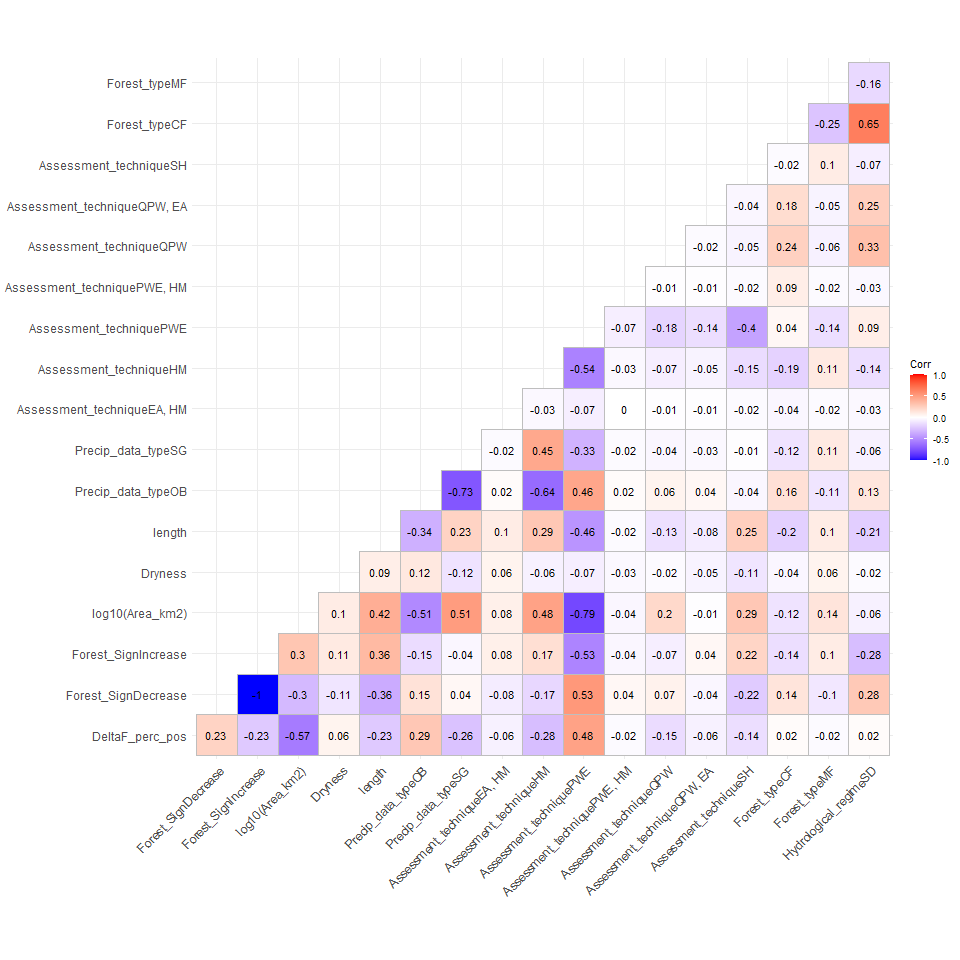

```{r setup, include=FALSE, echo =F}
knitr::opts_chunk$set(echo = TRUE)
require(tidyverse)
require(lubridate)
suppressWarnings(require(knitr))
suppressWarnings(require(bookdown))
suppressWarnings(require(pander))
```

# Introduction

The reviewer comments are ordered with the Editor in Chief comments listed first and our responses next. This is followed by the comments from the associate editor and our responsed. The reviewer comments are in \textcolor{blue}{blue} and our responses in normal text.  


# Editor comments

\textcolor{blue}{The first is to streamline the statistics.  As suggested by the AE, a formal model selection process, followed by using only the selected model(s) to evaluate change, would be a suitable approach.}    

We politely disagree with the suggestion of a formal model selection process, as we outline in our reply to the AE. If the statistical modelling was aimed at developing the best predictive model, then this would be the right approach. However, in this case the statistical modelling is aimed at hypothesis testing and explanation of variance in the data set.     

\textcolor{blue}{In doing so, please carefully note the AEs' concerns about some of the statistical methodology - concerns which range from interpretation to the use of appropriate performance metrics across models of varying structure, to the selection of the appropriate metrics of forest cover change for analysis.}   

Please see our comments in reply to the AE below.    

\textcolor{blue}{The second - hopefully supported by a streamlining of the statistics - is to simplify and improve the coherence of the argument.  Framing - as the AE states - a "systematic" exploration of the importance of parameters, will improve the readability and interpretability of the work.  At present, I think because the statistical analysis itself is convoluted - so too the thread of the argument and clarity of the messages are hard to follow.}    

Please see our comments in reply to the AE below.  


\textcolor{blue}{The final - and perhaps in truth the most problematic issue that may stand in the way of the MS being published - relates to novelty.  The AE highlights several recent works with similar questions, approaches and findings at global scales.  I could add to that list with more regional studies (e.g. Levy et al 2018).  So carefully identifying the knowledge gap being addressed, with respect to these recent studies, and making the case for the present study being "needed" will also be essential.}    

Thank you for the suggestion of the @levy2018 paper, which is an excellent example of a careful statistical analysis taking into account possible variations in climate and dynamic land use change. This is exactly the kind of statistical analysis that we believe needs to be undertaken to better understand how forest cover impacts  The paper also provides the rainfall and runoff data that was used in the study, but regrettably does not provide the land use data. Rather than deriving this ourselves following the methods described in the paper, we decided that it would be better to use @levy2018 as an example of how the analysis can be done well.   

You are quite right that we need to be clearer about the objectives of the paper and how this is different from the existing work. We agree that there have been many attempts to derive general conclusions in relation to the impact on streamflow of changes to forest cover, as we also discuss in our introduction. However, as we discuss in our response to the Associate Editor, there are considerable issues with the generalization of such studies (as attempted in @zhou2015; @jackson2005; @filoso2017 and @zhang2017). This is now extensively discussed in the discussion of the paper.   

As a result of this, we have rewritten the scope of the paper and changed the title to better reflect the main findings and message coming from this paper.   


The new title of the paper is:  

**Generalising the impact of forest cover on streamflow from experimental data: it is not that simple.**  

The key contribution of this paper is to highlight the knowledge gap that exists in the extrapolation of local studies to effects at the global scale. While the impact of forest cover on streamflow is easily hypothesised [e.g. @zhou2015; @hoekvandijke2022], our research clearly shows that the causal relationship between change in forest cover and streamflow is complex and not as straight forward as shown in earlier literature. In addition, to this we highlight that it is very difficult to reinterpret older studies to isolate the effect of  forestation or deforestation, and in many cases this becomes a qualitative assessment.  
As such, we provide three key insights.  

- While analysing global databases can be interesting, we need to be careful with drawing major conclusions (as in @zhang2017, @filoso2017, @zhou2015 and @jackson2005) based on basic regression analysis or using equilibrium analysis (such as the Fu model). In many cases statistical assumptions are violated and confounding factors can hide or strengthen assumed relationships. In addition, the equilibirum analysis is based on the assumption of water balance closure, which might not always be the case in arid and semi-arid climates. It can easily become a case of 'correlation without causation'. This is without considering the number of errors that existed in the data. This is particularly important, since results from these global analyses are used to build further models to analyse global impacts [e.g. @hoekvandijke2022], leading to possible wrong policy or management responses.  
- Cumulative and average values of change can be misleading, especially when extracted from published field studies which originally had different objectives. This is particularly true for quite a few studies which focused on regeneration of forests after wildfire or clear cutting followed by re-establishment of plantation of native forest. Many of the Paired Watershed Experiments in Australia [e.g. @cornish2001; @webb2009; @webb2012; @webb2013; @watson2001] fall in this category, and therefore easily be classified as either forestation or deforestation. In principle a decision needs to be made how many years post clearing needs to be considered, and whether the remainder of the timeseries should be classified as regeneration. We demonstrate how removing these experiments from the total changes the results of the analysis.
- In general, the size of the catchment and the length of the study play a huge role in the interpretation of the results. The length of the study relates to the last point, in all cases, there is large change in the streamflow in the first year, but this effect decreases with the length of the study due to either natural regeneration or some sort of other management, such as replanting. In terms of the catchment size, one of the key issues we originally had with the @zhang2017 paper was the arbitrary split between catchment > 1000 km^2^ and catchment < 1000 km^2^. Our analysis demonstrates that there is no indication of a distinct split, but that, more importantly there is a distinct difference in the type of methods used to analyse small catchments (mostly direct observation and paired catchment analysis) and large catchments (mostly hydrological modelling or some sort of statistical modelling). The paper by @beck2013 is an exception, focussing on hydrological model analysis of 12 small catchments in Puerto Rico. However, as we argue, the results of this paper are misrepresented in the database, as none of the analysed catchments had a significant change in the streamflow. This means the change should be recorded as 0.   


\textcolor{blue}{These are substantial changes and go beyond a major revision.  For this reason, we're rejecting the MS at present.  If the authors are able to address the 3 issues above in a substantial revision of the MS, we would be pleased to look at it again.}  

We acknowledge this, and we hope that the current revised version and our responses address these concerns.   

\textcolor{blue}{We would, however, consider as a new submission for review a substantially revised version of this paper that addresses all of the reviewers' comments.  Should you choose to submit such a revised manuscript please refer to the present manuscript number, provide a detailed point-by-point reply to all of the reviewers' comments, and state how the revised manuscript addresses these.}  

We acknowledge this, and we hope that the current revised version and our responses address these concerns. 

# Associate Editor:

## Comment AE 1  

\textcolor{blue}{The manuscript considers an enhanced dataset of streamflow and forest cover, to explore how deforestation/afforestation alters catchment water yields. The manuscript is potentially of interest of the JoH readership, but it is not ready for review in present form.}  

<!-- answer -->
Thank you, we acknowledge this and we hope that our current revision and answers to your comments have improved the manuscript sufficiently to go out for further review.  


## Comment AE 2  

\textcolor{blue}{The main aspects that need to be addressed before the manuscript can be evaluated by experts in the field are listed here. 
- As apparent from the diagnostic plots, the model assumptions may be violated in many cases. This can make the results of the fitting (and hence the manuscript conclusions) incorrect. I urge the authors to double check if this is indeed the case and consider ways to address the problem. It is also good practice to check the relevance of outliers (of data with high VIF) and set them aside before model fitting. It is also not correct to comment on models as if working better or worse in certain ranges, based on the residuals (P 29), because the residuals are the results of the data and fitted model, and the fitted model depends on all datapoints.}  

Our answer to this point from the associate editor is quite long and covers the following sub topics:  

- Error distributions
- The issue of outliers
- VIF analysis and understanding cross correlations between the variables

### Error distributions

<!-- answer -->
Thank you for raising these important points in relation to the validity of the statistical model. 
A first point that arises from this is that we clarify better what the aim of our statistical modelling is.  
There are in essence two approaches to statistical modelling. Generally a model is developed to be used in predictive mode: using a model to predict unknown values, either within or beyond the current data set (forecasting). In this case the model should be reduced to its most efficient version that minimises the bias - variance trade-off. Automatic variable selection and potentially validation on independent data are therefore important, as the aim is to develop the most robust model for prediction.  
However, a second reason for to use a statistical model is to explain the maximum variance in the data. In this case, it is important to develop a a-priori hypothesis about the causal relationships in the data. This is subsequently followed by a step by step analysis to test the different causal relationships, either as single variables (as was done in @zhang2017) or jointly (as in our approach). In this case there is no attempt to find the best predictive model, instead the focus is on the additional amount of explained variance from adding each variable.  
This explains why we build the model starting from the most simple model, rather than starting from the most complex model.

Either way, understanding the diagnostic plots and the residual distribution is important, which is why this was included in the manuscript. In many cases, including such diagnostic plots for single variable regressions is often omitted. For example, both @zhang2017 and @filoso2017 do not present any diagnostics for their relationships and the regressions (Fig 2 - Fig 4 in @zhang2017 and Fig 9 in @filoso2017) qualitatively indicate issues with the residuals.

In our case, we clearly indicate the steps we have taken to improve the quality of the regressions, such as transforming some of the variables, or explaining why we did not take any further steps. Furthermore, the residual distributions are mostly well-behaved, it is only in the tails of the distribution (very high flow changes and very small flow changes) where the residual distribution diverges from normal. As the change in flow variable covers $\mathbb{R}$, we cannot use a log transformation on the predictant, which is the usual solution for such residual distributions, especially in Hydrology. We therefore chose not to transform and discuss the issue with the fat tails of the distribution in the discussion.

We believe that our current discussion of the diagnostic plots in the paper clarifies this issue and also highlights the remaining non-normality in the residuals.  

### The issue of outliers

We agree that outliers could affect the observed residual distribution as this would most likley be obvious in the tails of the distribution. As @venables2013modern outline on p119:
"Outliers are sample values that cause surprise in relation to the majority of the sample. This is not a pejorative term; outliers may be correct, but they should always be checked for transcription errors." As a result, we believe that excluding values that are outliers is probably not a good idea.  

However, another careful review of the data identified many further errors in the data, which were all originally in @zhang2017. A particular problem was that many catchments had the wrong sign for the change in forest cover. There are many catchments with reported positive change in cover and a large increase in flow. These were all checked and corrected if needed and a full list of all these changes is below and is now included in the paper as Supplementary Data Part 1:  

- 76, Beaver Creek, the flow was corrected from 600% to 157% after review of the original publication [@baker1984].
- 124, D3, @amatya2008effects: The originally recorded 250\% change by @zhang2017 is clearly wrong. The paper says on page 7: Both of these outflow ratios (0.64 and 0.50) were higher than the calculated expected values of 0.55 for 2003 and 0.44 for 2005, respectively. So value should be $0.64/0.55*100 - 100$ or $0.5/044*100 - 100$: 16\% or 13\%. corrected to 16\%
- 3, Baker Creek, @zhangwei2012. The original recorde 201.1\% change by @zhang2017 is also wrong. Original paper says on page 2031: Annual mean flow has been increased by 47.6\%. corrected.
- 67, April rd, which is incorrectly attributed to @ruprecht1991 in @zhang2017. This is actually from @ruprecht1989 and the original paper clearly indicates "clearfelling". As a result the change in forest cover was changed to -100\% rather than +100\%.
- 210, March rd, 100, 147.6. Same problem as 67, @bari1996 clearly state that the catchment was cleared, so therefor the change in forest cover changed to -100\%.
- 213, 214 and 215, Monda 1, 2 and 3. These catchments are tricky. The original paper [@oshaughnessy1979] only reports on the control period and indicates that the catchments will be cleared. The later summary paper [@watson2001] shows the time series of the flow change, but does not report a single value, so the values in the database must have been estimated from the timeseries. The further complication is that the treatment included clearing and reseeding and regrowth. This suggest that the records should be removed from the database, or only the first few years of the experiment used. In any case, if the values are kept, the sign of the change in forest cover needs to changed to negative (Clearing).
- 230, Oleolega catchment. The paper describes a removal of forest up to 85\%. changed Delta_F_perc to -85 from 90.
- 312, Yerraminup South. The original publication for this catchment is a Western Australian Water Authority report from 1987, which is hard to find, but we have added a copy in the "Papers" folder on github. In this report, in Table 2 on page 11, for the catchment a "Crown cover" decrease of 60\% is given. Changed the sign of the change in forest cover: -60\%.
- 72 Barratta, 100 Coachwood, 103 Corkwood, and 83 Bollygum, as cited by @cornish1993 and @cornish2001. In the database from @zhang2017, the forest change for all these catchments is positive. However, the paper highlights that these catchments were all logged and either naturally regenerated or were planted with a plantation species. So, similar to the the earlier mentioned Monda catchments, the reported change probably only refers to the first couple of years after clearing (before regrowth). In any case, the reported change in forest cover should be negative (clearing) rather than positive. Corrected for all three catchments.
- 78, Black Spur 1, the treatments and effects are only reported in a conference paper [@jayasuriya1988] and once again indicated clearing, meaning that the change in forest cover should be negative rather than positive (as reported in @zhang2017). Corrected. Similar to other paired watershed experiments, only the first couple of years can be linked to the effect as later regrowth cancels out part of the increase in flow.
- 104, Coshocton. Checking the original paper indicates that this is in fact a reduction in flow as a result of reforestation. Changed the sign of Delta_Q_f to be negative.  
- 102, Cold Spring. Checking the original paper [@schneider1961] indicates that this is in fact a reduction in flow as a result of reforestation. Changed the sign of Delta_Q_f to be negative.  
- 85 Bosboukloof. This is esssentially a duplicate of 184, but the cited paper analyses only 1 year of runoff after a major fire. In any case, the data should reflect a decrease in forest cover: changed the sign of Delta_f_perc to -80\%.
- 259 Shackam Brook. There were a few issues with this catchment in the original database. The name was misspelled and it was incorrectly attributed to @brown2005. The original paper is the same as 102 [@schneider1961]. Finally, the catchments were all reforestation as the title of the original report indicates and the reported streamflows are all decreases. Corrected Delta_Qf_perc to -20.7\%.
- 95 Sage Brook. Similar to 259 and 102, originates from @schneider1961. Reforestation so Delta_Qf_perc corrected to -19.8\%.
- 101 Coalburn. Original publication (Robinson, 1993) which is a symposium paper, is not available, even after contacting the original authors. The best summary of the research is in @birkinshaw2014 which summaries 45 years of resaerch in the Coalburn catchment. It was a reforestation experiment, and there was a decrease in the streamflow over the longer time period. Changed to -20.3\%.

A further issue was the inclusion of the results of several catchments, for example from the study by @beck2013, which had no significant change in flow. Despite this, the "average" change in flow was reported in the database. We don't believe that this is correct and the results from such studies should be set to 0. A full list of changes is provided below:

- 97 Cibucio, 123 Culebrinas, 244 Portugues, 161 Grande de Loıza, 271 Tanama, 132 Fajardo, 89 Canovanas, 73, Bauta, 163 Grande de Patillas, 283 Valenciano, 181 Inabon, and 162 Grande de Manati. These are all catchments in Puerto Rico from the study from @beck2013. They should probably be removed from the database as the paper clearly indicates that there is no evidence of a change in flow due to reforestation. The values that are cited in the database should all be set to "not significant from 0", so might be included as 0. Including them with positive or negative values is misleading. This study is a very detailed hydrological modelling study, but in the end finds no significant change in streamflow as a result of deforestation. Values for all 12 studied catchments set to 0 in the database.
- 188 Kimakia. and 254 Sambret. The data in the database from @zhang2017 appear to originate from @bruijnzeel1990 which gives 3 values for different lengths of studies. However, the values in the original study by @blackie1979kimakia and @blackie1979kericho do not seem to add up to the same values, and the specific values are not mentioned in the actual papers. In addition, as @bruijnzeel1990 mentions in the footnotes, the control for Kimakia is a bamboo catchment, while the control for Sambret is a tea plantation. Overall, this suggests that the data are probably not a clear deforestation/reforestation study and should be discarded from the analysis.
- 221	N. Creek, Babinda, Queensland. The original paper from this study highlights that the differences between the catchments were insignificant.

### VIF analysis and understanding cross correlations between the variables

We agree that a VIF analysis can be important to identify high correlation between variables. As we have already indicated, we consider Dryness and Precipitation to be highly correlated, and therefore we don't include both in the model. However, a VIF analysis is only useful when all the data are numeric, and in this case several of the variables are factors and not numeric.


```{r corgraphs, echo=F, out.width="90%", fig.cap="Correlation matrix for all variables"}


```

As an alternative we created a correlation plot (Figure \@ref(fig:corgraphs)). This clearly shows the obvious correlations, but also shows that in general cross correlation is quite low between variables. Some interesting relationships, some of which were also highlighted in our models, appear in this graph:  

- the negative relationship between log10(Area) and change in forest area (DeltaF_perc_pos) indicating that in the data larger catchment tended to have (obviously) smaller areas of forest change.
- the weak positive relationship between log10(Area) and the assessment method using hydrological models. This is also obvious as it would be impossible to perform paired catchment studies at very large scales.
- As we also indicate in the models, there is a strong inverse relationship between log10(Area) and the paired watershed assessment method, which is simply the inverse from the last point, as also indicated by the negative relationship between the two assessment methods. This is further visible in the relationship between the change in forest cover and the paired watershed assessment method, showing the impact of the latent variable (log10(Area)). There is of course no causal effect of the assessment methods, it is simply that smaller catchments used in paired watershed assessments are easier to fully clear or fully replant.

Overall this analysis shows very clearly the danger of simply investigating single variable regressions as was done in @zhang2017 and @filoso2017 or even using simple modelling as in @jackson2005 and @zhou2015. It is too easy to miss the latent variables that are the underlying factors and influence the model results.

```{r correlation, eval=F, echo = F}
require(mgcv)
require(car)

All_data <- read_csv("All_data.csv")
All_data2 <- read_csv("All_data2.csv")
All_data2 <- All_data2 %>%
  mutate(length = To - From,
         mid_year = From + (To - From)/2)

#Maybe first simply
# https://stackoverflow.com/questions/52554336/plot-the-equivalent-of-correlation-matrix-for-factors-categorical-data-and-mi
library(ggcorrplot)
png("testcorr_plot.png", width = 960, height = 960)
model.matrix(~0+DeltaF_perc_pos + 
                    Forest_Sign + 
                   log10(Area_km2) + 
                    Dryness + 
                    length +
                    Precip_data_type +  Assessment_technique +
                    Forest_type +
                    Hydrological_regime, data=All_data2) %>% 
  cor(use="pairwise.complete.obs") %>% 
  ggcorrplot(show.diag = F, type="lower", lab=TRUE, lab_size=4)
dev.off()

# model6_all <- gam(DeltaQf_perc ~ DeltaF_perc_pos + 
#                     Forest_Sign + 
#                    log10(Area_km2) + 
#                     Dryness + 
#                     length +# s(From, k = 40, bs = "ts") +
#                     Precip_data_type +  Assessment_technique +
#                     Forest_type +
#                     Hydrological_regime
#                     , data = All_data2)
# summary(model6_all)
# gam.check(model6_all)
# #plot(model6_all)
# inf1 = influence.gam(model6_all)
# hist(inf1)
# hist(cooks.distance(model6_all))
# which.max(cooks.distance(model6_all))
# 
# regclass::VIF(model6_all)
# 
# # Can only do car::vif on linear model and only on numerical values
# car::vif(gam(DeltaQf_perc ~ DeltaF_perc_pos + Forest_Sign + 
#                     log10(Area_km2) + 
#                     Dryness + 
#                     length, data = All_data2))
```


## Comment AE 3  

\textcolor{blue}{- The manuscript presents a number of alternative statistical models, differing by candidate explanatory variables. Each model is designed considering the key shortcomings of the previous one. The end result of such an approach is a complex and somewhat non systematic exploration of predictors and their explanatory power, where it is easy to get lost. I suggest restructuring the manuscript around a well-designed and robustly formalized model selection. One way to proceed could be to start with the most complex model suggested by the extant understanding of the processes at play, and then proceed with a model simplification, according to some consistent criteria (AIC, dropping non significant terms, or similar; high r2 is not a good criterion because it does not consider the number of parameters). A full blown model selection would also allow to retain or discard the interaction terms, which could be important (as also recognized by the authors; Section 4.5) and should not be discarded a priori. Doing a proper model selection and presenting the results only for the best model (according to a clearly specified criterion) would be less subjective and allow to drastically reduce the number of figures and tables, allowing the reader to focus their attention on the key message.}  

<!-- answer -->
The Associate editor raises several points that need further discussion.  

- a formalised model selection;
- the use of AIC rather than *r*^2^ for model selection; and
- interaction terms.

### A formalised model selection

We agree that a classical statistical approach would involve a formal model selection. We acknowledge that in the manuscript we ended up mixing two approaches, where we should have stayed with a single approach. As outlined earlier, the current focus of the statistical modelling is on understanding the different covariates that explain the variation in the data, and to identify latent variables that cause the apparent relationships in the data. This means that there is no attempt to do a formal model selection, as we are not seeking the best predictive model.

However, we have written this badly in the original manuscript and have now reworded large sections of the methodology and the results to be more clear about this approach (line 220 - 224 on page 11)

### AIC rather than *r*^2^

We actually used the adjusted *r*^2^ in the paper, which does take into account the number of degrees of freedom in the model and therefore can be used to discriminate between models, in exactly the same way as the AIC does. However, as the GAM models also provide an AIC, we have for consistency changed our model performance measure to the AIC.

### Interaction terms

The issue of interaction terms is a tricky one. As we indicated in the manuscript, we did not include most of the interaction terms as it became a guessing game. While there clearly is cross correlation between the variables and there is potential interaction between terms, the question of clear causality remains unanswered. We therefore believed that including these interaction terms in the model brought us back to the original point we were trying to make: we need to be careful in simply applying models to global data and assuming relationships that might be clouded by latent variables.


## Comment AE 4  

\textcolor{blue}{- The novelty of this work needs to emerge more clearly in the introduction. As it looks now, the manuscript could be easily considered somewhat confirmatory, with respect to most data, approaches and conclusions reached by Zhang et al 2017 and Filoso et al 2017. Furthermore, the introduction needs to be rearranged, starting with a clear statement of the problem, what we know about that based on previous results, what is missing/how these previous analyses can be improved, and, stemming from these knowledge gaps and/or our understanding of the mechanisms, the questions addressed in the work or the hypotheses tested.}  

<!-- answer -->
We agree that this is a valid point and a weakness in the original manuscript. As we also outline in our reply to the Editor, we have rewritten the paper to strengthen the novelty of the work. In particular the paper now more directly focuses on the difficulties in analysing aggregated global data and the importance of latent variables. We point out that while global databases seem to be a great opportunity to understand global trends and interactions, we show that this is fraught with danger.    


## Comment AE 5  

\textcolor{blue}{There are also some typos and unfinished sentences (e.g., L 142, L 298). Some units are missing (for example those of length of the experiment in the figures) and symbols are not defined at their first appearance (E0/Pa in L 99; Dryness Index). Also: how is Table 1 used? These are not big issues per se but are nonetheless distracting.}

<!-- answer -->
Thank you for pointing this out, we have reviewed the paper carefully and corrected these minor issues. 


## Comment AE 6  

\textcolor{blue}{I would also like to provide the authors with a couple of suggestions regarding the statistical model and their interpretation. 
- The models used in the manuscript consider the absolute value of the forest cover change and then its sign, but this choice is not well justified. It implicitly assumes that the status corresponding to no change distinguishes two ‘realms’. Yet, I would expect (and it is also hinted at at some point in the manuscript) that what really matters is the \%forested area (possibly in relation to the climatic conditions) and how it changes. So, I would suggest the authors to consider whether a model nearer to our understanding of the phenomena at play would be one including, for the forest part, \%change in forested area (with sign) and \%forested area, with the latter possibly as random effect, if not of interested.}

<!-- answer -->
We agree with the AE that this would be an interesting idea and links back to our point about "latent variables". The excellent paper by @levy2018 includes \% forest area as a variable, but their data cannot be incorporated into the current paper. This is because their analysis focuses on a time progression rather than a "before and after" or a clear "control" and "treatment". 
Furthermore, extracting the total area of forest from the papers is not a trivial job, and the area is also not always mentioned in the papers. Finally, the actual data is likely to show the same skew as the current information, with most of the small and paired watershed catchments having a 100\% cover and only the larger catchments having mix of landuses. It is definitely an area of future research. 


## Comment AE 7

\textcolor{blue}{- The fact that the explanatory power is low (low r2) does not necessarily make the results uninteresting (against conclusion on L 530), simply it suggests there are other factors, not included in the model, which have a large effect, and that the model presented cannot be used in a predictive mode. While it is important to present also the r2, even a model with low r2 square we learn which factors significantly affect the change in streamflow and which do not do so.}

<!--answer -->
We totally agree with the AE, and this might be more a matter of symantics. We thought we had the same interpretation as the AE, but might have worded this correctly. The above comment from the AE actually points exactly to the way we are using models in the paper. We use the models to look at factors that significantly affect streamflow rather than looking at a predictive model. 
We have reviewed the text in the conclusion and have reworded to make sure we capture the above suggested meaning.