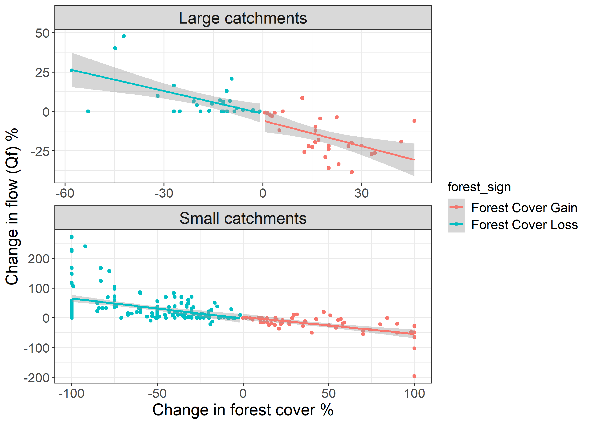
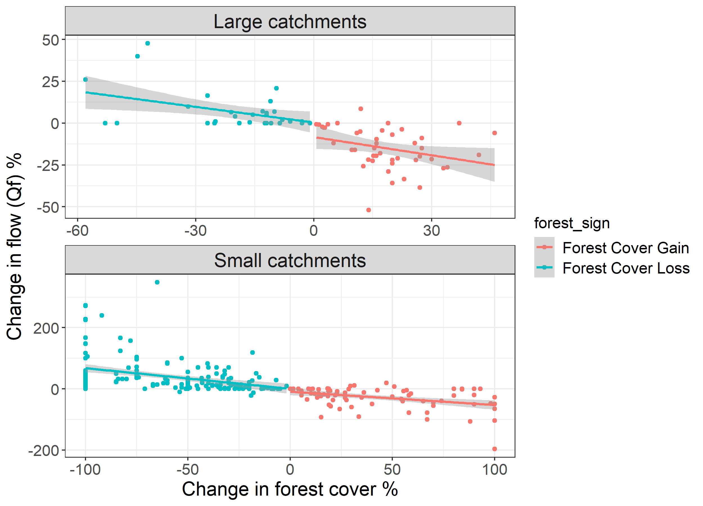
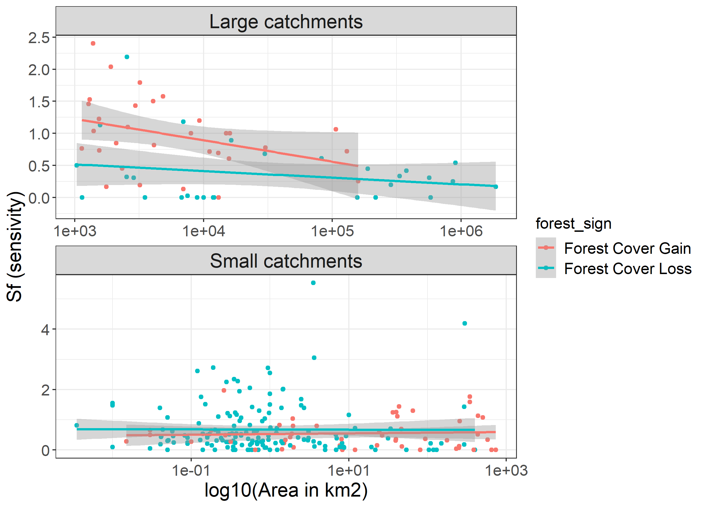
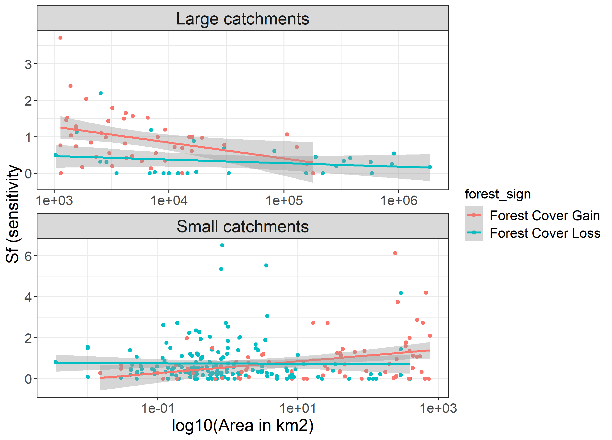
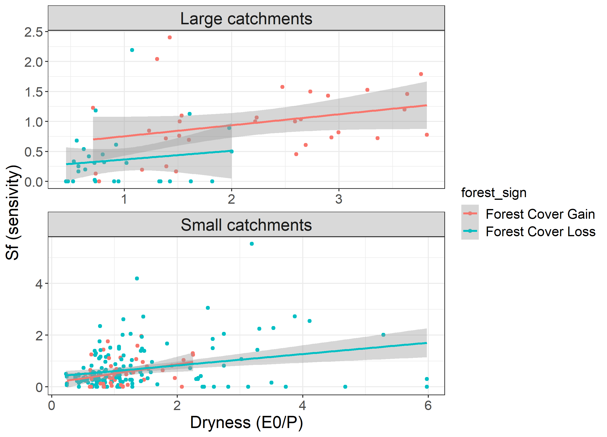
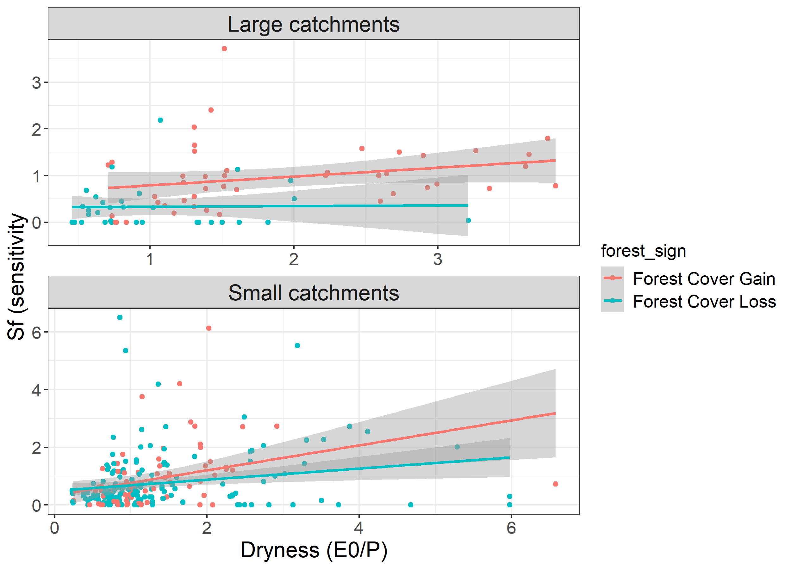

# Introduction

In this document we tested whether the fundamental conclusions in the single variable regressions with the improved data base differed from the original conclusions in @zhang2017. This is to check how much influence the changes to the data set and the additional data might have changed the original conclusions.

# Methods

First we will read in the data

```{r setup, include=FALSE, echo =T}
knitr::opts_chunk$set(echo = TRUE)
require(tidyverse)
require(lubridate)
suppressWarnings(require(knitr))
suppressWarnings(require(bookdown))
suppressWarnings(require(pander))

Zhang_small <- read_csv("../../data/SmallCatchments_T2.csv") %>%
  mutate(table = "Small catchments")
Zhang_large <- read_csv("../../data/LargeCatchments_T1.csv") %>%
  mutate(table = "Large catchments")
new_data <- read_csv("../../data/NewCatchments_T3.csv") %>%
  mutate(table = ifelse(`Area(km2)` > 1000, "Large catchments", "Small catchments"))

# change some column names
names(Zhang_small)[3:4] <- c("Area_km2", "Pa_mm")
names(Zhang_large)[3:4] <- c("Area_km2", "Pa_mm")
names(new_data)[3:4] <- c("Area_km2", "Pa_mm")
names(Zhang_small)[5:6] <- c("Forest_type", "Hydrological_regime")
names(Zhang_large)[5:6] <- c("Forest_type", "Hydrological_regime")
names(new_data)[5:6] <- c("Forest_type", "Hydrological_regime")
names(Zhang_small)[9:10] <- c("Precip_data_type", "Assessment_technique")
names(Zhang_large)[9:10] <- c("Precip_data_type", "Assessment_technique")
names(new_data)[9:10] <- c("Precip_data_type", "Assessment_technique")

# combine the data into one dataset

```

We will combine the different tables, but will keep an indicator to see where the data are from.

```{r, echo = T, warning = F, message = F}
Zhang_small$From <- as.numeric(Zhang_small$From)
Zhang_small$To <- as.numeric(Zhang_small$To)
Zhang_all <- bind_rows(Zhang_large,Zhang_small) %>%
  mutate(dataset = "original Zhang et al data")
new_data <- new_data %>%
  mutate(dataset = "new data")
All_data <- bind_rows(Zhang_all, new_data)
```

## Implementing the changes to the overall data

The following code implements the changes described in the Supplementary data part 1. However, many of the changes were implemented manually into the data set. These are simply the remaining changes not implemented manually.     

1. removing the duplicates.  
```{r, echo = T}
All_data <- All_data %>%
  mutate(`Possible duplicate` = 
           ifelse(is.na(`Possible duplicate`)==T,0,`Possible duplicate`),
         `Possible duplicate` = as.numeric(`Possible duplicate`)) %>%
  filter(`Possible duplicate` != 1)
```

2. calculating the dryness  

```{r, echo = T}
# calculate dryness index
All_data <- All_data %>%
  mutate(Dryness = E0/Pa_mm)
```

3. remove watershed 1 (the Amazon) from the analysis  
```{r, echo = T}
All_data <- All_data %>%
  filter(`Watershed #` != 1)
```

4. remove data set 188 and 254 Kamakia and Sambret
```{r,echo = T}
All_data <- All_data %>%
  filter(`Watershed #` != 188) %>%
  filter(`Watershed #` != 254)
```

5. add a column that indicates forst loss of forest gain

```{r, echo = T}
All_data <- All_data %>%
  mutate(forest_sign = ifelse(DeltaF_perc < 0, "Forest Cover Loss", "Forest Cover Gain"))
```


## Approach and analyses

The approach is similar to @zhang2017. We run single variable regressions separating large (> 1000 km^2^) and small catchments (<= 1000 km^2^). 

The paper by @zhang2017 calculates the sensitivity of runoff as a function of runoff as:

$\Delta Q_f = 100 \times \frac{\Delta Q_{f,mm}}{\bar{Q}}$

This first equation is superfluous in this case as the data (as extracted from @zhang2017) is already defined in terms of $\Delta Q_f$.

$S_f = |\frac{\Delta Q_f}{\Delta F}|$ 

```{r, echo = T}
All_data <- All_data %>%
  filter(is.na(DeltaF_perc) == F) %>%
  mutate(S_f = abs(DeltaQf_perc/DeltaF_perc))
```

In sequence we analyse:

- the relationship between forest cover change and streamflow change for small and large catchments (i.e. Figure 2 in @zhang2017);  
- the relationship between catchment size and the sensitivity to runoff change (i.e. Figure 3 in @zhang2017); and  
- the sensitivity to forest loss as a function of dryness (i.e. Figure 4 in @zhang2017).

# Results

## The change in stream flow as a function of change in forest cover

Figure \@ref(fig:Fig2Zhang) highlights that the overall relationship in the updated dataset is the same as in @zhang2017. This means that while the modifications have cleaned up the transcription errors in the data, they have not fundamentally changed the conclusions in the original paper.

The next figure (Figure \@ref(fig:Fig2Zhangnew)) is the same analysis, but this includes the new data that we identified in papers. Again, this figure highlights that the new datasets have not fundamentally changed the relationships found in @zhang2017.

```{r, echo = F, message = F, warning = F}
png("Fig2Zhang.png", width = 2500, height = 1800, res = 300)
All_data %>%
  filter(dataset == "original Zhang et al data") %>%
  ggplot(aes(DeltaF_perc,DeltaQf_perc, colour = forest_sign)) + 
  geom_point() +  geom_smooth(method = "lm") +
  facet_wrap(~table, ncol=1, scales = "free") + 
  theme_bw() + 
    theme(axis.title = element_text(size = rel(1.5)),
        axis.text = element_text(size = rel(1.2)),
        legend.text = element_text(size = rel(1.2)),
        legend.title = element_text(size = rel(1.2)),
        strip.text = element_text(size = rel(1.5))) + 
  # scale_colour_manual(name = "Forest cover direction", 
  #                     values = c("Decrease" = "red","Increase" = "blue")) +
  xlab("Change in forest cover %") + ylab("Change in flow (Qf) %")
dev.off()

# and for all data sets
png("Fig2Zhang_all.png", width = 2500, height = 1800, res = 300)
All_data %>%
#  filter(dataset == "original Zhang et al data") %>%
  ggplot(aes(DeltaF_perc,DeltaQf_perc, colour = forest_sign)) + 
  geom_point() +  geom_smooth(method = "lm") +
  facet_wrap(~table, ncol=1, scales = "free") + 
  theme_bw() + 
    theme(axis.title = element_text(size = rel(1.5)),
        axis.text = element_text(size = rel(1.2)),
        legend.text = element_text(size = rel(1.2)),
        legend.title = element_text(size = rel(1.2)),
        strip.text = element_text(size = rel(1.5))) + 
  # scale_colour_manual(name = "Forest cover direction", 
  #                     values = c("Decrease" = "red","Increase" = "blue")) +
  xlab("Change in forest cover %") + ylab("Change in flow (Qf) %")
dev.off()


```


```{r Fig2Zhang, echo =F, fig.cap="Changes in flow based on the catchments from the original data set", out.width="90%"}


```

```{r Fig2Zhangnew, echo =F, fig.cap="Changes in flow based on the catchments from the extended data set", out.width="90%"}


```
## The relationship between the area of the catchment and the sensitivity of streamflow to the change in forest cover.

This analysis replicates Figure 3 in @zhang2017, which investigates for large and small catchments the sensitivity to runoff change from change in forest cover as a function of area. Note that in the original figure, the x-axis is on a log scale. In the original paper, the analysis is presented for all catchments as well as for large and small catchments. Here we only analyse the small and large catchments.

We can see from Figure \@ref(fig:Fig3Zhang) that again the updated database for the original dataset results in little change in the relationships for both large and small catchments. However, when the additional new catchments are added to the database (Figure \@ref(fig:Fig3Zhangnew)), the relationships clearly change. In particular, for small catchments gaining forest cover, the sensitivity appears positively correlated with the logarithm of the size of the catchments.

```{r, echo = F, message = F, warning = F}
png("Fig3Zhang.png", width = 2500, height = 1800, res = 300)
All_data %>%
  filter(dataset == "original Zhang et al data") %>%
  ggplot(aes(Area_km2, S_f, colour = forest_sign)) + 
  geom_point() +  geom_smooth(method = "lm") +
  scale_x_continuous(trans='log10') +
  facet_wrap(~table, ncol=1, scales = "free") + 
  theme_bw() + 
    theme(axis.title = element_text(size = rel(1.5)),
        axis.text = element_text(size = rel(1.2)),
        legend.text = element_text(size = rel(1.2)),
        legend.title = element_text(size = rel(1.2)),
        strip.text = element_text(size = rel(1.5))) + 
  # scale_colour_manual(name = "Forest cover direction", 
  #                     values = c("Decrease" = "red","Increase" = "blue")) +
  xlab("log10(Area in km2)") + ylab("Sf (sensivity)")
dev.off()

# and for all data sets
png("Fig3Zhang_all.png", width = 2500, height = 1800, res = 300)
All_data %>%
#  filter(dataset == "original Zhang et al data") %>%
  ggplot(aes(Area_km2,S_f, colour = forest_sign)) + 
  geom_point() +  geom_smooth(method = "lm") +
  scale_x_continuous(trans='log10') +
  facet_wrap(~table, ncol=1, scales = "free") + 
  theme_bw() + 
    theme(axis.title = element_text(size = rel(1.5)),
        axis.text = element_text(size = rel(1.2)),
        legend.text = element_text(size = rel(1.2)),
        legend.title = element_text(size = rel(1.2)),
        strip.text = element_text(size = rel(1.5))) + 
  # scale_colour_manual(name = "Forest cover direction", 
  #                     values = c("Decrease" = "red","Increase" = "blue")) +
  xlab("log10(Area in km2)") + ylab("Sf (sensitivity")
dev.off()


```

```{r Fig3Zhang, echo =F, fig.cap="Changes in flow based on the catchments from the original data set", out.width="90%"}


```

```{r Fig3Zhangnew, echo =F, fig.cap="Changes in flow based on the catchments from the extended data set", out.width="90%"}


```
## The sensitivity to forest loss as a function of dryness

The final analysis that we retest here is the relationship in Figure 4 in the original @zhang2017 paper, which highlights the sensitivity to forest loss as a function of dryness. We are again showing just the for the small and large catchments, similar to the original paper.

Similar to earlier analyses in this document Figure \@ref(fig:Fig4Zhang) show that the updated database for the original dataset results in little change in the relationships for both large and small catchments. However, when the additional new catchments are added to the database (Figure \@ref(fig:Fig4Zhangnew)), the relationships clearly change. In particular, for small catchments both for forest gains and losses the relationship changes and appears stronger.

```{r, echo = F, message = F, warning = F}
png("Fig4Zhang.png", width = 2500, height = 1800, res = 300)
All_data %>%
  filter(dataset == "original Zhang et al data") %>%
  ggplot(aes(Dryness, S_f, colour = forest_sign)) + 
  geom_point() +  geom_smooth(method = "lm") +
  #scale_x_continuous(trans='log10') +
  facet_wrap(~table, ncol=1, scales = "free") + 
  theme_bw() + 
    theme(axis.title = element_text(size = rel(1.5)),
        axis.text = element_text(size = rel(1.2)),
        legend.text = element_text(size = rel(1.2)),
        legend.title = element_text(size = rel(1.2)),
        strip.text = element_text(size = rel(1.5))) + 
  # scale_colour_manual(name = "Forest cover direction", 
  #                     values = c("Decrease" = "red","Increase" = "blue")) +
  xlab("Dryness (E0/P)") + ylab("Sf (sensivity)")
dev.off()

# and for all data sets
png("Fig4Zhang_all.png", width = 2500, height = 1800, res = 300)
All_data %>%
#  filter(dataset == "original Zhang et al data") %>%
  ggplot(aes(Dryness,S_f, colour = forest_sign)) + 
  geom_point() +  geom_smooth(method = "lm") +
  #scale_x_continuous(trans='log10') +
  facet_wrap(~table, ncol=1, scales = "free") + 
  theme_bw() + 
    theme(axis.title = element_text(size = rel(1.5)),
        axis.text = element_text(size = rel(1.2)),
        legend.text = element_text(size = rel(1.2)),
        legend.title = element_text(size = rel(1.2)),
        strip.text = element_text(size = rel(1.5))) + 
  # scale_colour_manual(name = "Forest cover direction", 
  #                     values = c("Decrease" = "red","Increase" = "blue")) +
  xlab("Dryness (E0/P)") + ylab("Sf (sensitivity")
dev.off()


```

```{r Fig4Zhang, echo =F, fig.cap="Changes in flow based on the catchments from the original data set", out.width="90%"}


```

```{r Fig4Zhangnew, echo =F, fig.cap="Changes in flow based on the catchments from the extended data set", out.width="90%"}


```
